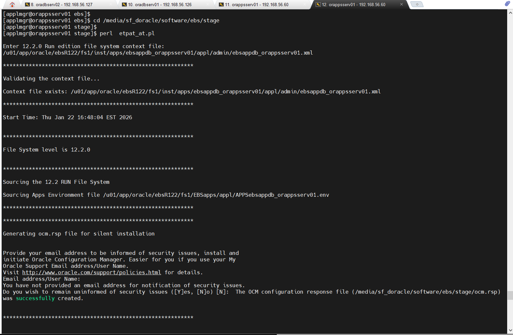
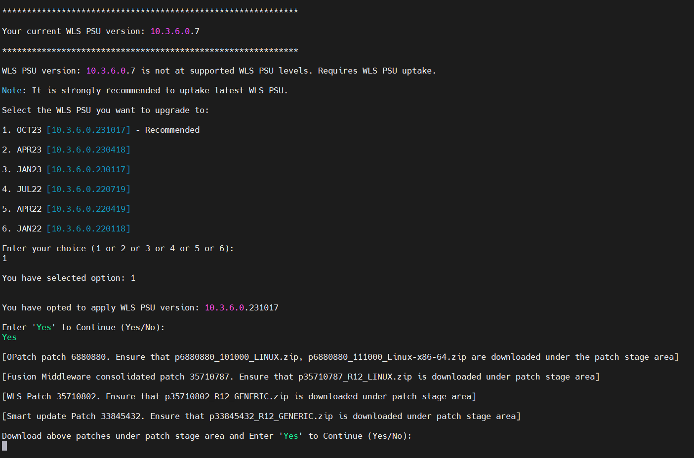

## Using the ETPAT-AT and EURC-DT to automate the patching of App and DB tier
		

EBS Technology Patch Automation Tool - Application Tier (ETPAT-AT)
 
Automates patching of key EBS Release 12.2.0 application tier technology  stack components such as Fusion Middleware and WebLogic Server, saving time and reducing the likelihood of error.

Capabilities:

Available for all platforms on which Oracle E-Business Suite is supported, the new ETPAT-AT tool complements the capabilities of the EBS Technology Codelevel Checker (ETCC).


1. Run the Middle Tier EBS Technology Codelevel Checker (MT-ETCC).

   You must run DB-ETCC and MT-ETCC (in that order) to ensure you have applied all the required database and middle tier technology one-off bugfixes

   The latest version of ETCC can always be downloaded via Patch 17537119. Instructions to run checkMTpatch.sh are available in the patch README.

 - Running on DB Tier as the Oracle user.
 
 ```bash
 
   unzip /media/sf_doracle/software/ebs/p17537119_R12_ETCC_GENERIC.zip -d /media/sf_doracle/software/ebs/17537119_R12_ETCC
   
   cd /u01/app/oracle/ebsR122/fs_ne/EBSapps/patch/ETCC
   
   ./checkDBpatch.sh
   
   
```

	
	
   
 -  Running on APP Tier as the applmgr user.

```bash

   cd /u01/app/oracle/ebsR122/fs_ne/EBSapps/patch/ETCC
   
   ./checkMTpatch.sh

```


	
3. As the applmgr user execute the Application Tier (ETPAT-AT) tool *etpat_at.pl* 


   #Note: 
   To avoid any errors: (/u01/app/oracle/ebsR122/fs1/EBSapps/10.1.2/bin/unzip cannot find the patched to unzip 
   although the files are present in the correct directories. Create a soft link to /bin/unzip)
						
   etpat_at.pl fails because of missing directory
		
		
   
	
```bash

   # --- Fix
   
   mv /u01/app/oracle/ebsR122/fs1/EBSapps/10.1.2/bin/unzip /u01/app/oracle/ebsR122/fs1/EBSapps/10.1.2/bin/unzip.old
   ln -s  /bin/unzip  /u01/app/oracle/ebsR122/fs1/EBSapps/10.1.2/bin/unzip

   mkdir -p /u01/app/oracle/fs_ne/EBSapps/patch/etpat-at/oraebsdb_etpat_at/log/temp

```

```bash
  
   mkdir -p /u01/app/oracle/ebsR122/fs_ne/EBSapps/patch
   
   cp /media/sf_doracle/software/ebs/p17537119_R12_GENERIC.zip /u01/app/oracle/ebsR122/fs_ne/EBSapps/patch
   
   unzip /media/sf_doracle/software/ebs/p32208510_R12_GENERIC.zip -d /u01/app/oracle/ebsR122/fs_ne/EBSapps/patch
   
   cd /u01/app/oracle/ebsR122/fs_ne/EBSapps/patch/stage
   
   # Stop all app processes
   
   /u01/app/oracle/ebsR122/fs1/inst/apps/ebsappdb_orappsserv01/admin/scripts/adstpall.sh
   
   perl  etpat_at.pl
 
```

   

```bash
 
   # Have the following information ready:
   # 
   # Run edition file system context file: /u01/app/oracle/ebsR122/fs1/inst/apps/ebsappdb_orappsserv01/appl/admin/ebsappdb_orappsserv01.xml
   # APPS schema name: APPS
   # Enter password for APPS schema: XXXXXXXXXX
   # Enter directory where you downloaded ETCC Patch 17537119: /u01/app/oracle/ebsR122/fs_ne/EBSapps/patch/stage
   # Enter patch stage area: /u01/app/oracle/ebsR122/fs_ne/EBSapps/patch/stage

		 
```

	
	
	
	
	
	
	
	
	

	
# Notes:

	
EBS Technology Patch Automation Tool for Application Tier (ETPAT-AT) (Doc ID 2749774.1)
EBS 12.2 Upgrade Readiness Checker - Database Tier (EURC-DT) (Doc ID 2749775.1)
	
	
	
Hope this helps !!!