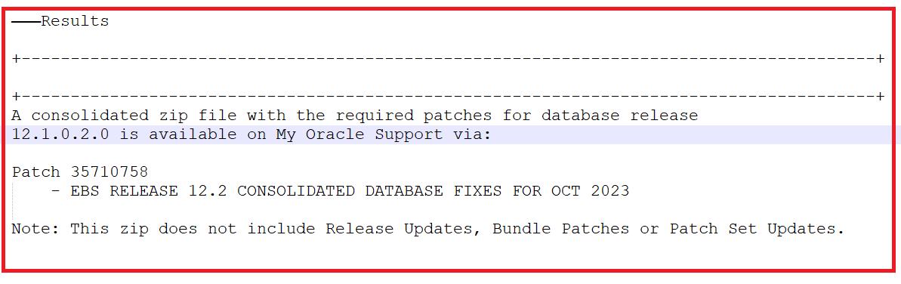
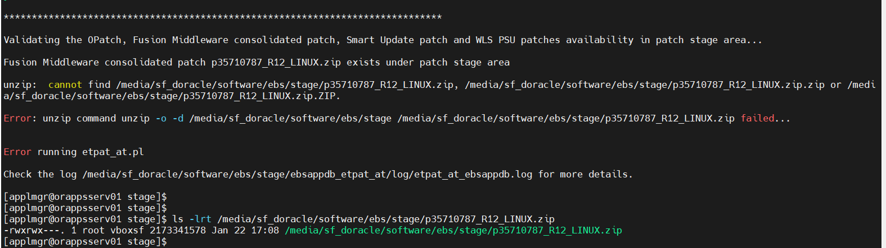
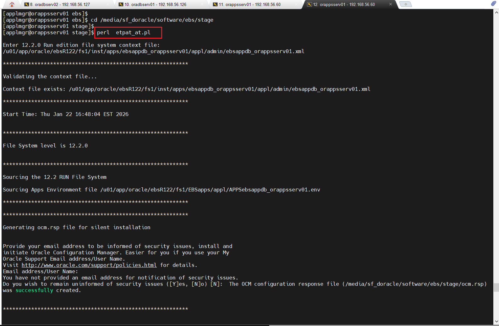
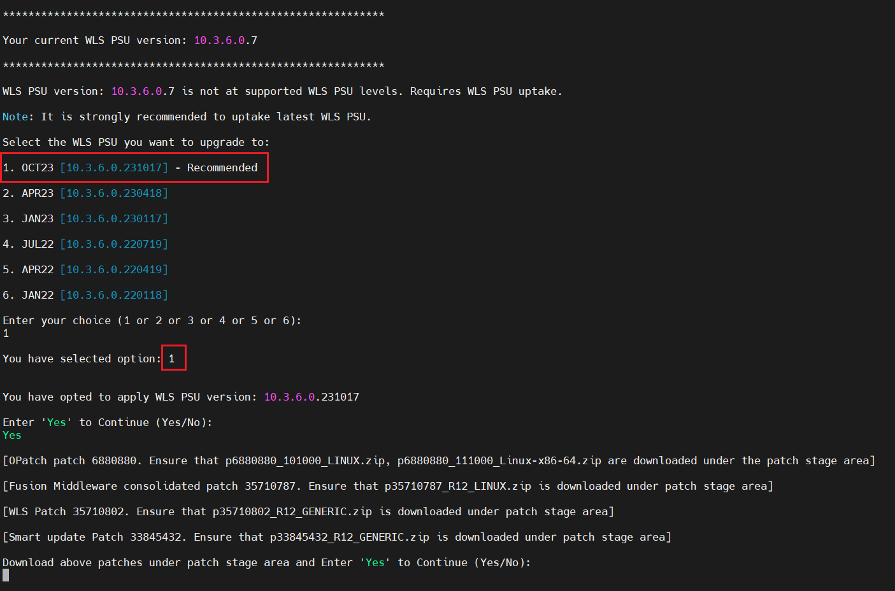
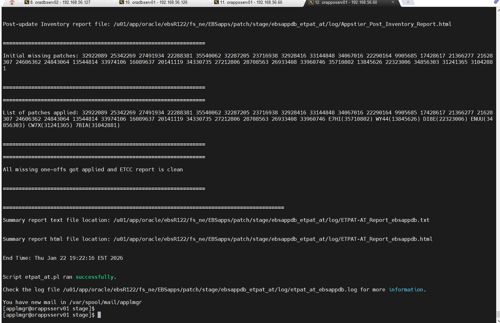
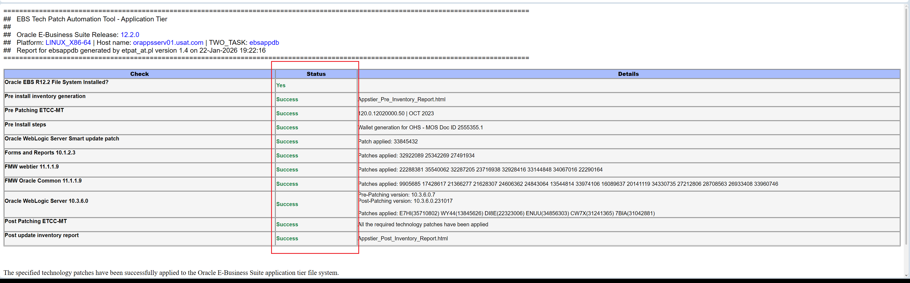

## Using the ETPAT-AT and EURC-DT to automate the patching of App and DB tier
		

EBS Technology Patch Automation Tool - Application Tier (ETPAT-AT)
 
Automates patching of key EBS Release 12.2.0 application tier technology  stack components such as Fusion Middleware and WebLogic Server, saving time and reducing the likelihood of error.

Capabilities:

Available for all platforms on which Oracle E-Business Suite is supported, the new ETPAT-AT tool complements the capabilities of the EBS Technology Codelevel Checker (ETCC).


### 1. Run the Middle Tier EBS Technology Codelevel Checker (MT-ETCC).

   You must run DB-ETCC and MT-ETCC (in that order) to ensure you have applied all the required database and middle tier technology one-off bugfixes

   The latest version of ETCC can always be downloaded via Patch 17537119. Instructions to run checkMTpatch.sh are available in the patch README.

 - Running on DB Tier as the Oracle user.
 
	```bash
    mkdir -p /u01/app/oracle/staging/patch/ebs/ETCC

 	# --- Unzip the ETCC Tool
 
	unzip /media/sf_doracle/software/ebs/p17537119_R12_ETCC_GENERIC.zip -d /u01/app/oracle/staging/patch/ebs/ETCC
   
	cd /u01/app/oracle/staging/patch/ebs/ETCC
   
	./checkDBpatch.sh
   
   	```

 	


	
	
   
 -  Running on APP Tier as the applmgr user.

	

	```bash

	mkdir -p /u01/app/oracle/ebsR122/fs_ne/EBSapps/patch/ETCC

 	unzip -q /media/sf_doracle/software/ebs/p17537119_R12_ETCC_GENERIC.zip -d /u01/app/oracle/ebsR122/fs_ne/EBSapps/patch/ETCC
 
	cd /u01/app/oracle/ebsR122/fs_ne/EBSapps/patch/ETCC
   
	./checkMTpatch.sh

	```


### 2. APP TIER: As the applmgr user execute the  EBS Technology Patch Automation Tool (ETPAT-AT) tool *etpat_at.pl* to patch


   #Note: 
   To avoid any errors: (/u01/app/oracle/ebsR122/fs1/EBSapps/10.1.2/bin/unzip cannot find the patched to unzip 
   although the files are present in the correct directories. Create a soft link to /bin/unzip)
						
   etpat_at.pl fails because of missing directory
		
		
   
	
	```bash

	# --- Fix
   
	mv /u01/app/oracle/ebsR122/fs1/EBSapps/10.1.2/bin/unzip /u01/app/oracle/ebsR122/fs1/EBSapps/10.1.2/bin/unzip.old
 
	ln -s  /bin/unzip  /u01/app/oracle/ebsR122/fs1/EBSapps/10.1.2/bin/unzip

	```

	```bash

  
   
   
	mkdir -p /u01/app/oracle/ebsR122/fs_ne/EBSapps/patch/ETPAT
 	mkdir -p /u01/app/oracle/ebsR122/fs_ne/EBSapps/patch/AD_TXK

 	# --- Unzip ETPAT Patch

 	unzip -q /media/sf_doracle/software/ebs/p32208510_R12_GENERIC.zip -d /u01/app/oracle/ebsR122/fs_ne/EBSapps/patch/ETPAT

 	# --- Copy the patch ETCC patch p17537119_R12_GENERIC.zip into the ETPAT directory. 

 	cp /media/sf_doracle/software/ebs/p17537119_R12_GENERIC.zip  /u01/app/oracle/ebsR122/fs_ne/EBSapps/patch/ETPAT
 
	cd /u01/app/oracle/ebsR122/fs_ne/EBSapps/patch/ETPAT
 
 	ls -lrt
   
	# Stop all app processes
   
	/u01/app/oracle/ebsR122/fs1/inst/apps/ebsappdb_orappsserv01/admin/scripts/adstpall.sh
   
	perl  etpat_at.pl
 
	```

   

   
	```bash
 
	# Have the following information ready:
	# 
	# Run edition file system context file: /u01/app/oracle/ebsR122/fs1/inst/apps/ebsappdb_orappsserv01/appl/admin/ebsappdb_orappsserv01.xml
	# APPS schema name: APPS
	# Enter password for APPS schema: XXXXXXXXXX
	# Enter directory where you downloaded ETCC Patch 17537119: /u01/app/oracle/ebsR122/fs_ne/EBSapps/patch/ETPAT
	# Enter patch stage area: /u01/app/oracle/ebsR122/fs_ne/EBSapps/patch/AD_TXK
	----
 	----
 	----   # ---Entries removed
 	----
 	----
 	************************************************************
	Your current WLS PSU version: 10.3.6.0.7
	************************************************************

	WLS PSU version: 10.3.6.0.7 is not at supported WLS PSU levels. Requires WLS PSU uptake.
	Note: It is strongly recommended to uptake latest WLS PSU.
	Select the WLS PSU you want to upgrade to:

	1. OCT23 [10.3.6.0.231017] - Recommended
	2. APR23 [10.3.6.0.230418]
	3. JAN23 [10.3.6.0.230117]
	4. JUL22 [10.3.6.0.220719]
	5. APR22 [10.3.6.0.220419]
	6. JAN22 [10.3.6.0.220118]

	Enter your choice (1 or 2 or 3 or 4 or 5 or 6):
	1

	You have selected option: 1

	You have opted to apply WLS PSU version: 10.3.6.0.231017

	Enter 'Yes' to Continue (Yes/No):
	yes

	[OPatch patch 6880880. Ensure that p6880880_101000_LINUX.zip, p6880880_111000_Linux-x86-64.zip are downloaded under the patch stage area]

	[Fusion Middleware consolidated patch 35710787. Ensure that p35710787_R12_LINUX.zip is downloaded under patch stage area]

	[WLS Patch 35710802. Ensure that p35710802_R12_GENERIC.zip is downloaded under patch stage area]

	[Smart update Patch 33845432. Ensure that p33845432_R12_GENERIC.zip is downloaded under patch stage area]

	Download above patches under patch stage area and Enter 'Yes' to Continue (Yes/No):

		 
	```
	
   


	After all  6 files have been copied to the stage are: Type **YES** to continue

	
   
	
   
   HTML log file showing a successful completion:
   
   
	
	
# Notes:

	
EBS Technology Patch Automation Tool for Application Tier (ETPAT-AT) (Doc ID 2749774.1)
EBS 12.2 Upgrade Readiness Checker - Database Tier (EURC-DT) (Doc ID 2749775.1)
	
	
	
Hope this helps !!!
