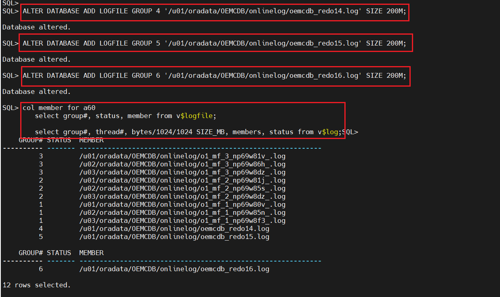
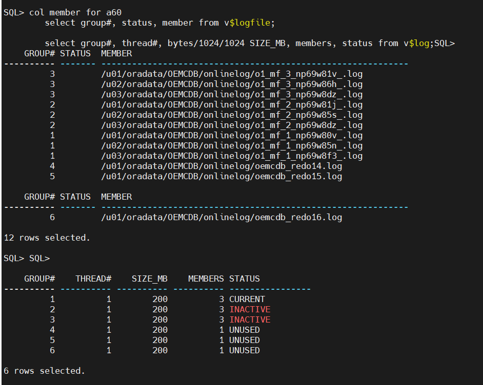
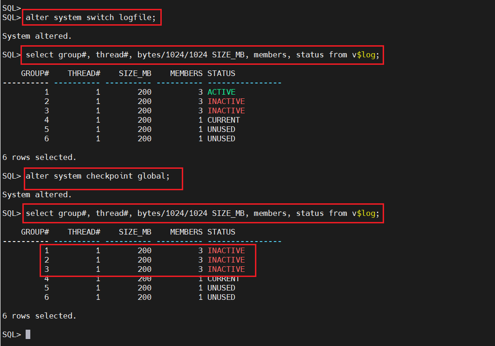
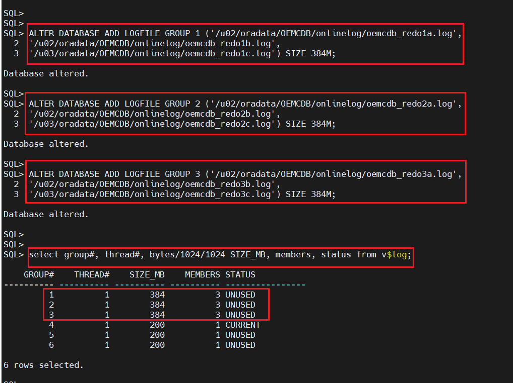
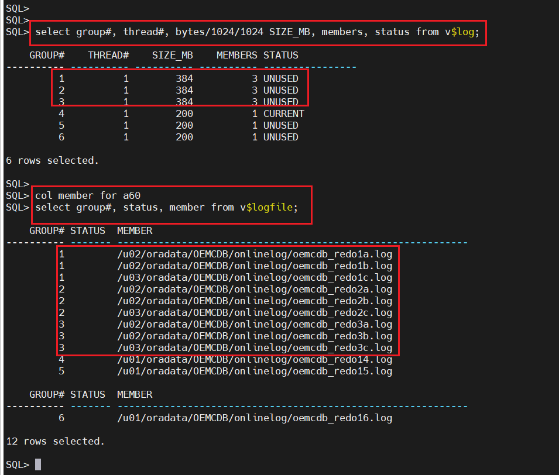
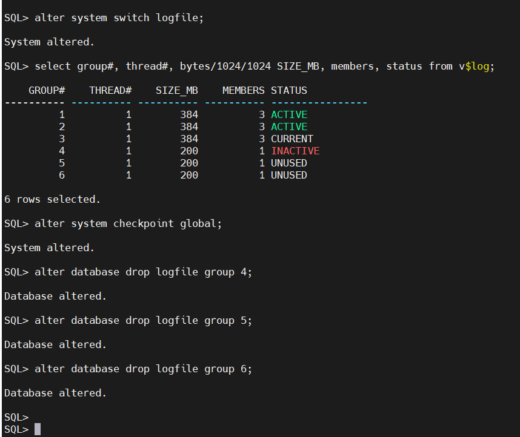
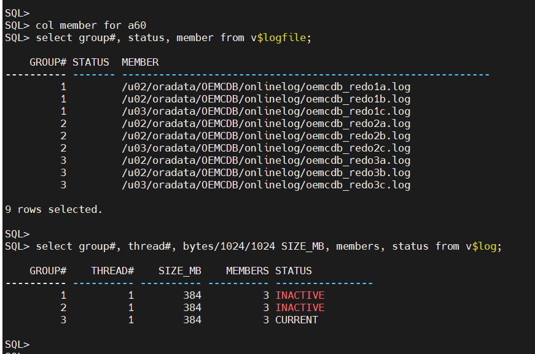

# Overview: Reorganizing Online Redo Logs After Storage Migration


## Scenario: Online Redo Logs where not properly sized during configuration of stages of the database.

## Current State:

 - Database has 3 redo log groups with 2 members each

 - Each log file is 200MB in size

 - Database generates heavy redo due to frequent transactions (peak: 50MB/sec)
  
 - All redo log members reside on /u01/oradata/OEMCDB/onlinelog
 
 
## The Problem:

 - Storage Performance Issue: The existing storage array hosting redo logs is experiencing:

 - High latency (25ms+ during peak hours)

 - Frequent I/O bottlenecks affecting commit performance

 - No redundancy for redo logs (single point of failure)


## Risk Assessment:

 - Loss of the /u01/oradata/REDO mount point would mean losing ALL redo log members

 - This could lead to database crash and potential data loss if recovery is needed

 - Current architecture violates the company's "no single point of failure" policy


## Solution: Reorganize Redo Logs


### Phase 1: Add New temporal thread#


	sqlplus / as sysdba
	
	
	SQL>
	SQL> col member for a60
	SQL> select group#, status, member from v$logfile;
	
		GROUP# STATUS  MEMBER
	---------- ------- ------------------------------------------------------------
			3         /u01/oradata/OEMCDB/onlinelog/o1_mf_3_np69w81v_.log
			3         /u01/oradata/OEMCDB/onlinelog/o1_mf_3_np69w86h_.log
			3         /u01/oradata/OEMCDB/onlinelog/o1_mf_3_np69w8dz_.log
			2         /u01/oradata/OEMCDB/onlinelog/o1_mf_2_np69w81j_.log
			2         /u01/oradata/OEMCDB/onlinelog/o1_mf_2_np69w85s_.log
			2         /u01/oradata/OEMCDB/onlinelog/o1_mf_2_np69w8dz_.log
			1         /u01/oradata/OEMCDB/onlinelog/o1_mf_1_np69w80v_.log
			1         /u01/oradata/OEMCDB/onlinelog/o1_mf_1_np69w85n_.log
			1         /u01/oradata/OEMCDB/onlinelog/o1_mf_1_np69w8f3_.log
	
	9 rows selected.
	
	SQL>
	SQL> select group#, thread#, bytes/1024/1024 SIZE_MB, members, status from v$log;
	
		GROUP#    THREAD#    SIZE MB    MEMBERS STATUS
	---------- ---------- ---------- ---------- ----------------
			1          1        200          3 INACTIVE
			2          1        200          3 INACTIVE
			3          1        200          3 CURRENT
	

	# --- Adding temporal redologs
	
	
	
	SQL> ALTER DATABASE ADD LOGFILE GROUP 4 '/u01/oradata/OEMCDB/onlinelog/oemcdb_redo14.log' SIZE 200M;
											 
	SQL> ALTER DATABASE ADD LOGFILE GROUP 5 '/u01/oradata/OEMCDB/onlinelog/oemcdb_redo15.log' SIZE 200M;
											 
	SQL> ALTER DATABASE ADD LOGFILE GROUP 6 '/u01/oradata/OEMCDB/onlinelog/oemcdb_redo16.log' SIZE 200M;


### Phase 2: Verify & Switch


 -  Confirm new members have been added:
 
	
	
	```bash
	
	col member for a60
	select group#, status, member from v$logfile;
	
	select group#, thread#, bytes/1024/1024 SIZE_MB, members, status from v$log;

	```
	
 - Force log switches to ensure groups# 1, 2, and 3 become inactive:
 
	

	```bash
	
	# --- Switch
	
	alter system switch logfile;

	
	# --- And Verify
	
	select group#, thread#, bytes/1024/1024 size MB, members, status from v$log;

	```

	


	```bash
	SQL> alter database drop logfile group 1;
	
	Database altered.
	
	SQL> alter database drop logfile group 2;
	
	Database altered.
	
	SQL> alter database drop logfile group 3;
	
	Database altered.
	```

### Phase 4: Add New properly sized and multiplexed Redo logs 


	

	```bash

	SQL> ALTER DATABASE ADD LOGFILE GROUP 1 ('/u02/oradata/OEMCDB/onlinelog/oemcdb_redo1a.log',
											'/u02/oradata/OEMCDB/onlinelog/oemcdb_redo1b.log',
											'/u03/oradata/OEMCDB/onlinelog/oemcdb_redo1c.log') SIZE 384M;  
											
	Database altered.
	
	SQL> ALTER DATABASE ADD LOGFILE GROUP 2 ('/u02/oradata/OEMCDB/onlinelog/oemcdb_redo2a.log',
											'/u02/oradata/OEMCDB/onlinelog/oemcdb_redo2b.log',
											'/u03/oradata/OEMCDB/onlinelog/oemcdb_redo2c.log') SIZE 384M;  
											
	Database altered.
	
	SQL> ALTER DATABASE ADD LOGFILE GROUP 3 ('/u02/oradata/OEMCDB/onlinelog/oemcdb_redo3a.log',
                                             '/u02/oradata/OEMCDB/onlinelog/oemcdb_redo3b.log',
                                             '/u03/oradata/OEMCDB/onlinelog/oemcdb_redo3c.log') SIZE 384M;  
											
	Database altered.
	
	
	# --- Switch
	
	SQL> alter system switch logfile;
	
	```
	
 -  And Verify
	
	
	
	
	```bash
	SQL> col member for a60
	SQL> select group#, status, member from v$logfile;
	
	SQL> select group#, thread#, bytes/1024/1024 size MB, members, status from v$log;
	```

### Phase 5: Clean up. Drop the temporal group# 4, 5, and 6 added in phase 1


	


	```bash
	SQL> alter system switch logfile;

	System altered.
	
	SQL> /
	
	System altered.
	
	SQL> alter system checkpoint global;
	
	System altered.

	SQL> alter database drop logfile group 4;
	
	Database altered.
	
	SQL> alter database drop logfile group 5;
	
	Database altered.
	
	SQL> alter database drop logfile group 6;
	
	Database altered.
	```
	

### Phase 6: Final verification 

	Also use OS commands to check the file system to make sure the files have been dropped.


	

	```bash

	SQL> col member for a60
	SQL> select group#, status, member from v$logfile;
	
	SQL> select group#, thread#, bytes/1024/1024 SIZE_MB, members, status from v$log;
	```
	

## Result After Reorganization:

 - Improved Performance: Redo writes now use faster SSD storage (latency reduced to 2ms)

 - High Availability: Each redo log group has members on separate storage arrays

 - Disaster Recovery: No single storage failure can destroy all copies of redo logs

 - Compliance: Meets regulatory requirements for data redundancy


## Key Reasons for Redo Log Reorganization:

 - Performance Optimization - Moving to faster storage

 - High Availability - Eliminating single points of failure

 - Storage Rearchitecture - Aligning with new infrastructure

 - Compliance Requirements - Meeting audit/regulatory standards

 - Proactive Maintenance - Addressing performance degradation before crisis


