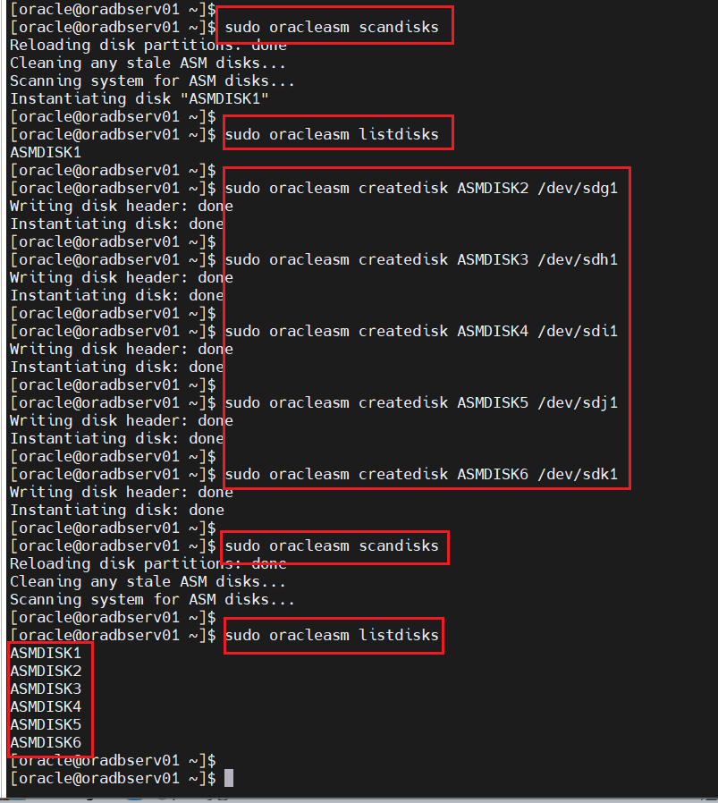
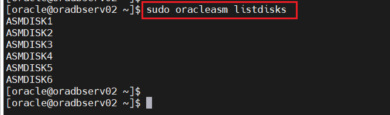
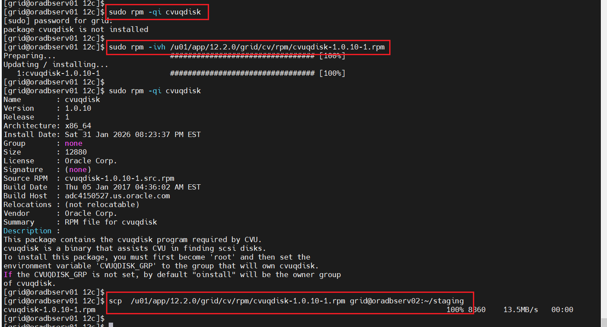
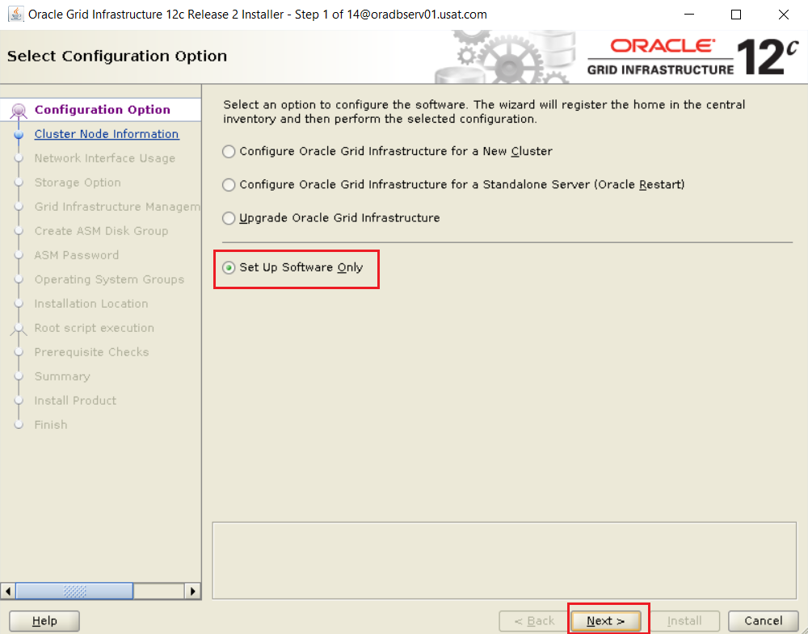
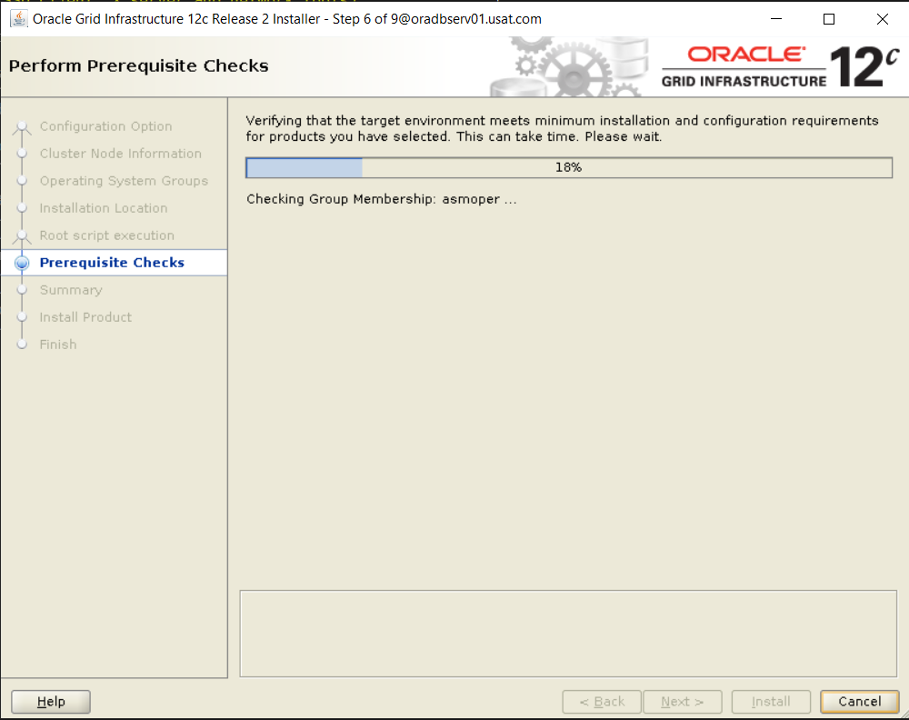
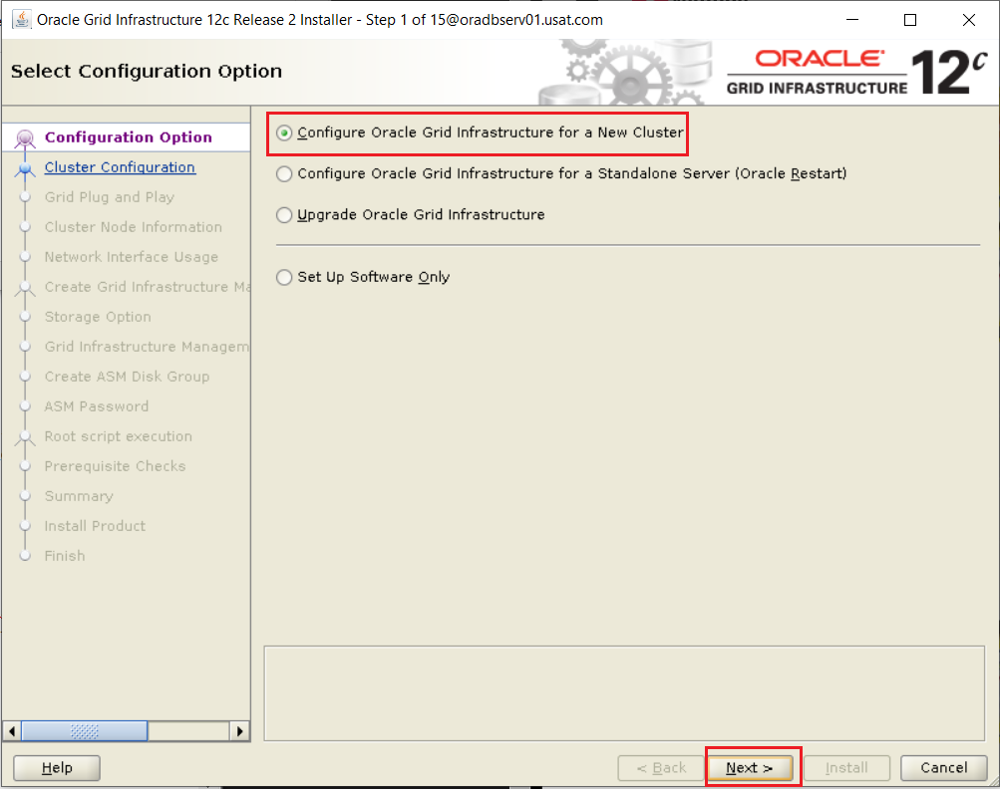
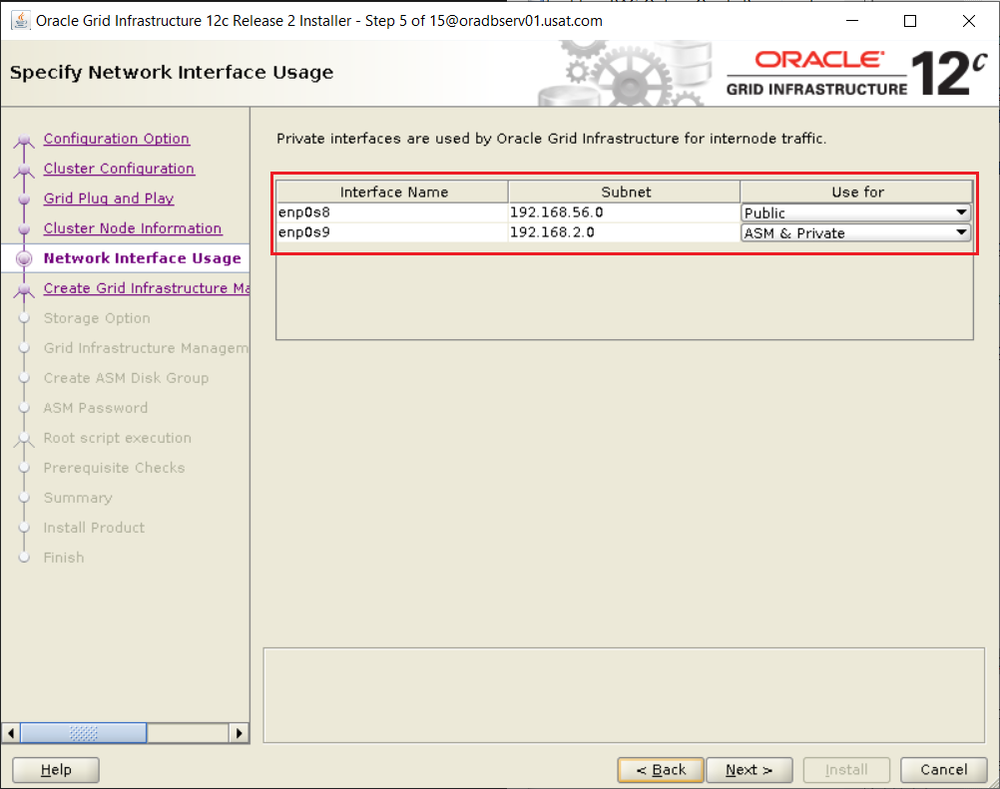
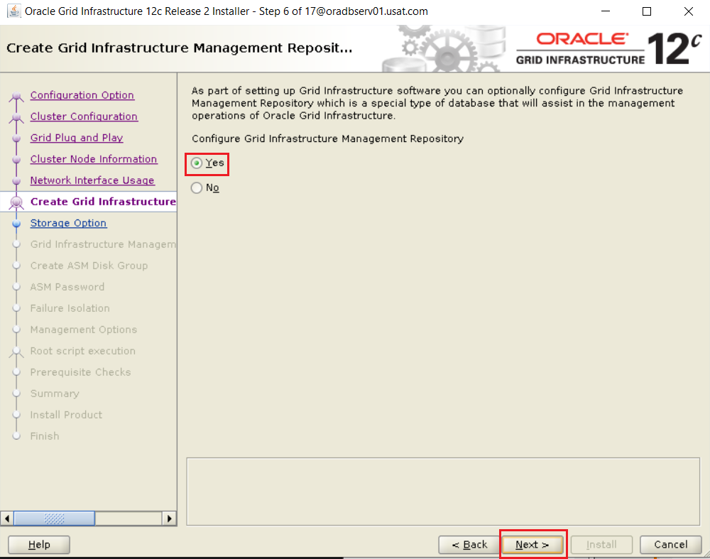
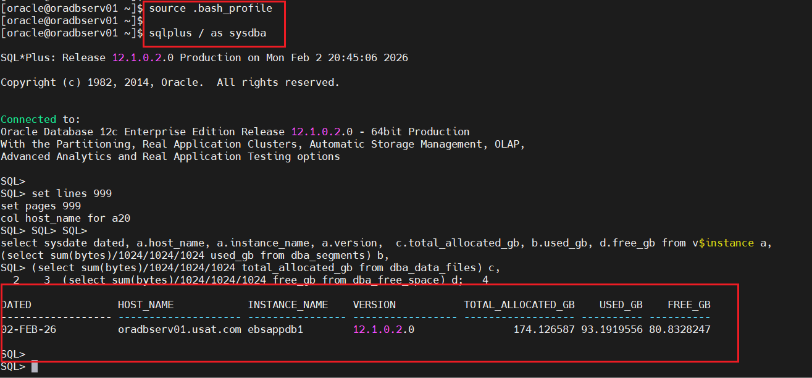
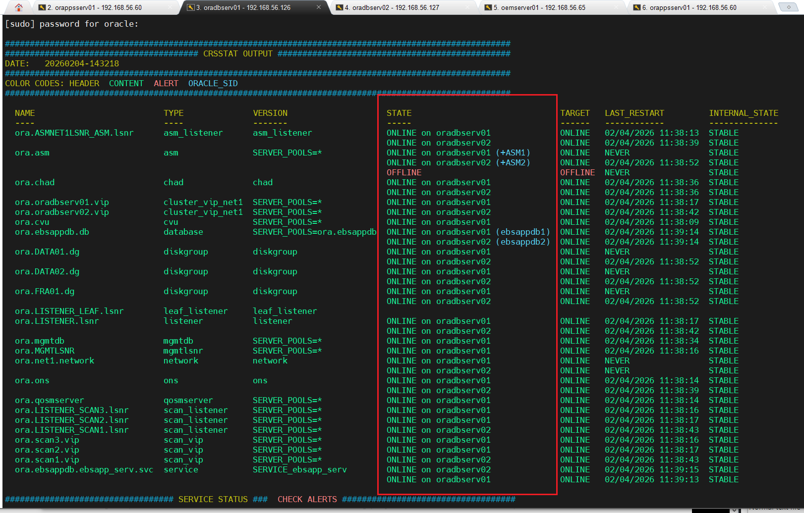

# Converting Single Instance Oracle E-Business Suite (EBS) Release 12.2 to a 2-Node Oracle RAC for High Availability

## Overview: Why High Availability (HA) with Oracle RAC?

High Availability ensures your EBS system remains operational despite hardware failures, maintenance, or spikes in load. Oracle RAC provides:

 - Redundancy and Failover: Multiple nodes share the database workload; if one node fails, others take over seamlessly.
 
 - Scalability: Load balancing across nodes improves performance for concurrent users and batch jobs.
 
 - Zero Downtime Maintenance: Patch one node while others handle traffic.
 
 - Business Continuity: Reduces unplanned downtime (e.g., from node crashes) and supports features like Parallel Concurrent Processing (PCP) in EBS.
 
 - Integration with Other Tools: Complements Data Guard (for DR) and GoldenGate (for replication), and monitoring via OEM.

Without HA, a single-instance setup risks extended outages. RAC achieves 99.99%+ uptime in production, but requires proper setup for interconnect (private network) and shared storage.

Estimated Time: 4-8 hours for setup, plus testing. Downtime during conversion: ~1-2 hours (can be minimized with careful planning).


## Prerequisites

### Note: 

Note: This process assumes your current setup (OEM Server, single-instance EBS App Server, single-instance DB Server) is on Linux x86-64 (as per your host and common EBS setups). RAC requires shared storage (e.g., via VirtualBox shared disks or NFS for testing). Test in a non-production environment first. Allocate VM resources: e.g., 8 CPUs and 16 GB RAM per node (total ~32 GB for 2 nodes + overhead).

Hardware/VM Setup:

Create 2 VirtualBox VMs: Node1 (oradbserv01). This is the current SINGLE NON-RAC DB server 
                         Node2 (oradbserv02). This is the new node to add (I made a clone of oradbserv01 without the database) 

OS: Oracle Linux 7 (matching your current setup).

Network: 3 NICs per server

 - Public NIC (NAT):                    enp0s3 (eth0): DHCP (Connect Automatically)
 - Private NIC (Host-Only-Adapter):     enp0s8 (eth1): IP=192.168.56.128, Subnet=255.255.255.0, Gateway=192.168.56.1, DNS=<blank>, Search=usat.com (Connect Automatically)
 - Virtual IP (VIP) (Internal Network:  enp0s9 (eth2): IP=192.168.2.128, Subnet=255.255.255.0, Gateway=<blank>, DNS=<blank>, Search=<blank> (Connect Automatically)

Shared Storage: Use VirtualBox shared disks (VDI files) for ASM (Automatic Storage Management). 
I am using ~450 GB shared disk for DB files.

```bash
	# Clone Golden Image Linux 7 VDI Disks
	
	"c:\Program Files\Oracle\VirtualBox\VBoxManage" clonehd "G:\virtualbox_vm\BackupLoc\Linux7server\bk_swapdisk01.vdi" "E:\virtualbox_vm\oradbserv02\Disks\oradbserv02_SWAPDISK.vdi"
	"c:\Program Files\Oracle\VirtualBox\VBoxManage" clonehd "G:\virtualbox_vm\BackupLoc\Linux7server\bk_rootdisk01.vdi" "E:\virtualbox_vm\oradbserv02\Disks\oradbserv02_DISK1.vdi"
	
	# Attach Disks to the VM RAC Node2.
	
	"C:\Program Files\Oracle\VirtualBox\VBoxManage" storageattach oradbserv02 --storagectl "SATA" --port 0 --device 0 --type hdd  --medium "E:\virtualbox_vm\oradbserv02\Disks\oradbserv02_SWAPDISK.vdi"
	"C:\Program Files\Oracle\VirtualBox\VBoxManage" storageattach oradbserv02 --storagectl "SATA" --port 1 --device 0 --type hdd  --medium "E:\virtualbox_vm\oradbserv02\Disks\oradbserv02_DISK1.vdi"

	# Create the disks and associate them with VirtualBox as virtual media.

    # Rcongif will need extra 300 GB to convert the database to RAC in scenario
			
	# Remove the ASM DISKS Extra DISK GROUPS after RConfig is successful.


	"C:\Program Files\Oracle\VirtualBox\VBoxManage" createhd --filename "F:\virtualbox_vm\ASMDISKS\DATA1_ASM01.vdi" --size 155000 --format VDI --variant Fixed   
	"C:\Program Files\Oracle\VirtualBox\VBoxManage" createhd --filename "F:\virtualbox_vm\ASMDISKS\DATA2_ASM02.vdi" --size 155000 --format VDI --variant Fixed
	"C:\Program Files\Oracle\VirtualBox\VBoxManage" createhd --filename "G:\virtualbox_vm\ASMDISKS\DATA3_ASM03.vdi" --size 155000 --format VDI --variant Fixed
	"C:\Program Files\Oracle\VirtualBox\VBoxManage" createhd --filename "G:\virtualbox_vm\ASMDISKS\DATA4_ASM04.vdi" --size 155000 --format VDI --variant Fixed
	"C:\Program Files\Oracle\VirtualBox\VBoxManage" createhd --filename "G:\virtualbox_vm\ASMDISKS\FRA1_ASM01.vdi" --size  75000 --format VDI --variant Fixed
	"C:\Program Files\Oracle\VirtualBox\VBoxManage" createhd --filename "G:\virtualbox_vm\ASMDISKS\FRA2_ASM02.vdi" --size  75000 --format VDI --variant Fixed
	
	# Make HDs shareable.
	
	"C:\Program Files\Oracle\VirtualBox\VBoxManage" modifyhd "F:\virtualbox_vm\ASMDISKS\DATA1_ASM01.vdi" --type shareable
	"C:\Program Files\Oracle\VirtualBox\VBoxManage" modifyhd "F:\virtualbox_vm\ASMDISKS\DATA2_ASM02.vdi" --type shareable
	"C:\Program Files\Oracle\VirtualBox\VBoxManage" modifyhd "G:\virtualbox_vm\ASMDISKS\DATA3_ASM03.vdi" --type shareable
	"C:\Program Files\Oracle\VirtualBox\VBoxManage" modifyhd "G:\virtualbox_vm\ASMDISKS\DATA4_ASM04.vdi" --type shareable
	"C:\Program Files\Oracle\VirtualBox\VBoxManage" modifyhd "G:\virtualbox_vm\ASMDISKS\FRA1_ASM01.vdi" --type shareable
	"C:\Program Files\Oracle\VirtualBox\VBoxManage" modifyhd "G:\virtualbox_vm\ASMDISKS\FRA2_ASM02.vdi" --type shareable
	
	# Attach ASMDISKS to ONE SERVER RAC Node1 (oradbserv01) only for now.
	
	"C:\Program Files\Oracle\VirtualBox\VBoxManage" storageattach oradbserv01 --storagectl "SATA" --port 5 --device 0 --type hdd  --medium "F:\virtualbox_vm\ASMDISKS\DATA1_ASM01.vdi"
	"C:\Program Files\Oracle\VirtualBox\VBoxManage" storageattach oradbserv01 --storagectl "SATA" --port 6 --device 0 --type hdd  --medium "F:\virtualbox_vm\ASMDISKS\DATA2_ASM02.vdi"
	"C:\Program Files\Oracle\VirtualBox\VBoxManage" storageattach oradbserv01 --storagectl "SATA" --port 7 --device 0 --type hdd  --medium "G:\virtualbox_vm\ASMDISKS\DATA3_ASM03.vdi"
	"C:\Program Files\Oracle\VirtualBox\VBoxManage" storageattach oradbserv01 --storagectl "SATA" --port 8 --device 0 --type hdd  --medium "G:\virtualbox_vm\ASMDISKS\DATA4_ASM04.vdi"
	"C:\Program Files\Oracle\VirtualBox\VBoxManage" storageattach oradbserv01 --storagectl "SATA" --port 9 --device 0 --type hdd  --medium "G:\virtualbox_vm\ASMDISKS\FRA1_ASM01.vdi" 
	"C:\Program Files\Oracle\VirtualBox\VBoxManage" storageattach oradbserv01 --storagectl "SATA" --port 10 --device 0 --type hdd  --medium "G:\virtualbox_vm\ASMDISKS\FRA2_ASM02.vdi" 

	# RAC Node2 (oradbserv02) LATER!
	
	"C:\Program Files\Oracle\VirtualBox\VBoxManage" storageattach oradbserv02 --storagectl "SATA" --port 0 --device 0 --type hdd  --medium "F:\virtualbox_vm\ASMDISKS\DATA1_ASM01.vdi"
	"C:\Program Files\Oracle\VirtualBox\VBoxManage" storageattach oradbserv02 --storagectl "SATA" --port 1 --device 0 --type hdd  --medium "F:\virtualbox_vm\ASMDISKS\DATA2_ASM02.vdi"
	"C:\Program Files\Oracle\VirtualBox\VBoxManage" storageattach oradbserv02 --storagectl "SATA" --port 0 --device 0 --type hdd  --medium "G:\virtualbox_vm\ASMDISKS\DATA3_ASM03.vdi"
	"C:\Program Files\Oracle\VirtualBox\VBoxManage" storageattach oradbserv02 --storagectl "SATA" --port 1 --device 0 --type hdd  --medium "G:\virtualbox_vm\ASMDISKS\DATA4_ASM04.vdi"
	"C:\Program Files\Oracle\VirtualBox\VBoxManage" storageattach oradbserv02 --storagectl "SATA" --port 0 --device 0 --type hdd  --medium "G:\virtualbox_vm\ASMDISKS\FRA1_ASM01.vdi" 
	"C:\Program Files\Oracle\VirtualBox\VBoxManage" storageattach oradbserv02 --storagectl "SATA" --port 1 --device 0 --type hdd  --medium "G:\virtualbox_vm\ASMDISKS\FRA2_ASM02.vdi"
```

```bash
	# On both oradbserv01 RAC Node1 and oradbserv02 RAC Node2
	
	# Install ASMlib as ASM Filter driver ASMFD has been deprecated.
	
	sudo yum install -y oracleasm
	sudo yum install -y oracleasm-support
	
	# Use fdisk command to format the ASM Disks. Don this On ONE server only. NODE1 (oradbserv01) 
	# For example
	
	sudo fdisk -l                    #  List disks 
	
	sudo fdisk /dev/sdd              #  Format disks.
```


###	Network DNS Configuration

 -  Edit */etc/hosts* file with the new IP addresses

```bash
	Server names and IP addresses.
	
	# OEM Suite Server
	
	192.168.56.65     oemserver01.usat.com       oemserver01
	
	# E-Business APP Suite Server
	
	192.168.56.60  orappsserv01.usat.com       orappsserv01
	
	# ORACLE RAC Databases for EBS
	# Public
	192.168.56.126   oradbserv01.usat.com        oradbserv01
	192.168.56.127   oradbserv02.usat.com        oradbserv02
	
	# Private
	192.168.2.126   oradbserv01-priv.usat.com   oradbserv01-priv
	192.168.2.127   oradbserv02-priv.usat.com   oradbserv02-priv
	
	# Virtual
	192.168.56.131   oradbserv01-vip.usat.com    oradbserv01-vip
	192.168.56.132   oradbserv02-vip.usat.com    oradbserv02-vip
	
	# SCAN
	192.168.56.151   scan-oradbserv.usat.com  scan-oradbserv
	192.168.56.161   scan-oradbserv.usat.com  scan-oradbserv
	192.168.56.171   scan-oradbserv.usat.com  scan-oradbserv
		
	# Single instance dataguard db
	
	192.168.56.130 oradbserv04.usat.com   oradbserv04
```

 -  Disable SELinux. Open the config file and change the SELINUX variable from enforcing to disabled.

```bash
	sudo vi /etc/selinux/config
```

 -  Turn off and disable the firewall IPTables. If exists.

```bash	
	sudo chkconfig --list iptables
```

 -  Make life easier, just turn off  firewalld.

```bash
	
	sudo service firewalld stop
	
	sudo systemctl disable firewalld
```

 -  Verify that all the network interfaces are up.

```bash
	sudo ip l
```

 -  Install BIND on ALL RAC NODES in the cluster. if you do not have it

```bash
	sudo yum install bind-libs bind bind-utils -y
```

 -  Enable BIND DNS to start at boot time.

```bash
	sudo chkconfig named on
```

 -  Change named directory permissions

```bash	
	sudo ls -ltr /var/named
	
	sudo touch /var/named/usat.com
	
	sudo chgrp named /var/named/usat.com
	
	sudo chmod g+w /var/named
```

 -  Backup the BIND configuration file.

```bash	
	ls -ltr /etc/named.conf*
	
	sudo cp /etc/named.conf /etc/named.conf.bak
```

 -  Change /etc/named.conf permissions.
	Otherwise, the original protection may cause trouble in the restarting named step with write-protection errors in /var/log/messages. 

```bash
	sudo chmod 664 /etc/named.conf
```

 -  Replace or edit the /etc/named.conf file to change the named configuration manually RAC NODE1 (oradbserv01) will serve as the MASTER while RAC NODE2 (oradbserv02) the slave.

```bash
	
	vi  /etc/named.conf file #--- Sample
	//
	// named.conf
	//
	// Provided by Red Hat bind package to configure the ISC BIND named(8) DNS
	// server as a caching only nameserver (as a localhost DNS resolver only).
	//
	// See /usr/share/doc/bind*/sample/ for example named configuration files.
	//
	// See the BIND Administrator's Reference Manual (ARM) for details about the
	// configuration located in /usr/share/doc/bind-{version}/Bv9ARM.html
	
	options {
			listen-on port 53 { 192.168.56.126; };
			listen-on-v6 port 53 { ::1; };
			directory       "/var/named";
			dump-file       "/var/named/data/cache_dump.db";
			statistics-file "/var/named/data/named_stats.txt";
			memstatistics-file "/var/named/data/named_mem_stats.txt";
			recursing-file  "/var/named/data/named.recursing";
			secroots-file   "/var/named/data/named.secroots";
			allow-query     { 192.168.56.0/24; localhost; };
			allow-transfer  { 192.168.56.0/24; };
	
			/*
			- If you are building an AUTHORITATIVE DNS server, do NOT enable recursion.
			- If you are building a RECURSIVE (caching) DNS server, you need to enable
			recursion.
			- If your recursive DNS server has a public IP address, you MUST enable access
			control to limit queries to your legitimate users. Failing to do so will
			cause your server to become part of large scale DNS amplification
			attacks. Implementing BCP38 within your network would greatly
			reduce such attack surface
			*/
			recursion yes;
			forward first;
			forwarders {
			10.0.2.3;
			};
	
			dnssec-enable yes;
			dnssec-validation yes;
	
			/* Path to ISC DLV key */
			bindkeys-file "/etc/named.root.key";
	
			managed-keys-directory "/var/named/dynamic";
	
			pid-file "/run/named/named.pid";
			session-keyfile "/run/named/session.key";
	};
	
	logging {
			channel default_debug {
					file "data/named.run";
					severity dynamic;
			};
	};
	
	zone "." IN {
			type hint;
			file "named.ca";
	};
	
	include "/etc/named.rfc1912.zones";
	include "/etc/named.root.key";
	
	zone "usat.com" {
	type master;
	file "usat.com";
	};
	
	zone "in-addr.arpa" {
	type master;
	file "in-addr.arpa";
	};
```

 -  Create the zone file for the usat.com domain on oradbserv01 by running the following command:

```bash
	sudo vi /var/named/usat.com  #--- Sample
	
	(Paste this into the file)
	
	$TTL 3H
	@       IN SOA  oradbserv01        hostmaster      (
											101   ; serial
											1D      ; refresh
											1H      ; retry
											1W      ; expire
											3H )    ; minimum
					NS      oradbserv01
					NS      oradbserv02
	localhost       A       127.0.0.1
	oradbserv01        A       192.168.56.126
	oradbserv01-vip    A       192.168.56.131
	oradbserv01-priv   A       192.168.2.126
	oradbserv02        A       192.168.56.127
	oradbserv02-vip    A       192.168.56.132
	oradbserv02-priv   A       192.168.2.127
	scan-oradbserv     A       192.168.56.151
	scan-oradbserv     A       192.168.56.161
	scan-oradbserv     A       192.168.56.171
	
	
	sudo sudo cat /var/named/usat.com
```

 -  Create the reverse zone file oradbserv01.

```bash
	sudo vi /var/named/in-addr.arpa #--- Sample
	
	# Copy and paste below command as root:
	
	$TTL 3H
	@       IN SOA  oradbserv01.usat.com.      hostmaster.usat.com. (
											101   ; serial
											1D      ; refresh
											1H      ; retry
											1W      ; expire
											3H )    ; minimum
					NS      oradbserv01.usat.com.
					NS      oradbserv02.usat.com.
	
	126.56.168.192  PTR     oradbserv01.usat.com.
	131.56.168.192  PTR     oradbserv01-vip.usat.com.
	126.2.168.192   PTR     oradbserv01-priv.usat.com.
	127.56.168.192  PTR     oradbserv02.usat.com.
	132.56.168.192  PTR     oradbserv02-vip.usat.com.
	127.2.168.192   PTR     oradbserv02-priv.usat.com.
	151.56.168.192  PTR     scan-oradbserv.usat.com.
	161.56.168.192  PTR     scan-oradbserv.usat.com.
	171.56.168.192  PTR     scan-oradbserv.usat.com.
	
	
	sudo cat /var/named/in-addr.arpa
```
	
 -  Generate the rndc.key file.

```bash	
	sudo rndc-confgen -a -r /dev/urandom
	
	sudo chgrp named /etc/rndc.key
	
	sudo chmod g+r /etc/rndc.key
	
	sudo ls -lrta /etc/rndc.key
```

 -  Check that the parameter PEERDNS is set to no in /etc/sysconfig/network-scripts/ifcfg-enp0s3 to prevent the resolv.conf from being overwritten by the dhcp client.

```bash	
	sudo cp /etc/sysconfig/network-scripts/ifcfg-enp0s3	 /etc/sysconfig/network-scripts/ifcfg-enp0s3.bak  
	
	sudo vi /etc/sysconfig/network-scripts/ifcfg-enp0s3
		
	sudo cat /etc/sysconfig/network-scripts/ifcfg-enp0s3
	
	===> Before
	
	TYPE="Ethernet"
	PROXY_METHOD="none"
	BROWSER_ONLY="no"
	BOOTPROTO="dhcp"
	DEFROUTE="yes"
	IPV4_FAILURE_FATAL="no"
	IPV6INIT="yes"
	IPV6_AUTOCONF="yes"
	IPV6_DEFROUTE="yes"
	IPV6_FAILURE_FATAL="no"
	IPV6_ADDR_GEN_MODE="stable-privacy"
	NAME="enp0s3"
	UUID="608fff3b-9ee3-4661-8652-0ded1bfb7ef4"
	DEVICE="enp0s3"
	ONBOOT="yes"
	
	
	===> After
	
	TYPE="Ethernet"
	PROXY_METHOD="none"
	BROWSER_ONLY="no"
	BOOTPROTO="dhcp"
	DEFROUTE="yes"
	IPV4_FAILURE_FATAL="no"
	IPV6INIT="yes"
	IPV6_AUTOCONF="yes"
	IPV6_DEFROUTE="yes"
	IPV6_FAILURE_FATAL="no"
	IPV6_ADDR_GEN_MODE="stable-privacy"
	NAME="enp0s3"
	UUID="608fff3b-9ee3-4661-8652-0ded1bfb7ef4"
	DEVICE="enp0s3"
	ONBOOT="yes"
	PEERDNS="no"
```

 -  Restart the named service.

```bash	
	sudo service named restart
```

 -  Restart network service.

```bash
	sudo  service network restart
```

 -  Change /etc/resolv.conf and check nslookup nodes and SCAN ips working fine.

```bash	
	============ BEFORE Change Sample ========
	
	sudo cat  /etc/resolv.conf
	# Generated by NetworkManager
	search lan usat.com
	nameserver 10.0.2.3
	
	sudo vi /etc/resolv.conf
	
	============ AFTER Change ========
	sudo cat /etc/resolv.conf
	# Generated by NetworkManager
	search usat.com 
	nameserver 192.168.56.126
	nameserver 192.168.56.127
```
	
 -  Make it immutable to prevent future overwrites:

```bash
	sudo chattr +i /etc/resolv.conf
```

 -  To edit later if needed: 

```bash
	sudo chattr -i /etc/resolv.conf
```

 -  Restart the named service.

```bash
	sudo service named restart
```

 -  Restart network service.

```bash
	sudo  service network restart
```


```bash	
	nslookup oradbserv01.usat.com
	Server:         ::1
	Address:        ::1#53
	
	Name:   oradbserv01.usat.com
	Address: 192.168.56.126
	
	nslookup oradbserv01
	Server:         ::1
	Address:        ::1#53
	
	Name:   oradbserv01.usat.com
	Address: 192.168.56.126
	
	nslookup scan-oradbserv
	Server:         ::1
	Address:        ::1#53
	
	Name:   scan-oradbserv.usat.com
	Address: 192.168.56.171
	Name:   scan-oradbserv.usat.com
	Address: 192.168.56.161
	Name:   scan-oradbserv.usat.com
	Address: 192.168.56.151
```
		
 -  Configuration DNS RAC NODE2 (oradbserv02) as the SLAVE
	Stop the DNS service.

```bash
	sudo service named stop
```

 -  As root, create the zone files for the usat.com domain on RAC NODE2 slave (oradbserv02)  by running the following command:
    Modify the file /etc/named.conf by using the following command:

	Copy from oradbserv01 to oradbserv02

```bash
	sudo scp /etc/named.conf root@oradbserv02:/etc

	# Execute this script to edit the named.conf file on the 2 NODE. This is the SLAVE.
	
	sudo sed -i -e 's/listen-on .*/listen-on port 53 { 192.168.56.127; };/' \
	-e 's/type master;/type slave;\n masters {192.168.56.126; };/' \
	/etc/named.conf
```

 -  Start the named service.

```bash
	sudo service named start
```


-  Check that both the master on oradbserv01 and slave on oradbserv02 DNS servers are working

```bash
	dig @oradbserv01 oradbserv01.usat.com
	dig @oradbserv01 oradbserv01.usat.com
	dig @oradbserv01 oradbserv02.usat.com
	dig @oradbserv01 oradbserv02.usat.com
	dig @oradbserv01 oradbserv01-vip.usat.com
	dig @oradbserv01 oradbserv01-vip.usat.com
	dig @oradbserv01 oradbserv02-vip.usat.com
	dig @oradbserv01 oradbserv02-vip.usat.com
	dig @oradbserv01 oradbserv01-priv.usat.com
	dig @oradbserv01 oradbserv01-priv.usat.com
	dig @oradbserv01 oradbserv02-priv.usat.com
	dig @oradbserv01 oradbserv02-priv.usat.com
	dig @oradbserv01 scan-oradbserv.usat.com
	
	
	dig @oradbserv02 oradbserv01.usat.com
	dig @oradbserv02 oradbserv01.usat.com
	dig @oradbserv02 oradbserv02.usat.com
	dig @oradbserv02 oradbserv02.usat.com
	dig @oradbserv02 oradbserv01-vip.usat.com
	dig @oradbserv02 oradbserv01-vip.usat.com
	dig @oradbserv02 oradbserv02-vip.usat.com
	dig @oradbserv02 oradbserv02-vip.usat.com
	dig @oradbserv02 oradbserv01-priv.usat.com
	dig @oradbserv02 oradbserv01-priv.usat.com
	dig @oradbserv02 oradbserv02-priv.usat.com
	dig @oradbserv02 oradbserv02-priv.usat.com
	dig @oradbserv02 scan-oradbserv.usat.com
```

## Configure Local Chrony Server/Client on for RAC (I will be using the APP Server)

-  Chrony Server: I am using my AppServer as my Chrony server. Log into the APP Server as a privilege OS user.
 
-  Disable firewall for simplicity and set **SELINUX=disabled** in **/etc/selinux/config** file.

```bash
	sudo vi /etc/selinux/config
	sudo systemctl stop firewalld
    sudo systemctl disable firewalld
```

-  Install chrony and disable NTP

```bash
	sudo yum install -y chrony
	sudo service ntpd stop
	sudo chkconfig ntpd off
	sudo chkconfig --list ntpd
```
	
-  Edit the Server Config file **/etc/chrony.conf** and make the following changes.

```bash
	sudo vi  /etc/chrony.conf
	
	--- Make changes and save the file.
	
    ---# Allow NTP client access from local network.
	allow 192.168.0.0/16

    ---# Serve time even if not synchronized to a time source.
	local stratum 10
```
	
-  Start the chrony server and enable at boot time

```bash
	sudo systemctl stop chronyd
	sudo systemctl start chronyd
	
	sudo systemctl status chronyd.service
```

 -  Verify Chrony tracking

```bash
	sudo chronyc tracking
	
	sudo chronyc sources
	
	sudo ntpdate 23.186.168.132
```

 -  Chrony Client. Edit on all NODES in the RAC cluster-
	
```bash
	sudo vi /etc/chrony.conf
	
	#server 0.pool.ntp.org iburst
	#server 1.pool.ntp.org iburst
	#server 2.pool.ntp.org iburst
	#server 3.pool.ntp.org iburst
	
	#Add local Chrony server entry pointing to our RAC Nameserver
	server 192.168.56.60 iburst
	
	# Serve time even if not synchronized to a time source.
	local stratum 10
```

 -  Restart the network and check.
	
```bash
	sudo systemctl stop chronyd
	sudo systemctl start chronyd
	sudo chronyc sources
	sudo ntpdate 192.168.56.60
```	
	
### Network Configuration is complete.


### Configuration for GRID user.

 -  Create the GRID User

 ```bash
	sudo groupadd -g 54327 asmdba
	sudo groupadd -g 54328 asmadmin
	sudo groupadd -g 54329 asmoper
	
	sudo useradd -u 54328 -g oinstall -G dba,asmadmin,asmdba,asmoper,racdba,vboxsf  grid
	
	sudo usermod -G asmadmin,asmdba,oper,backupdba,dgdba,kmdba,racdba,vboxsf oracle
	
	sudo passwd grid
	Changing password for user grid.
	New password:

	id grid


	vi  /etc/security/limits.conf ------> ( If configuring manually)
	
	# Oracle 
	
	Oracle  soft   rtprio   99
	Oracle  hard   rtprio   99
	Oracle  soft   memlock  unlimited
	Oracle  hard   memlock  unlimited
	
	
	# grid user
	#
	
	grid     soft   rtprio   99
	grid     hard   rtprio   99
	grid     soft   memlock  unlimited
	grid     hard   memlock  unlimited
	
	grid     soft    nproc   2047
	grid     hard    nproc   16384
	grid     soft    nofile  1024
	grid     hard    nofile  65536
	grid     soft    stack   10240
	grid     soft    stack   32768


	vi /etc/sudoers

	## Allow root to run any commands anywhere
	root    ALL=(ALL)       ALL
	oracle  ALL=(ALL)       ALL
	grid    ALL=(ALL)       ALL
```


### Configure Oracleasm on both RAC NODE1 (oradbserv01) and RAC NODE2 (oradbserv02)
	

```bash
	df -ha |grep -i oracleasm
	
	sudo oracleasm configure -i
	
	#--- Check oracleasm Status
	
	sudo oracleasm status
	
	#--- Load the oracleasm module 
		
	sudo oracleasm init
	
	#--- Check OracleAsm Status
	
	sudo oracleasm status 
	
	--- Verify the oracleasm configuration
		
	sudo df -ha |grep -i oracleasm
	
	sudo lsmod | grep oracleasm
```

### Create ASM disks. Do this on RAC Node1 only. (oradbserv01)
	

```bash
	sudo oracleasm scandisks
	
	sudo oracleasm listdisks
		
	sudo oracleasm createdisk ASMDISK1 /dev/sdf1
	
	sudo oracleasm createdisk ASMDISK2 /dev/sdg1
	 
	sudo oracleasm createdisk ASMDISK3 /dev/sdh1
	 
	sudo oracleasm createdisk ASMDISK4 /dev/sdi1
	 
	sudo oracleasm createdisk ASMDISK5 /dev/sdj1
	 
	sudo oracleasm createdisk ASMDISK6 /dev/sdk1
	 
	sudo oracleasm scandisks
	 
	sudo oracleasm listdisks
```	

###  Manual User Equivalence (Key-Based Authentication) Configuration (Oracle and Grid) Os users.

 -  Assuming we have a two node cluster (oradbserver01.usat.com, oradbserver02.usat.com), log in as the "oracle" user and perform the following tasks on each node.

 -  The RSA public key is written to the ~/.ssh/id_rsa.pub file and the private key to the ~/.ssh/id_rsa file.
	
 -  Log in as the "oracle" user on oradbserver01.usat.com, generate an "authorized_keys" file and copy it to oradbserver02.usat.comusing the following commands.

	

```bash
	su - oracle
	
	mkdir ~/.ssh  # -- Create this directory on all Nodes in the RAC before proceeding.
	
	chmod 700 ~/.ssh
	
	cd ~/.ssh
	
	/usr/bin/ssh-keygen -t rsa -f ~/.ssh/id_rsa -N ""  # Generates the keys without a passphrase
	
	cat id_rsa.pub >> authorized_keys
	
	chmod 600 authorized_keys
	chmod 600 id_rsa
	chmod 644 id_rsa.pub      # This one can be more permissive, but 644 is standard
	
	scp authorized_keys oradbserver02.usat.com:/home/oracle/.ssh/
```
	
 -  Next, log in as the "oracle" user on oradbserver02.usat.com and perform the following commands.
 	

```bash
	su - oracle
	
	cd ~/.ssh
	
	/usr/bin/ssh-keygen -t rsa -f ~/.ssh/id_rsa -N ""  
	
	chmod 600 authorized_keys
	chmod 600 id_rsa
	chmod 644 id_rsa.pub 
	
	cat id_rsa.pub >> authorized_keys
	
	scp authorized_keys oradbserver01.usat.com:/home/oracle/.ssh/
	
	
	#- The "authorized_keys" file on both servers now contains the public keys generated on all nodes.
	
	#- To enable SSH user equivalence on the cluster member nodes issue the following commands on each node.
	
	ssh oradbserv01 date
	ssh oradbserv02 date
	ssh oradbserv01.usat.com date
	ssh oradbserv02.usat.com date
	exec /usr/bin/ssh-agent $SHELL
	/usr/bin/ssh-add
	
	#- You should now be able to SSH and SCP between servers without entering passwords.
```

 -  Repeat the steps above to configure User Equivalence for the Grid user.
 
### Recap of what we have done so far.

 -  We have 2 servers in the Oracle RAC Cluster.
 -  All OS parameters have been set.
 -  All Storage have been configured. ASM Disk created: ASMDISK[1-6]
 -  The DNS network configuration is complete. All DNS names are resolvable.
 -  All Os users Oracle and Grid have been created.
 -  User ssh equivalence configure.
 

##             ┌─┤ At this time I will shutdown all my servers and take a SNAPSHOT as backup ├──┐
																					  

### Here I am attaching the ASM Storage to NODE2.
 
```bash
	"C:\Program Files\Oracle\VirtualBox\VBoxManage" storageattach oradbserv02 --storagectl "SATA" --port 5 --device 0 --type hdd  --medium "F:\virtualbox_vm\ASMDISKS\DATA1_ASM01.vdi"
	"C:\Program Files\Oracle\VirtualBox\VBoxManage" storageattach oradbserv02 --storagectl "SATA" --port 6 --device 0 --type hdd  --medium "F:\virtualbox_vm\ASMDISKS\DATA2_ASM02.vdi"
	"C:\Program Files\Oracle\VirtualBox\VBoxManage" storageattach oradbserv02 --storagectl "SATA" --port 7 --device 0 --type hdd  --medium "G:\virtualbox_vm\ASMDISKS\DATA3_ASM03.vdi"
	"C:\Program Files\Oracle\VirtualBox\VBoxManage" storageattach oradbserv02 --storagectl "SATA" --port 8 --device 0 --type hdd  --medium "G:\virtualbox_vm\ASMDISKS\DATA4_ASM04.vdi"
	"C:\Program Files\Oracle\VirtualBox\VBoxManage" storageattach oradbserv02 --storagectl "SATA" --port 9 --device 0 --type hdd  --medium "G:\virtualbox_vm\ASMDISKS\FRA1_ASM01.vdi" 
	"C:\Program Files\Oracle\VirtualBox\VBoxManage" storageattach oradbserv02 --storagectl "SATA" --port 10 --device 0 --type hdd  --medium "G:\virtualbox_vm\ASMDISKS\FRA2_ASM02.vdi" 
```
 
   
 
 
 -  Log into Node2 and verify
 
  


	
	sudo oracleasm listdisks
	ASMDISK1
	ASMDISK2
	ASMDISK3
	ASMDISK4
	ASMDISK5
	ASMDISK6


### Install the Grid Infrastructure software

 -  create the GI $ORACLE_HOME directory
 
```bash
	su - grid
	
	sudo mkdir -p /u01/app/oracle/product/12.2.0/db_1
	sudo mkdir -p /u01/app/12.2.0/grid
	sudo chown -R oracle:oinstall /u01
	sudo chmod -R 775 /u01
	
	ls -lrt /u01/app/
```
	
 -  Unzip the GI *linuxx64_12201_grid_home.zip* binaries to the */u01/app/12.2.0/grid* 
 


```bash
	unzip linuxx64_12201_grid_home.zip -d /u01/app/12.2.0/grid/
```
	
 -  As root: Install Cluster Verification Utility **cvudisk** on both nodes. As root copy it to Nodes in the RAC Cluster.
 

 
```bash
   scp  /u01/app/12.2.0/grid/cv/rpm/cvuqdisk-1.0.10-1.rpm grid@oradbserv02:/u01/app/oracle/staging

	sudo rpm -qi cvuqdisk
	
	CVUQDISK_GRP=oinstall; export CVUQDISK_GRP
	
	sudo rpm -ivh /u01/app/12.2.0/grid/cv/rpm/cvuqdisk-1.0.10-1.rpm
	
	sudo rpm -qi cvuqdisk
```
	
 -  Run CLUVFY Utility to verify the cluster. Address any issues identified.


```bash
	export ORATAB=/etc/oratab
	export ORACLE_BASE=/u01/app/oracle
	export PATH=$PATH:$ORACLE_HOME/bin
	export ORACLE_HOME=/u01/app/oracle/product/12.2.0/db_1
	export GRID_HOME=/u01/app/12.2.0/grid
	
	/u01/app/12.2.0/grid/runcluvfy.sh stage -pre crsinst -n oradbserv01,oradbserv02 -verbose -logdir /media/sf_eoracle/pgmlogs
```

### Do a Software only installation of the GI software:

```bash
	nohup /u01/app/12.2.0/grid/gridSetup.sh &
```
	
 -  Select **Set Up Software Only**



Click **Next**

 -  Add the nodes of the cluster and test SSH connectivity


Click **Next**

 -  Oracle base directory


Click **Next**


Click **Next**

Perform Prerequisites Checks



Click **Next**

 - Summary

Click **Install**


 -  Execute orainstRoot.sh and root.sh


Click **OK**

Click **Close**


### Configure the installation

```bash
	nohup /u01/app/12.2.0/grid/gridSetup.sh &
```



Select **Configure an Oracle Standalone Cluster**


Click **Next**

 -  Set Cluster name and scan


Click **Next**

 -  Cluster Node Information

 -  Specify Network Interface Usage




Click **Next**

 -  Create the Grid Infrastructure Management Repository.



Click **Next**

 -  Select Storage Option Information


 -  Configure ASM Disks
 


 
```bash
	asmca
			ASM Compatibility      12.1.0.1   ----> Min ASM RDBMS to mount diskgroup.
			Database Compatibility 12.1.0.1   ----> Min db RDBMS version to use files on Diskgroup
	
	su - grid
	
	nohup asmca &
```

### Here is the current scenario:

 I have a single instance EBS database.
 I have also configured that EBS database server into a 2 NODE RAC with ASM installed.
 So Grid Infrastructure has been set up.
 The goal now is to enable the RAC_OPTION on the database and clone the database rdbms to NODE2
 Then move the database files from file system the to the ASM storage.


### I have a separate article here on how to do that

Checkout: [Migration](Enabling_RAC_Option_Oracle Binary_Single_node_to_RAC_README.md)


### Put database in archive log mode.


  - Shut down the database and start up mount only, using the *startup mount* command.
  - Use the command *alter database archivelog* to disable archiving.
  - Shut down the database using the shutdown immediate command.
  - Start up the database using the startup command.
  - Use the command *archive log list* to verify.


### There are basically 4 options for converting Oracle Database to Oracle RAC. Here i will be using rconfig


  - DBCA
  - rconfig
  - Enterprise Manager
  - Manually


  - Unset by running the following command:
   
```bash
	alter system reset local_listener sid='*' scope=both;
```	

  - Make a copy of the *ORACLE_HOME/assistants/rconfig/sampleXMLs/ConvertToRAC_AdminManaged.xml*
	Edit your copy and make sure to remember the name.


 -  Execute rconfig using the convert option convert *verify="ONLY"*. Highly recommended to validate the environment. Fix all issues.
	Here below are all the parameters that need modifying.
	

	
```bash
	# ------- Sample ConvertToRAC_AdminManaged.xml
	
	*Convert verify="ONLY"*
	*SourceDBHome>/u01/app/oracle/product/12.2.0/db_1*
	*TargetDBHome>/u01/app/oracle/product/12.2.0/db_1*
	*SID="ebsappdb"*
	*User>sys*
	*Password>(sys_passwd)*
	*Node name="oradbserv01.usat.com*
	*Node name="oradbserv02.usat.com*
	*InstancePrefix>ebsappdb*
	*SharedStorage type="ASM"*
	*TargetDatabaseArea>+DATA01*
	*TargetFlashRecoveryArea>+FRA01*
 
		
	cd $ORACLE_HOME/bin
	
	./rconfig /media/sf_eoracle/12c/ConvertToRAC_AdminManaged.xml
	<?xml version="1.0" ?>
	<RConfig version="1.1" >
	<ConvertToRAC>
		<Convert>
		<Response>
			<Result code="0" >
			Operation Succeeded
			</Result>
		<Warnings>
			<Warning>File /etc/oratab not updatable on node oradbserv01.</Warning>
		</Warnings>
		</Response>
		<ReturnValue type="object">
	There is no return value for this step     </ReturnValue>
		</Convert>
	</ConvertToRAC></RConfig>
```

 -  After successfully validating the environment. Navigate to the database *$ORACLE_HOME/bin* and execute *rconfig*.
    Set *Convert verify="YES"*
 


```bash
	cd $ORACLE_HOME/bin
	
	./rconfig /media/sf_eoracle/12c/ConvertToRAC_AdminManaged.xml
	
	Converting Database "ebsappdb" to Cluster Database. Target Oracle Home: /u01/app/oracle/product/12.2.0/db_1. Database Role: PRIMARY.
	Setting Data Files and Control Files
	Adding Trace files
	Adding Database Instances
	Adding Redo Logs
	Enabling threads for all Database Instances
	Setting TEMP tablespace
	Adding UNDO tablespaces
	Setting Fast Recovery Area
	Updating Oratab
	Creating Password file(s)
	Configuring related CRS resources
	Starting Cluster Database
	<?xml version="1.0" ?>
	<RConfig version="1.1" >
	<ConvertToRAC>
		<Convert>
		<Response>
			<Result code="0" >
			Operation Succeeded
			</Result>
		</Response>
		<ReturnValue type="object">
	<Oracle_Home>
			/u01/app/oracle/product/12.2.0/db_1
		</Oracle_Home>
		<Database type="ADMIN_MANAGED"  >
			<InstanceList>
			<Instance SID="ebsappdb1" Node="oradbserv01"  >
			</Instance>
			<Instance SID="ebsappdb2" Node="oradbserv02"  >
			</Instance>
			</InstanceList>
		</Database>     </ReturnValue>
		</Convert>
	</ConvertToRAC></RConfig>
```	


### Verify 
 





	
```bash
	srvctl status server -servers "oradbserv01,oradbserv02" -detail

	srvctl status database -db ebsappdb -verbose
	
	srvctl status asm -node oradbserv01 -detail -verbose
	
	srvctl status asm -node oradbserv02 -detail -verbose
```	


### Post-Migration Steps 

#### RCONFIG enable block change tracking but stores the file on the local node.
     It's recommended to move the block chain tracking file into the ASM shared storage.


	 
```bash 
	alter database disable block change tracking;
	 
	alter database enable block change tracking using file '+FRA01/ebsappdb/block_change_tracking.dbf';

	alter system set log_archive_dest_1='LOCATION=+FRA01/ebsappdb/ARCHIVELOGS' scope=both sid='*';
	
	alter system set remote_listener='scan-oradbserv:1521' scope=both sid='*' 
```

### Listener Configuration

 -  On each node, add as an *ifile* the AutoConfig **listener.ora**, **tnsnames.ora**, and **sqlnet.ora**.
	*ifile* acts as a pionter to the actual files.
	
```bash
	# ----------------------  Example NODE1
	
	#-- Edit the Listener.ora file. ONLY include the IFILE. Example for NODE2
	
	vi $ORACLE_HOME/network/admin/listener.ora
	
	IFILE=/u01/app/oracle/product/12.2.0/db_1/network/admin/ebsappdb1_oradbserv01/listener.ora

	#-- Edit the tnsnames.ora file. ONLY include the IFILE
	
	vi $ORACLE_HOME/network/admin/tnsnames.ora

	IFILE=/u01/app/oracle/product/12.2.0/db_1/network/admin/ebsappdb1_oradbserv01/tnsnames.ora

	#-- Edit the sqlnet.ora file. ONLY include the IFILE
	
	vi $ORACLE_HOME/network/admin/sqlnet.ora
	
	IFILE=/u01/app/oracle/product/12.2.0/db_1/network/admin/ebsappdb1_oradbserv01/sqlnet.ora
```	
	
```bash
	# ----------------------  Example NODE2
	
	#-- Edit the Listener.ora file. ONLY include the IFILE. Example for NODE2
	
	vi $ORACLE_HOME/network/admin/listener.ora
	
	IFILE=/u01/app/oracle/product/12.2.0/db_1/network/admin/ebsappdb2_oradbserv02/listener.ora

	#-- Edit the tnsnames.ora file. ONLY include the IFILE
	
	vi $ORACLE_HOME/network/admin/tnsnames.ora

	IFILE=/u01/app/oracle/product/12.2.0/db_1/network/admin/ebsappdb2_oradbserv02/tnsnames.ora

	#-- Edit the sqlnet.ora file. ONLY include the IFILE
	
	vi $ORACLE_HOME/network/admin/sqlnet.ora
	
	IFILE=/u01/app/oracle/product/12.2.0/db_1/network/admin/ebsappdb2_oradbserv02/sqlnet.ora
```

### EBS App Service Configuration	
	
 -  Create the Service for EBS and add ORA_NLS10 to the database using the following command:
 
```bash
	export ORACLE_HOME=/u01/app/oracle/product/12.2.0/db_1
	export LD_LIBRARY_PATH=/u01/app/oracle/product/12.2.0/db_1/lib:/u01/app/oracle/product/12.2.0/db_1/ctx/lib
	export ORACLE_SID=ebsappdb1
	export PATH=$PATH:$ORACLE_HOME/bin
	export TNS_ADMIN=$ORACLE_HOME/network/admin/ebsappdb1_oradbserv01
	
	srvctl setenv database -d ebsappdb -t ORA_NLS10=$ORACLE_HOME/nls/data/9idata
	
	srvctl add service -db ebsappdb -service ebsapp_serv -preferred ebsappdb1,ebsappdb2  -tafpolicy BASIC -role PRIMARY -policy AUTOMATIC -failovertype SELECT -failovermethod BASIC -verbose

	srvctl start service -db ebsappdb -service ebsapp_serv

	srvctl status service -db ebsappdb -service ebsapp_serv
```

### Generate New Context File on Database Tier (Enable SCAN)	


 -  Source the RDBMS environment on **Node 1** (Here I choose a simplicity).

```bash
	export ORACLE_HOME=/u01/app/oracle/product/12.2.0/db_1
	export LD_LIBRARY_PATH=/u01/app/oracle/product/12.2.0/db_1/lib:/u01/app/oracle/product/12.2.0/db_1/ctx/lib
	export ORACLE_SID=ebsappdb1
	export PATH=$PATH:$ORACLE_HOME/bin
	export TNS_ADMIN=$ORACLE_HOME/network/admin/ebsappdb1_oradbserv01
```bash
	
 -  Run **adbldxml.pl** to regenerate the DB context file with SCAN enabled:text
	When prompted:
	Enter Hostname of Database server: **scan-oradbserv** (use the SCAN name, not physical host like oradbserv01.usat.com).
	Enter Port of Database server: **1521** (or your listener port).
	Enter SID of Database server: **ebsappdb** (use the DB name, not instance like ebsappdb1—AutoConfig will handle instances).
	Enter Database Service Name: **ebsapp_serv** (your service name).
	Do you want to enable SCAN addresses [N]: **Y** (answer Y)
    This generates a new context file: $ORACLE_HOME/appsutil/ebsappdb1_oradbserv01.xml (new $CONTEXT_NAME is something like ebsappdb_scan-oradbserv).

```bash	
	cd $ORACLE_HOME/appsutil/bin
	perl adbldxml.pl appsuser=apps appspass=apps
```

 - Repeat on **NODE 2**


```bash
	# ------------------------ Example NODE 2 ------------
	
	[oracle@oradbserv02 bin]$  export ORACLE_HOME=/u01/app/oracle/product/12.2.0/db_1
	[oracle@oradbserv02 bin]$ export LD_LIBRARY_PATH=/u01/app/oracle/product/12.2.0/db_1/lib:/u01/app/oracle/product/12.2.0/db_1/ctx/lib
	[oracle@oradbserv02 bin]$ export ORACLE_SID=ebsappdb2
	[oracle@oradbserv02 bin]$ export PATH=$PATH:$ORACLE_HOME/bin
	[oracle@oradbserv02 bin]$ export TNS_ADMIN=$ORACLE_HOME/network/admin/ebsappdb2_oradbserv02
	[oracle@oradbserv02 bin]$
	[oracle@oradbserv02 bin]$ cd $ORACLE_HOME/appsutil/bin
	[oracle@oradbserv02 bin]$
	[oracle@oradbserv02 bin]$  perl adbldxml.pl appsuser=apps appspass=apps
	
	Starting context file generation for db tier..
	Using JVM from /u01/app/oracle/product/12.2.0/db_1/appsutil/jre/bin/java to execute java programs..
	
	The log file for this adbldxml session is located at:
	/u01/app/oracle/product/12.2.0/db_1/appsutil/log/adbldxml_02041246.log
	
	Enter Database Service Name: ebsapp_serv
	Do you want to enable SCAN addresses[N]:Y
	
	Specify value for s_scan_name[scan-oradbserv]:scan-oradbserv
	
	Specify value for s_scan_port[1521]:
	
	Context File  /u01/app/oracle/product/12.2.0/db_1/appsutil/ebsappdb2_oradbserv02.xml
	already exists.
	
	Overwriting Context File may cause loss of existing settings, hence
	backing it up as: /u01/app/oracle/product/12.2.0/db_1/appsutil/ebsappdb2_oradbserv02.xml.bak
	
	
	
	The context file has been created at:
	/u01/app/oracle/product/12.2.0/db_1/appsutil/ebsappdb2_oradbserv02.xml
	[oracle@oradbserv02 bin]$
	[oracle@oradbserv02 bin]$ cd $ORACLE_HOME/appsutil/bin
	[oracle@oradbserv02 bin]$
	[oracle@oradbserv02 bin]$ ./adconfig.sh contextfile=$ORACLE_HOME/appsutil/ebsappdb2_oradbserv02.xml
	Enter the APPS user password:
	The log file for this session is located at: /u01/app/oracle/product/12.2.0/db_1/appsutil/log/ebsappdb2_oradbserv02/02041251/adconfig.log
	
	AutoConfig is configuring the Database environment...
	
	AutoConfig will consider the custom templates if present.
			Using ORACLE_HOME location : /u01/app/oracle/product/12.2.0/db_1
			Classpath                   : :/u01/app/oracle/product/12.2.0/db_1/jdbc/lib/ojdbc6.jar:/u01/app/oracle/product/12.2.0/db_1/appsutil/java/xmlparserv2.jar:/u01/app/oracle/product/12.2.0/db_1/appsutil/java:/u01/app/oracle/product/12.2.0/db_1/jlib/netcfg.jar:/u01/app/oracle/product/12.2.0/db_1/jlib/ldapjclnt12.jar
	
			Using Context file          : /u01/app/oracle/product/12.2.0/db_1/appsutil/ebsappdb2_oradbserv02.xml
	
	Context Value Management will now update the Context file
	
			Updating Context file...COMPLETED
	
			Attempting upload of Context file and templates to database...COMPLETED
	
	Updating rdbms version in Context file to db121
	Updating rdbms type in Context file to 64 bits
	Configuring templates from ORACLE_HOME ...
	
	AutoConfig completed successfully.
	[oracle@oradbserv02 bin]$
```


### Configure Application Tier for RAC (Enable SCAN)

 -  Source the APPS environment on the app tier.
 -  Edit the app tier context file for RAC mine is *$INST_TOP/$CONTEXT_NAME/appl/admin/ebsappdb_orappsserv01.xml*
    (use vi or your editor; search for related DB vars):
 -  Set **s_dbhost** to SCAN name (**scan-oradbserv**).
 -  Set **s_dbport** to **1521**.
 -  Set **s_dbSid** to DB name (**ebsappdb**).
 -  Search for the jdbc connection to the database **<jdbc_url oa_var="s_apps_jdbc_connect_descriptor">** and replace with:
    
```bash
	jdbc:oracle:thin:@(DESCRIPTION=(LOAD_BALANCE=YES)(FAILOVER=YES)(ADDRESS_LIST=(ADDRESS=(PROTOCOL=TCP)(HOST=scan-oradbserv)(PORT=1521)))(CONNECT_DATA=(SERVICE_NAME=ebsapp_serv)))
```
	
 -  Run AutoConfig on app tier:
 -  This updates app tier tnsnames.ora in $TNS_ADMIN to use SCAN and service name.

 ```bash
     ./adautocfg.sh appspass=apps
 ```
 
 -  Restart app services: *adstrtal.sh apps/apps*.
 

#### Enable Parallel Concurrent Processing (PCP) for RAC (Optional but Recommended)

Per Doc ID 387709.1 and Appendix E in Doc ID 2530680.1 (if using 19c).
Set up PCP to distribute concurrent managers across RAC instances for load balancing/failover.


#### Test and Validate



 -  In DB you can verify both the nodes 

```bash
	SQL> select node_name from apps.fnd_nodes;
	
	NODE_NAME
	------------------------------
	AUTHENTICATION
	ORADBSERV01
	ORADBSERV02
	ORAPPSSERV01
```


#Notes:
	
	Add multi-node config if app tier is multi-node (per Doc ID 387709.1).
	
