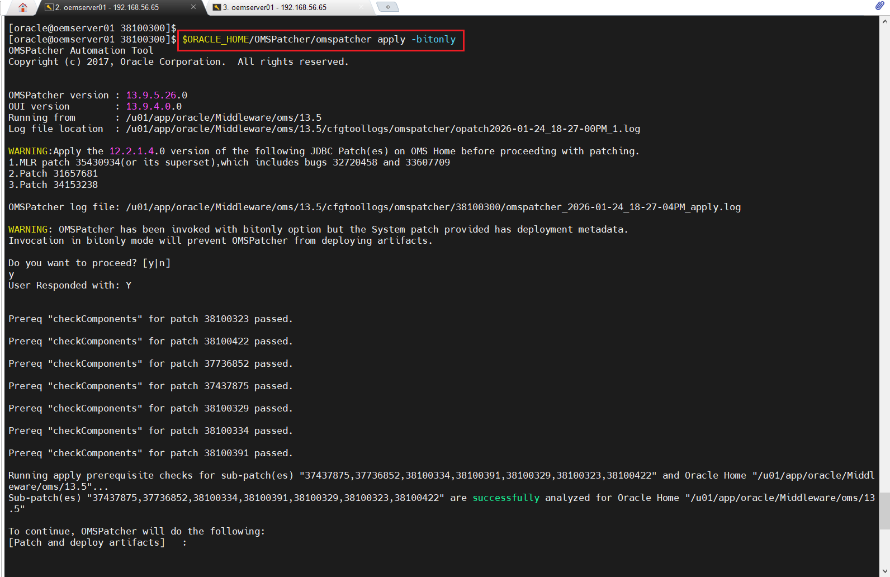
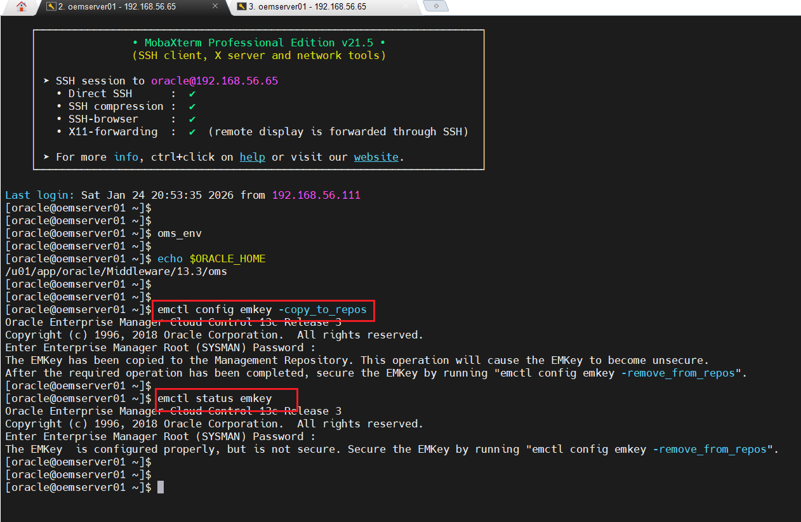
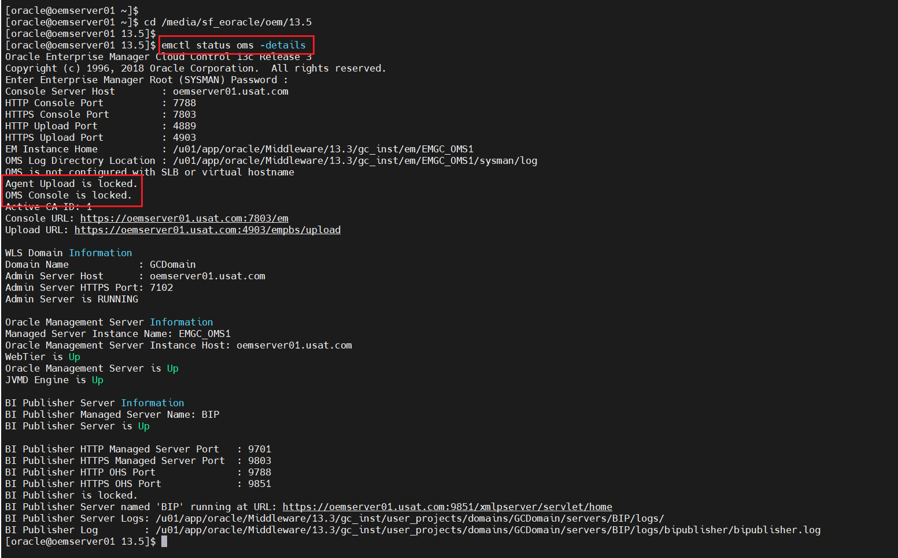
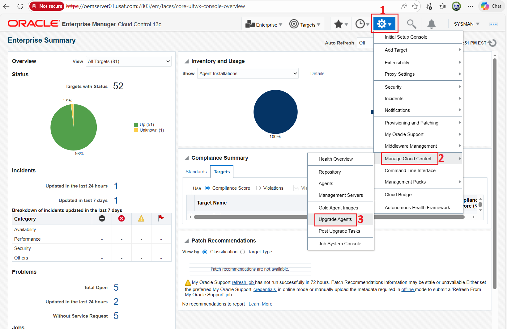
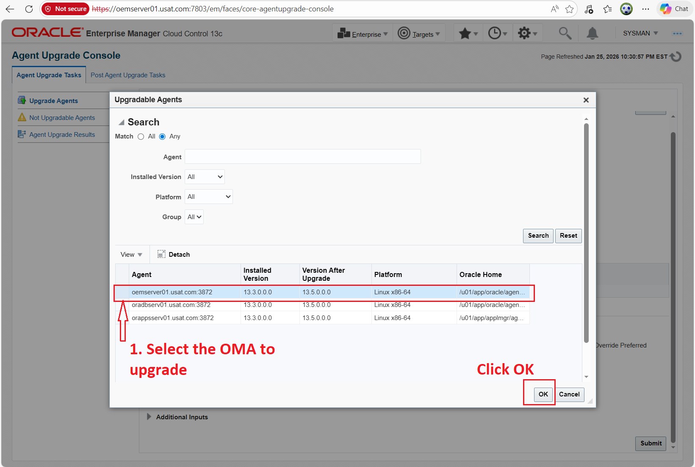
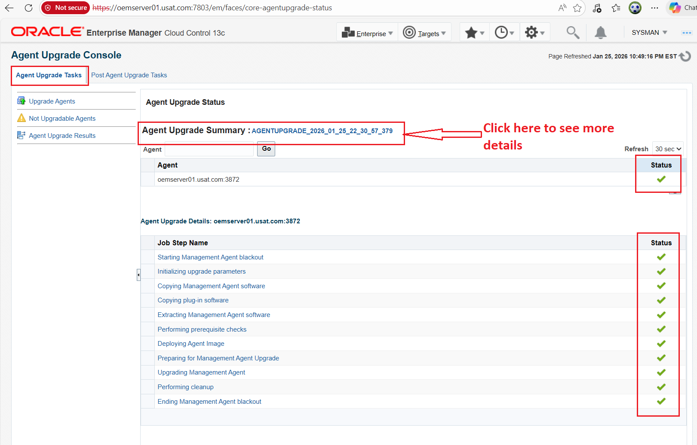
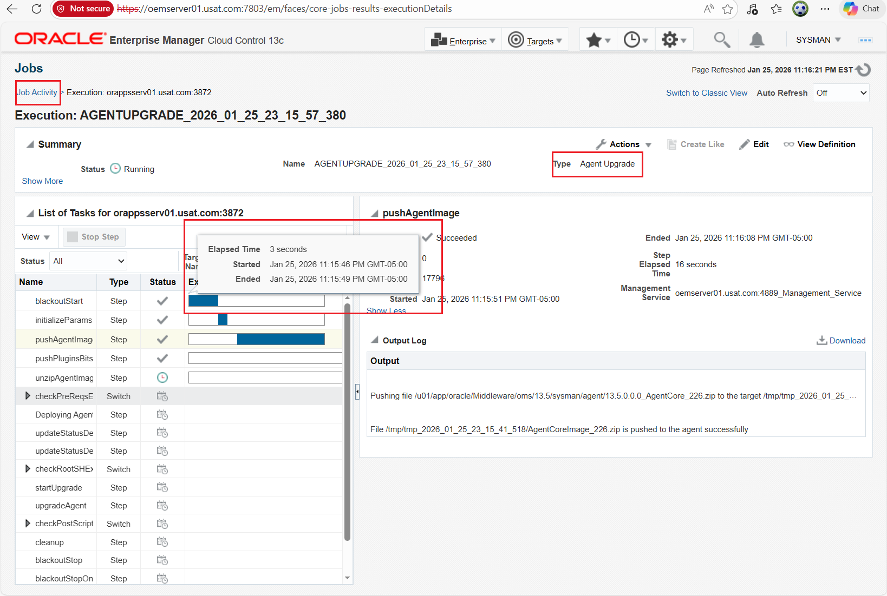
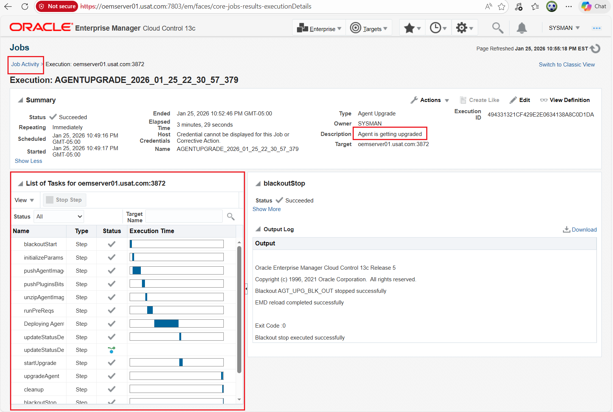
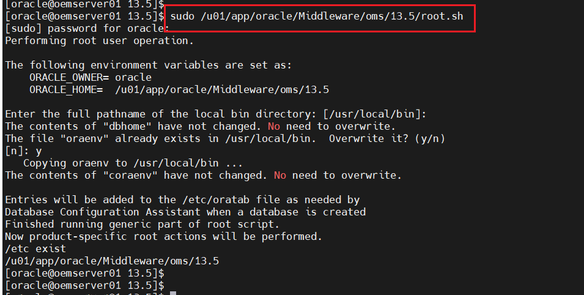

# Upgrading OEM OMR Database from 12c to 19c in EBS HA/DR POC

## Overview

This guide demonstrates upgrading Oracle Enterprise Manager (OEM) Oracle Management Service (OMS) from 13.3 to 13.5. This highlights patching for security (e.g., OAuth fixes per MOS Doc ID 2998693.1 and supports move from OAM to IDCS for secure cloud identity, addressing auth vulnerabilities like token exposure).
Security Reason: Oracle recommends 13.5 for Holistic Patching (streamlined CPU application), enhanced DBSAT compliance for PDB/RAC, and fixes for OAuth/IDCS integration – reducing risks in hybrid/cloud setups (per MOS 2998693.1 and 13.5 RU notes).
(Reference: Oracle EM Upgrade Guide; MOS for RUs.)


## Best Practices & Security

 - Downtime: Software-only minimizes (upgrade binaries offline).
 - Automation: Silent responses; script backups/pre-checks.
 - Security: Apply latest CPU via Holistic Patching (13.5+); enable IDCS OAuth for secure auth.
 - Tuning: Monitor post-upgrade AWR; tune dirty_ratio for disk caching.
 - Testing: Rediscover EBS targets; simulate monitoring.

## Prerequisites:

 - Certified DB: Upgraded to 19c (certified).
 - Agents: Upgrade to 13.5-compatible (use Agent Upgrade Console).
 - Backup: emctl exportconfig oms; full file system backup.
 - Download: 13.5 software (p32646422_13500_Linux-x86-64.zip); latest RU (e.g., 13.5.0.28).
 - SSL: If enabled, use ENABLE_SSL=true.
 - Pre-Checks: Run EM Prerequisite Kit: *./em13500_linux64.bin EMPREREQ_KIT=true*.
 

## Prepare the OEM Server


1. Downloading the files
   ---------------------
   
   Download the all shiphome zips files, for each platform there are 5 files example as shown below to a staging directory of your choice.
	
	
	- V1007079-01(V1007079-01.zip)	
	- V1007080-01(V1007080-01.zip)
	- V1007081-01(V1007081-01.zip)
	- V1007082-01(V1007082-01.zip)
	- V1007083-01(V1007083-01.zip)			


2. The downloaded files are compressed with the zip format. Use any unzip tool to uncompress the file, or download a utility from eDelivery http://updates.oracle.com/unzips/unzips.html. This will generate the compressed zip files.


	```bash
	cd /staging_area

	unzip V1007079-01.zip
	unzip V1007080-01.zip
	unzip V1007081-01.zip
	unzip V1007082-01.zip
	unzip V1007083-01.zip

	```


3. Server (system) Pre-Checks: To check the local server's OS packages, kernel parameters, and hardware (RAM/Swap) before you even touch a database 
   Run EM Prereqchecker: *./em13500_linux64.bin -prereqchecker*.


	```bash
	
	cd /media/sf_eoracle/oem/13.5
	
	./em13500_linux64.bin -silent -prereqchecker -entryPoint oracle.sysman.top.oms_Core -J-Djava.io.tmpdir=/media/sf_eoracle/oem/13.5/prerequisites/log
	
	```

	```bash

	# Sample log output
	
	Launcher log file is /tmp/OraInstall2026-01-19_04-46-09PM/launcher2026-01-19_04-46-09PM.log.
	Extracting the installer . . . . . . . . . . . . . . . . . . . . . . . . . . . . . . . . . . . . . . . . . . . . . . . . . . Done
	Checking swap space: must be greater than 512 MB.   Actual 16382 MB    Passed
	Checking if this platform requires a 64-bit JVM.   Actual 64    Passed (64-bit not required)
	Preparing to launch the Oracle Universal Installer from /tmp/OraInstall2026-01-19_04-46-09PM
	Oracle Prerequisite Checker Version 13.9.4.0.0 Production
	Copyright (C) 1999, 2021, Oracle. All rights reserved.
	
	Starting execution of prerequisite checks
	Total No of checks: 13
	
	Performing check for CertifiedVersions
	
	------
	------
	------ ++++++++++ For brevity Log entries have been removed.
	------
	------
	------
	------
	
	Check complete: Passed
	========================================================
	PrereqChecks complete
	
	
	The log(s) can be found here: /tmp/OraInstall2026-01-19_04-46-09PM.
	
	```

	
	


4. Perform Software Only with Plug-ins in Silent Mode


  - Extract and edit the Response file.
  
	```bash
	
	cd /media/sf_eoracle/oem/13.5
	
	./em13500_linux64.bin -getResponseFileTemplates -outputLoc /media/sf_eoracle/oem/13.5/responsefile
  
	```
	
	
	
  
  - Edit the *softwareOnlyWithPlugins_upgrade.rsp* file
  
	```bash
	cd /media/sf_eoracle/oem/13.5/responsefile
	vi softwareOnlyWithPlugins_install.rsp
	
	# Inputs sample softwareOnlyWithPlugins_install.rsp
	
	STAGE_LOCATION=/media/sf_eoracle/oem/13.5
	ORACLE_MIDDLEWARE_HOME_LOCATION=/u01/app/oracle/Middleware/oms/13.5
	AGENT_BASE_DIR=/u01/app/oracle/Middleware/agent/13.5
	ORACLE_HOSTNAME=oemserver01.usat.com
	CONFIGURATION_TYPE=LATER
	```
 
 
  - Unset CLASSPATH. Will set it later:
 
	```bash
	cd /media/sf_eoracle/oem/13.5/
	echo $CLASSPATH 
	export CLASSPATH=
	echo $CLASSPATH
	```

	

	
	
  - Execute the software-only installation. 
	
	```bash
		
	cd /media/sf_eoracle/oem/13.5
	
	./em13500_linux64.bin -silent -responseFile /media/sf_eoracle/oem/13.5/responsefile/softwareOnlyWithPlugins_upgrade.rsp \
	-J-Djava.io.tmpdir=/media/sf_eoracle/oem/13.5/log
		
	```

	```bash
	
	Run the allroot.sh Script
	
	sudo /u01/app/oracle/Middleware/oms/13.5/allroot.sh
	```


5. Updating OMSPatcher and applying the latest OMS patch to the new OMS_HOME

	```bash
    export ORACLE_HOME=/u01/app/oracle/Middleware/oms/13.5
	export OMS_HOME=$ORACLE_HOME
	export PATH=$PATH:$ORACLE_HOME/bin:$ORACLE_HOME/OMSPatcher:$ORACLE_HOME/OPatch
	export CLASSPATH=
	echo $CLASSPATH
	
	# -- Upgrading OMSPatcher
	
	# -1- Verify
	
	# We need omspatcher 13.9.5.26.0. p38100300_135000_Generic.zip
	
	/u01/app/oracle/Middleware/oms/13.5/OMSPatcher/omspatcher version
	
	# OMSPatcher Version: 13.9.4.4.0
	# OPlan Version: 12.2.0.1.16
	# OsysModel build: Tue Apr 28 18:16:31 PDT 2020
	# 
	# OMSPatcher succeeded.
	
	# -2- Backup
	
	 mv /u01/app/oracle/Middleware/oms/13.5/OMSPatcher /u01/app/oracle/Middleware/oms/13.5/OMSPatcher_old
	
	# -3- Update
	
	cd /media/sf_foracle/oem/13.5
	
	unzip /media/sf_foracle/oem/13.5/p19999993_135000_Generic_v13.9.5.26.zip -d \
	/u01/app/oracle/Middleware/oms/13.5
	
	# -4- Post Update verification
	
	/u01/app/oracle/Middleware/oms/13.5/OMSPatcher/omspatcher version
	
	# OMSPatcher Version: 13.9.5.26.0
	# OPlan Version: 12.2.0.1.16
	# OsysModel build: Tue Apr 28 18:16:31 PDT 2020
	# 
	# OMSPatcher succeeded.

	
	# -5- Apply new Patch to the installed OEM 13.5 Software.
	
	
	cd /media/sf_eoracle/Patch/oem/oms/holistic_Patch_5_Update_28/
	
	unzip p38100300_135000_Generic.zip
	
	
	cd 38100300/
	
	$ORACLE_HOME/OMSPatcher/omspatcher apply -analyze -bitonly
	
	
	$ORACLE_HOME/OMSPatcher/omspatcher apply -bitonly
	
	```
	
	Sample output
	
	
	
	
	
	
	```bash
	$ORACLE_HOME/OMSPatcher/omspatcher apply -bitonly
	OMSPatcher Automation Tool
	Copyright (c) 2017, Oracle Corporation.  All rights reserved.
	
	
	OMSPatcher version : 13.9.5.26.0
	OUI version        : 13.9.4.0.0
	Running from       : /u01/app/oracle/Middleware/oms/13.5
	Log file location  : /u01/app/oracle/Middleware/oms/13.5/cfgtoollogs/omspatcher/opatch2026-01-24_18-27-00PM_1.log
	
	WARNING:Apply the 12.2.1.4.0 version of the following JDBC Patch(es) on OMS Home before proceeding with patching.
	1.MLR patch 35430934(or its superset),which includes bugs 32720458 and 33607709
	2.Patch 31657681
	3.Patch 34153238
	
	OMSPatcher log file: /u01/app/oracle/Middleware/oms/13.5/cfgtoollogs/omspatcher/38100300/omspatcher_2026-01-24_18-27-04PM_apply.log
	
	WARNING: OMSPatcher has been invoked with bitonly option but the System patch provided has deployment metadata.
	Invocation in bitonly mode will prevent OMSPatcher from deploying artifacts.
	
	Do you want to proceed? [y|n]
	y
	User Responded with: Y
	
	
	Prereq "checkComponents" for patch 38100323 passed.
	
	Prereq "checkComponents" for patch 38100422 passed.
	
	Prereq "checkComponents" for patch 37736852 passed.
	
	Prereq "checkComponents" for patch 37437875 passed.
	
	Prereq "checkComponents" for patch 38100329 passed.
	
	Prereq "checkComponents" for patch 38100334 passed.
	
	Prereq "checkComponents" for patch 38100391 passed.
	
	Running apply prerequisite checks for sub-patch(es) "37437875,37736852,38100334,38100391,38100329,38100323,38100422" and Oracle Home "/u01/app/oracle/Middleware/oms/13.5"...
	Sub-patch(es) "37437875,37736852,38100334,38100391,38100329,38100323,38100422" are successfully analyzed for Oracle Home "/u01/app/oracle/Middleware/oms/13.5"
	
	To continue, OMSPatcher will do the following:
	[Patch and deploy artifacts]   :
	
	
	Do you want to proceed? [y|n]
	y
	User Responded with: Y
	
	Applying sub-patch(es) "37437875,37736852,38100323,38100329,38100334,38100391,38100422"
	Please monitor log file: /u01/app/oracle/Middleware/oms/13.5/cfgtoollogs/opatch/opatch2026-01-24_18-27-05PM_1.log
	
	
	Complete Summary
	================
	
	
	All log file names referenced below can be accessed from the directory "/u01/app/oracle/Middleware/oms/13.5/cfgtoollogs/omspatcher/2026-01-24_18-27-00PM_SystemPatch_38100300_1"
	
	Patching summary:
	-----------------
	
	Binaries of the following sub-patch(es) have been applied successfully:
	
							Featureset                                                      Sub-patches                                                                                           Log file
							----------                                                      -----------                                                                                           --------
	oracle.sysman.top.oms_13.5.0.0.0   37437875,37736852,38100323,38100329,38100334,38100391,38100422   37437875,37736852,38100323,38100329,38100334,38100391,38100422_opatch2026-01-24_18-27-05PM_1.log
	
	
	The following sub-patches are not needed by any component installed in the OMS system:
	38100387,34430509,36752930,35854914,38100376,36329046,38100397,36752891
	
	
	
	--------------------------------------------------------------------------------
	The following warnings have occurred during OPatch execution:
	1) Apply the 12.2.1.4.0 version of the following JDBC Patch(es) on OMS Home before proceeding with patching.
	1.MLR patch 35430934(or its superset),which includes bugs 32720458 and 33607709
	2.Patch 31657681
	3.Patch 34153238
	
	2)  OMSPatcher has been invoked with bitonly option but the System patch provided has deployment metadata.
	Invocation in bitonly mode will prevent OMSPatcher from deploying artifacts.
	--------------------------------------------------------------------------------
	Log file location: /u01/app/oracle/Middleware/oms/13.5/cfgtoollogs/omspatcher/38100300/omspatcher_2026-01-24_18-27-04PM_apply.log
	
	OMSPatcher succeeded.
	```
	
	
	
	
	Perform the verification
	
	
	
	```bash
	
	omspatcher lspatches
	
	```
	
6. Execute PrereqChecks for Upgrades: Each database environment is very unique. Therefore you as the DBA is responsible for making sure that all prerequisite checks are successfully met for the environment.

 - I found these documents very helpful is performing my Prerequisite checks before Configuring OMS.
  
   *13.5: Checklist for Upgrading Enterprise Manager Cloud Control from Version 13.3/13.4 to 13.5(Doc ID 2761728.1)*
   *Doc ID 2761728.1 Oracle recently resigned  their website so this doc might not be found that easily.*
     
   Prerequisites for Upgrading to Enterprise Manager Cloud Control 13c Release 5:
   *https://docs.oracle.com/en/enterprise-manager/cloud-control/enterprise-manager-cloud-control/13.5/emupg/prerequisites-upgrading-enterprise-manager-cloud-control-13c-release.html#GUID-F6CFDFAD-D742-4644-A11A-4CBB5A6E8338*

	
 - For Upgrades: Using EMPREREQ_KIT=true
   This is the modern method for OEM 13.5 and 24c. It triggers a specific logic that validates the existing repository database and the middleware environment.


 - Executing the *em13500_linux64.bin EMPREREQ_KIT=true* file 

	```bash
	 cd /media/sf_eoracle/oem/13.5

	 ./em13500_linux64.bin EMPREREQ_KIT=true -silent -J-Djava.io.tmpdir=/media/sf_eoracle/oem/13.5/log \
	 -responseFile /media/sf_eoracle/oem/13.5/responsefile/emprereqkit_upgrade.rsp
	```  
	
	1st run showed issues that needed fixing.
 
	
	
	```bash
	
	# ---- Sample Check fixes for my environment
	
	Disabling triggers
	
	SQL> SELECT COUNT (trigger_name) FROM sys.dba_triggers WHERE TRIGGERING_EVENT LIKE 'LOGON%' AND status='ENABLED';
	
	COUNT(TRIGGER_NAME)
	-------------------
					0
	
	SQL>
	SQL> SELECT trigger_name FROM sys.dba_triggers WHERE TRIGGERING_EVENT LIKE 'LOGON%' AND status='ENABLED';
	
	no rows selected
	
	SQL>
	SQL>
	SQL> SELECT COUNT (trigger_name) FROM sys.dba_triggers WHERE TRIGGERING_EVENT LIKE 'LOGOFF%' AND status='ENABLED';
	
	COUNT(TRIGGER_NAME)
	-------------------
					1
	
	SQL> SELECT owner, trigger_name FROM sys.dba_triggers WHERE TRIGGERING_EVENT LIKE 'LOGOFF%' AND status='ENABLED';
	
	OWNER                     TRIGGER_NAME
	-------------------       --------------
	GSMADMIN_INTERNAL         GSMLOGOFF
	
		
	SQL> alter trigger GSMADMIN_INTERNAL.GSMLOGOFF disable;
	
	Trigger altered.
	
	SQL>
	SQL> SELECT trigger_name FROM sys.dba_triggers WHERE TRIGGERING_EVENT LIKE 'LOGOFF%' AND status='ENABLED';
	
	no rows selected
	

	# ---- Backup Spfile
	
	SQL> create pfile='init.ora_20260120.bak' from spfile;
	
	
	# --- Make the necessary changes
	
	
	SQL> alter system set "job_queue_processes"=0 scope=both sid='*';
	SQL> grant execute on DBMS_RANDOM to DBSNMP;
	SQL> alter system set "_allow_insert_with_update_check"=TRUE scope=both sid='*';
	SQL> alter system set parallel_max_servers=30 scope=both  sid='*';
	
	
		
	For improved SQL performance all the adaptive features parameters should be unsetprior to the upgrade:
	Connect to the database as SYSDBA and run the following commands:
	
	alter system reset "_optimizer_nlj_hj_adaptive_join" scope=both sid='*';
	alter system reset "_optimizer_strans_adaptive_pruning" scope=both sid='*';
	alter system reset "_px_adaptive_dist_method" scope=both sid='*';
	alter system reset "_sql_plan_directive_mgmt_control" scope=both sid='*';
	alter system reset "_optimizer_dsdir_usage_control" scope=both sid='*';
	alter system reset "_optimizer_use_feedback" scope=both sid='*';
	alter system reset "_optimizer_gather_feedback" scope=both sid='*';
	alter system reset "_optimizer_performance_feedback" scope=both sid='*';

	```

7.	Prior to upgrade, the EM KEY must be copied into the repository: 
	EMKEY Copy Requirements
 
 
	```bash
	
	/u01/app/oracle/Middleware/13.3/oms/bin/emctl config emkey -copy_to_repos -sysman_pwd xxxxxxxx
	
	
	/u01/app/oracle/Middleware/13.3/oms/bin/emctl status emkey
	
	```
	
	


8. Upgrade: Configuring the install 13.5 Software in Silent Mode.

 - Edit the *upgrade.rsp*. This file was generated in the beginning *getResponseFileTemplates*

	```bash
	
	# --- Sample upgrade.rsp entries
	
	UNIX_GROUP_NAME=oinstall
	INVENTORY_LOCATION=/app/oracle/oraInventory
	INSTALL_UPDATES_SELECTION=skip
	STAGE_LOCATION=/media/sf_eoracle/oem/13.5
	ORACLE_MIDDLEWARE_HOME_LOCATION=/u01/app/oracle/Middleware/oms/13.5
	ORACLE_INSTANCE_HOME_LOCATION=/u01/app/oracle/product/19.3.0/db_1
	OLD_BASE_DIR=/u01/app/oracle/Middleware/13.3/oms
	ORACLE_HOSTNAME=oemserver01.usat.com
	ONE_SYSTEM=true
	AGENT_BASE_DIR=/u01/app/oracle/Middleware/agent/13.5
	logLoc=/media/sf_eoracle/oem/13.5/log
	OLD_DATABASE_SYSMAN_PASSWORD=xxxxx
	WLS_ADMIN_SERVER_USERNAME=weblogic
	WLS_ADMIN_SERVER_PASSWORD=xxxxxxxx
	WLS_ADMIN_SERVER_CONFIRM_PASSWORD=xxxxxx
	NODE_MANAGER_PASSWORD=xxxxxxxx
	NODE_MANAGER_CONFIRM_PASSWORD=xxxxxx
	WLS_ADMIN_SERVER_PASSWORD=xxxxxx
	DATABASE_HOSTNAME=oemserver01.usat.com
	LISTENER_PORT=1521
	SERVICENAME_OR_SID=oemcdb
	SYS_PASSWORD=sys
	SYSMAN_PASSWORD=xxxxxx
	EMPREREQ_AUTO_CORRECTION=true
	REPOSITORY_BACKUP_DONE=true
	b_upgrade=true
	EM_INSTALL_TYPE=NOSEED
	```

  - Stop the OMS, and AGENT
	Make sure you have a SUCCESSFUL Backup in place.
    
 
	```bash
		
	# --- Shut down the 13.3 OMS that you are about to upgrade
	
	/u01/app/oracle/Middleware/13.3/oms/bin/emctl stop oms -all
	
	3 --- Stop the Agent
	
	/u01/app/oracle/agent/agent_13.3.0.0.0/bin/emctl stop agent 
	

	```
	
	OMS Status prior to the upgrade showing a smoothly running 13.3 OMS.
	
	
	
	
	OMS Status confirming that the OMS and OMA 13.3 is stopped.
	
	
	

 - Execute the *ConfigureGC.sh* script to start the upgrade and configure the OMS
 
 
	
	
	
	```bash
	
	cd /media/sf_eoracle/oem/13.5
	
	export ORACLE_HOME=/u01/app/oracle/Middleware/oms/13.5
	export OMS_HOME=$ORACLE_HOME
	export PATH=$PATH:$ORACLE_HOME/bin:$ORACLE_HOME/OMSPatcher:$ORACLE_HOME/OPatch
	export CLASSPATH=
	echo $CLASSPATH

	/u01/app/oracle/Middleware/oms/13.5/sysman/install/ConfigureGC.sh -silent -responseFile /media/sf_eoracle/oem/13.5/responsefile/upgrade.rsp \
	-J-Djava.io.tmpdir=/media/sf_eoracle/oem/13.5/log

	```
	
	End of the upgrade showing that it completed successfully.
	
	
	
		
	Console showing that we have a SUCCESSFUL UPGRADE!
	
	
	
	
  - Execute the *root.sh* script
  
	
	
	```bash
	
	sudo /u01/app/oracle/Middleware/oms/13.5/root.sh
	
	```
	
9.	Post Upgrade:
	

  - Upgradge Agents from the NEW 13.5 console

	```bash
	mkdir -p /u01/app/oracle/Middleware/agent/13_5
	```
	
	
	
	
	
	
	
	
	
	
	
	It didn't like my 13.5 directory so I created a 13_5

	Rules for creating the OMA *Directory path*
	
	```bash
	Error: Wrong Input
	Check for the following reasons.. 
	1.Directory path length should not exceed 50 characters . 
	2.Base Directory value should not contain special characters other than slashes,minus,underscore and colon. 
	3.Base Directory first word character should not be a number.
	Specify the new agent base directory for upgrade. Example: /u01/app/agent or c:/john/agent
	```
	
	
	

	*Agent Upgrade Notification*
	
	
	
	
	Monitor job *Agent Upgrade Console*
	
	
	
	
	Monitor job progress details: You can click on the *Agent Upgrade Summary* to view more indept details about the job.
	
	
	
	
	
	Agent Upgrade Summary job completion details
	
	

     
	
	
  - Execute root.sh script
	
	
	
	```bash
	sudo /u01/app/oracle/Middleware/agent/13_5/agent_13.5.0.0.0/root.sh
	```

  - Clean up


	
	
	
	
	
  - Remove EMKEY from repos
	
	
	
	```bash
	"emctl config emkey -remove_from_repos".
	```
	
  - Rest spfile values that you changed prior in the spfile 


	```bash
	
	sqlplus / as sysdba
	
	alter system set "job_queue_processes"=80 scope=both sid='*';
	revoke execute on DBMS_RANDOM to DBSNMP;
	alter system set parallel_max_servers=120 scope=both  sid='*';
	alter system set parallel_min_servers=2 scope=both  sid='*';
	
	# --- Before values:
	
	job_queue_processes                  integer     80
	parallel_max_servers                 integer     120
	parallel_min_servers                 integer     2
	
	```


Enjoy your new OEM 13.5!


