# Upgrading OEM OMR Database from 12c to 19c in EBS HA/DR POC

## Overview
This guide demonstrates upgrading the Oracle Management Repository (OMR) database from 12c (e.g., 12.1.0.2) to 19c using AutoUpgrade. I acknowledge that there are old ways of accomplishing this task. 
– Oracle's recommended tool for efficiency, automation, and minimal downtime. This showcases best practices for DB maintenance in OEM environments integrated with EBS 12c single-instance backends.

**Why Upgrade?** 19c offers long-term support (Premier until 2027, Extended to 2031), enhanced security (e.g., TDE, better auditing), performance (e.g., Automatic Indexing), and compatibility with OEM 13.5+.

(Reference: Oracle Doc: Using AutoUpgrade for Oracle Database Upgrades; MOS Doc ID 555.1 for 19c patches.)

## Prerequisites
1. Backup: 
	- RMAN full backup of 12c DB (e.g., `rman target /` → `backup database plus archivelog;`).
	- Take a snapshot of all the server after all applications have been shutdown. (Fastest restore and least headache)
2. Download: AutoUpgrade JAR (latest from MOS Doc ID 2485457.1); 19c software (p33446294_190000_Linux-x86-64.zip).  
3. OS Checks: OL7/8 certified; HugePages tuned (vm.dirty_ratio=20, vm.dirty_background_ratio=3 per best practices for caching).  
4. Pre-Upgrade: Run preupgrade.jar (from 19c home): `java -jar $ORACLE_HOME/rdbms/admin/preupgrade.jar`. Fix issues (e.g., invalid objects).  
5. Space: 10-15 GB free in /tmp; DB >20% free space.  
6. Params: Set PROCESSES=300, SGA_TARGET=4GB+ (tune via AWR).  
7. Patches: Apply latest 19c RU (e.g., 19.21 as of 2024 per MOS 555.1).  

 

## Step-by-Step Upgrade Using AutoUpgrade

1.	Prepare the OMS server. Download and execute oracle-database-preinstall-19c.
	The Oracle Database Preinstallation RPM, oracle-database-preinstall-19c, automatically installs all required packages and also performs other system configuration..

	```bash
	sudo yum install oracle-database-preinstall-19c -y
	```
	Or
	```bash
	rpm -ivh oracle-database-preinstall-19c-1.0-3.el7.x86_64.rpm
	```
	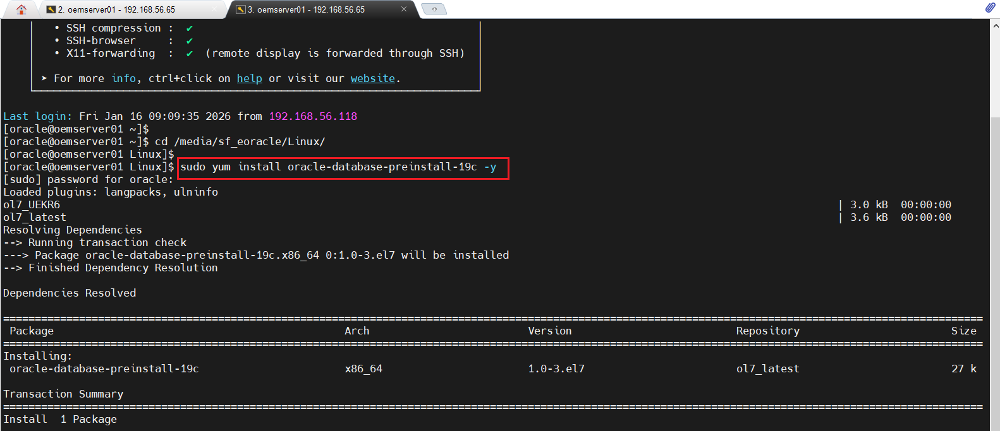
	
	
2. 	As the Oracle OS user, install 19c Software (Silent): 
	- Unzip to new home (e.g., */u01/app/oracle/product/19.3.0/db_1*).
	- Copy the responseFile *db_install.rsp* from $ORACLE_HOME/install/response to the staging directory
	- Edit the file. Filling out the values for the install.
	- Upgrade the OPatch to the latest version
	- Run: *./runInstaller -silent -responseFile /path/to/db_install.rsp*. 
    - Note: I am installing the 19c Software-only and applying the patches at the same time. Cool!	

	```bash
	mkdir -p /u01/app/oracle/product/19.3.0/db_1
	unzip -p /u01/app/oracle/staging/db/LINUX.X64_193000_db_home.zip -d /u01/app/oracle/product/19.3.0/db_1
	
	export ORACLE_BASE=/u01/app/oracle
	export ORACLE_HOME=$ORACLE_BASE/product/19.3.0/db_1
	export PATH=$PATH:$ORACLE_HOME/bin:$ORACLE_HOME/OPatch
	
	cp $ORACLE_HOME/install/response/db_install.rsp /media/sf_eoracle/19c/db_install.rsp
	
	vi /media/sf_eoracle/19c/db_install.rsp
	
	mv $ORACLE_HOME/OPatch $ORACLE_HOME/OPatch.old

	unzip-q /media/sf_eoracle/Patch/opatch/p6880880_190000_Linux-x86-64v12.2.0.1.37.zip -d $ORACLE_HOME/
	
	$ORACLE_HOME/runInstaller -silent -responseFile /media/sf_eoracle/19c/db_install.rsp -applyRU /media/sf_eoracle/Patch/19c/35037840/35042068  -applyOneOffs /media/sf_eoracle/Patch/19c/35037877,/media/sf_eoracle/Patch/19c/35074478,/media/sf_eoracle/Patch/19c/34340632,/media/sf_eoracle/Patch/19c/34832725,/media/sf_eoracle/Patch/19c/29213893

	
	```
	
   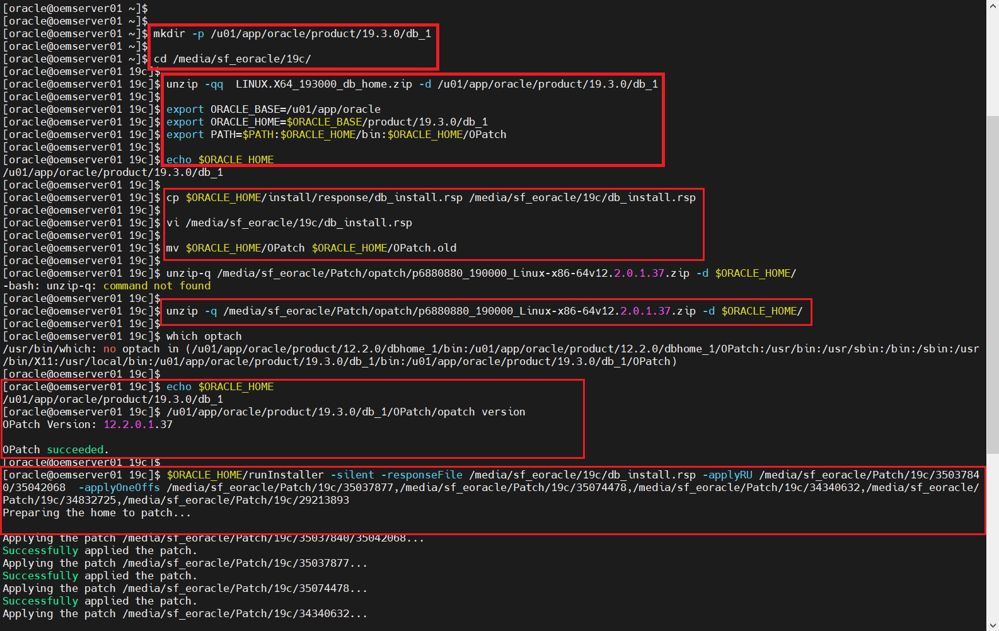 

     
   

3. Patch the OMR 12c Oracle database to the latest Patch level:

	- Download the latest Patch sets and OPatch from Oracle Support to the staging area.
	- Unzip the patches.
	- Backup and Upgrade the 12c OPatch
	- Check for patch conflicts.
	- Check for invalid objects in the database and recompile them. Fix them.
	- Validate the Database registry to make sure all the components are VALID!
	- Stop OMS 
	- Stop the listener
	- Shutdown the 12c Oracle Management Repository Database
	- Backup the OMR 12c Oracle database $ORACLE_HOME
	- Apply the Patches.
	- Verify and perform any Post patch steps.
	
	
	```bash
	
	$ORACLE_HOME/OPatch version
	
	mv $ORACLE_HOME/OPatch $ORACLE_HOME/OPatch.old
	
	unzip -q /media/sf_eoracle/Patch/12c/p6880880_122010_Linux-x86-64v12.2.0.1.40.zip -d $ORACLE_HOME/
	
	$ORACLE_HOME/OPatch version
	
	# Check for patch conflicts.
	$ORACLE_HOME/OPatch/opatch prereq CheckConflictAgainstOHWithDetail -phBaseDir /media/sf_eoracle/Patch/12c/33583921/33678030
    $ORACLE_HOME/OPatch/opatch prereq CheckConflictAgainstOHWithDetail -phBaseDir /media/sf_eoracle/Patch/12c/33583921/33587128
	$ORACLE_HOME/OPatch/opatch prereq CheckConflictAgainstOHWithDetail -phBaseDir /media/sf_eoracle/Patch/12c/33561275
	$ORACLE_HOME/OPatch/opatch prereq CheckConflictAgainstOHWithDetail -phBaseDir /media/sf_eoracle/Patch/12c/35220732
	$ORACLE_HOME/OPatch/opatch prereq CheckConflictAgainstOHWithDetail -phBaseDir /media/sf_eoracle/Patch/12c/35239280
	```
	
	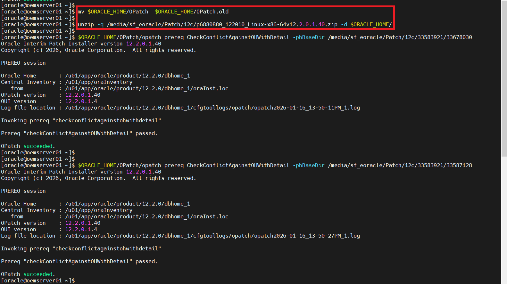
	
	```bash
	
	# Check for invalid objects in the database and recompile them. Fix them.
	
	sqlplus / as sysdba
	
	select owner, object_name, object_type from dba_invalid_objects order by owner, object_type, object_name;

	col comp_name for a40
	col status for a12
	col comp_id for a10
	col version for a10
	select substr(comp_name,1,40) comp_name, substr(comp_id,1,10)  
	comp_id,substr(version,1,12) version,status from dba_registry ;
	```
	
	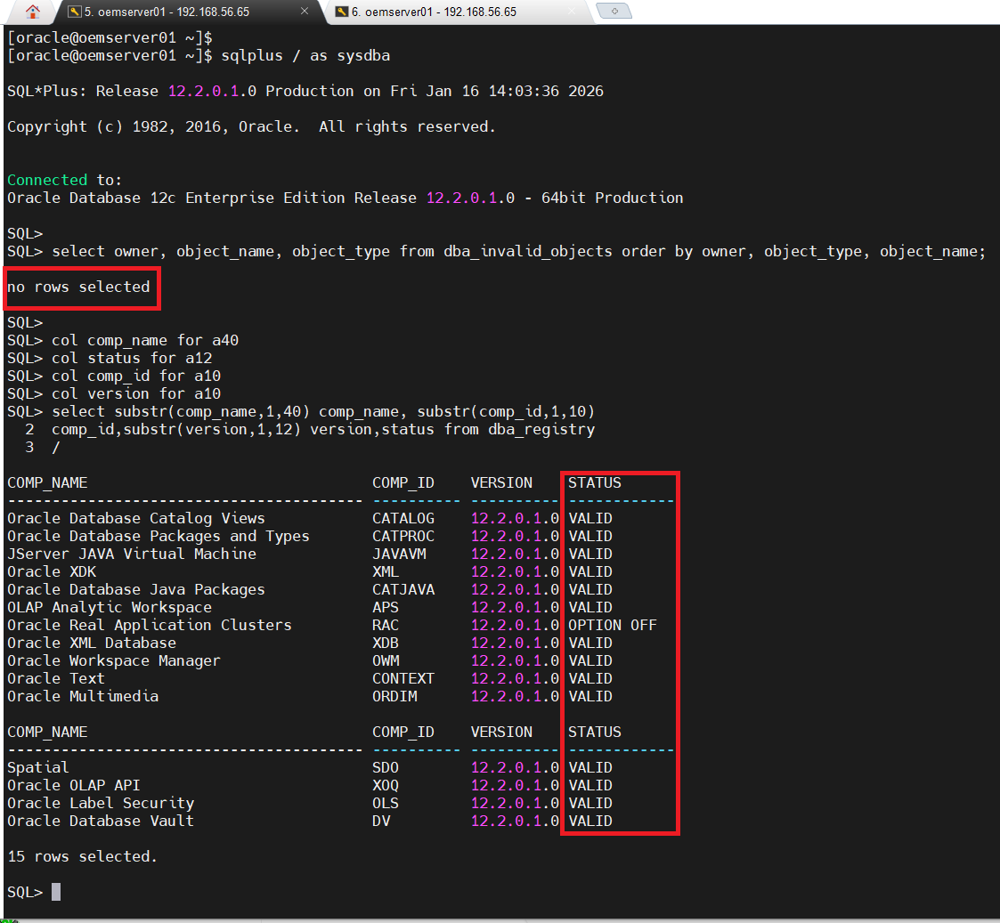
	
	```bash
	# Stop OMS 
	# Stop the listener
	# Shutdown the 12c Oracle Management Repository Database
	# Backup the OMR 12c Oracle database $ORACLE_HOME
	# Apply the Patches.

	emctl status oms
	
	emctl stop oms
	
	lsnrctl stop oemserver01_listener

	sqlplus / as sysdba

	shutdown immediate
	
	exit
	
	# Backup $ORACLE_HOME
	
	tar -zcvf /u01/app/oracle/product/12.2.0/dbhome_1.tar.gz /u01/app/oracle/product/12.2.0/dbhome_1
	
	
	```
		
	


	```bash
	
	cd /media/sf_eoracle/Patch/12c/33583921/33678030
	
	> opatch apply

	# Loading Modified SQL Files into the Database (Single/Multitenant (CDB/PDB) DB)

	sqlplus /nolog
	
	Connect / as sysdba
	startup
	quit
	
	cd $ORACLE_HOME/OPatch
	./datapatch -verbose


	# Not showing every patch application. You can repeat the process as above and apply the remaining patches below:
	
	/media/sf_eoracle/Patch/12c/33583921/33587128
    /media/sf_eoracle/Patch/12c/33561275
	/media/sf_eoracle/Patch/12c/35220732
    /media/sf_eoracle/Patch/12c/35239280

    ```
	
	```bash
	Patch verification:

	opatch lsinventory | grep "Patch  "
	
	sqlplus / as sysdba
	
	select owner, object_name, object_type from dba_invalid_objects order by owner, object_type, object_name;
	
	col comp_name for a40
	col status for a12
	col comp_id for a10
	col version for a10
	select substr(comp_name,1,40) comp_name, substr(comp_id,1,10)  
	comp_id,substr(version,1,12) version,status from dba_registry ;
	
	
	set linesize 300
	col ACTION_TIME for a30
	col status for a12
	select INSTALL_ID,PATCH_ID,PATCH_UID,VERSION,ACTION,STATUS,FLAGS,ACTION_TIME from dba_registry_sqlpatch;
	```


4. Performing the OMR 12c Oracle database upgrade to 19c using AutoUpgrade:  

 - Back Up Oracle Database Before Upgrading
   Since I'm using a VM I just take a snapshot or ask SYSADMIN/Storage to take one for you.
   You can do both RMAN and snapshot. 

	```bash
	rman "target / nocatalog"

	RUN 
	{
    ALLOCATE CHANNEL chan_name TYPE DISK;
    sql 'ALTER SYSTEM ARCHIVE LOG CURRENT';
    BACKUP DATABASE FORMAT '/media/sf_e_oracle/19c/autoupgrade/backup/preupgrd_oemcdb%U' TAG before_upgrade 
    PLUS ARCHIVELOG FORMAT '/media/sf_e_oracle/19c/autoupgrade/backup/preupgrd_oemcdb_arch%U' TAG before_upgrade;
    BACKUP CURRENT CONTROLFILE FORMAT '/media/sf_e_oracle/19c/autoupgrade/backup/preupgrd_oemcdb_ctl%U' TAG before_upgrade;
	}
	```
	
  - As sys execute *dbupgdiag.sql* script. Download the script from My Oracle Support note 556610
	The dbupgdiag.sql script collects diagnostic information about the status of the database, either before or after the upgrade.
	
	```bash
	sqlplus / as sysdba

	sta dbupgdiag.sql
	
	# Examine the output and fix any issues.
	
	```
	
	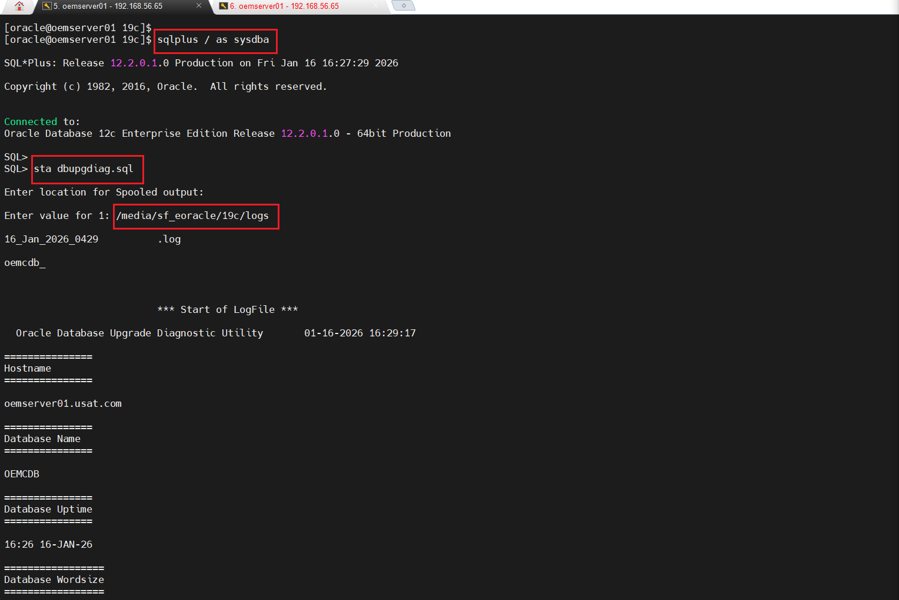 
	
	
 - AutoUpgrade file location: 19c $ORACLE_HOME 
   Oracle recommended to download the latest version: My Oracle Support Document 2485457.1
   The AutoUpgrade Utility is a Java JAR file provided by Oracle that helps to ensure 
   that your upgrade completes successfully.

	```bash
	
	cd 
	 
	# --- Create a sample configuration file that we can use.
	
	  java -jar autoupgrade.jar -create_sample_file 12c_to_19c_autoupgrade_config.cfg
	  
	  ```
	  
	  
	Sample config file for AutoUpgrade:
	
	```Bash
	
	vi  12c_to_19c_autoupgrade_config.cfg

	# This directory will include the following:
	#   (1) AutoUpgrade''s global directory
	#   (2) Any logs, not directly tied to a job
	#   (3) Config files
	#   (4) progress.json and status.json
	global.autoupg_log_dir=/media/sf_eoracle/19c/autoupgrade
  
	 	
	# Database all/pdbs 1 - Full DB/CDB upgrade
	#
	oemcdb.log_dir=/u01/app/oracle/staging/autoupgrade/oemcdb   # Path of the log directory for the upgrade job
	upg1.sid=oemcdb                                                # ORACLE_SID of the source DB/CDB
	upg1.source_home=/u01/app/oracle/product/12.2.0/dbhome_1       # Path of the source ORACLE_HOME
	upg1.target_home=/u01/app/oracle/product/19.3.0/db_1    # Path of the target ORACLE_HOME
	upg1.start_time=NOW                     # Optional. [NOW | +XhYm (X hours, Y minutes after launch) | dd/mm/yyyy hh:mm:ss]
	upg1.upgrade_node=oemserver01.usat.com  # Optional. To find out the name of your node, run the hostname utility. Default is ''localhost''
	upg1.run_utlrp=yes                     # Optional. Whether or not to run utlrp after upgrade
	upg1.timezone_upg=yes                  # Optional. Whether or not to run the timezone upgrade
	upg1.target_version=19                 # Oracle version of the target ORACLE_HOME.  Only required when the target Oracle database version is 12.2
	
	upg1.restoration=no                 # Database is in noarchivelog mode. Default is yes.
	
	# Optional
	
	upg1.dictionary_stats_before=yes
	upg1.dictionary_stats_after=yes
	# upg1.enable_local_undo=yes
	upg1.fixed_stats_before=yes
	upg1.remove_underscore_parameters=yes
	upg1.manage_network_files=ignore_read_only

	```

	
	```bash
	# --- Analyze Mode to analyze the source database:

	  java -jar autoupgrade.jar -config 12c_to_19c_autoupgrade_config.cfg.cfg -mode analyze
	```
	
	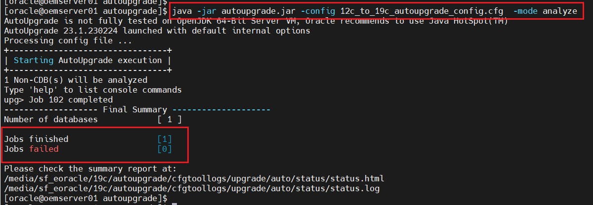 
	
	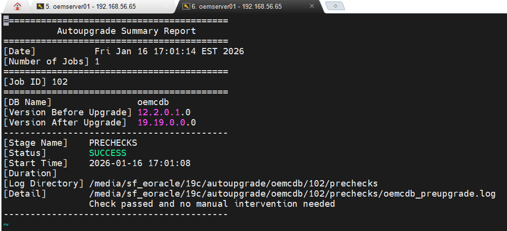
	
	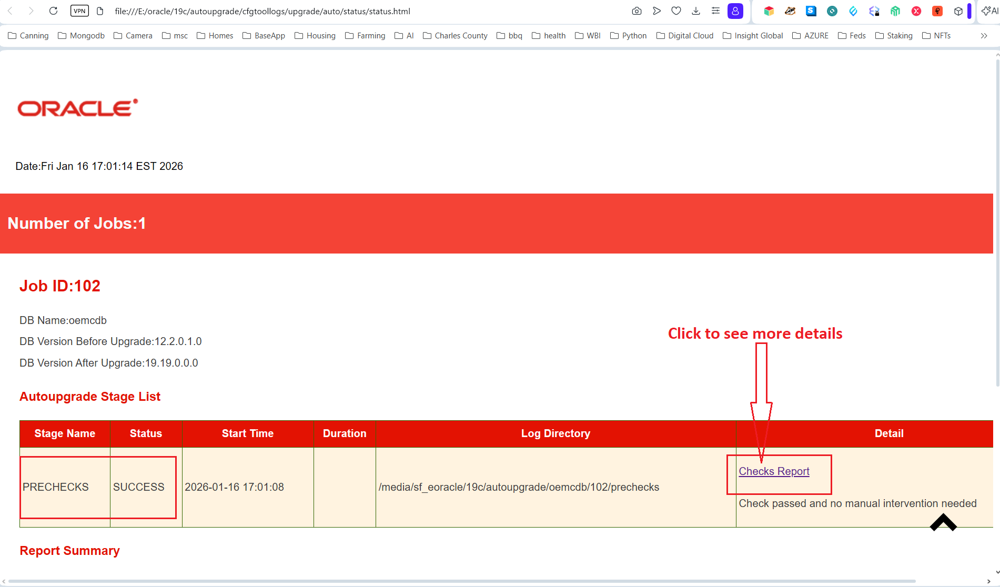
	
	
	```bash
	# --- AutoUpgrade Fixup: Oracle recommends that you run this mode outside of normal business hours.
	# --- I have a few warnings.
	
	  java -jar autoupgrade.jar -config 12c_to_19c_autoupgrade_config.cfg -mode fixups
	  
	```
	
	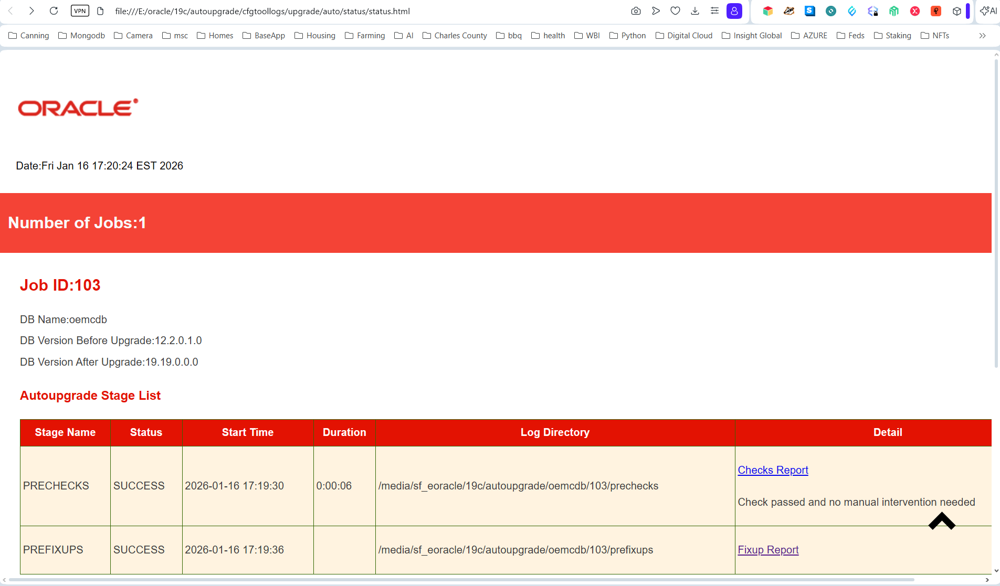
	

	```bash
    # --- Simplifying Upgrades: Deploy and Upgrade Modes
	# --- To start the deployment of the upgrade, enter the following command:

	java -jar autoupgrade.jar -config 12c_to_19c_autoupgrade_config.cfg -mode deploy
 
 	# --- if you want to obtain an overview of the progress, you can entering the command lsj in the console
    #     provides a quick status update on the jobs, such as "in progress" or "finished successfully".
		
	```  	
	
	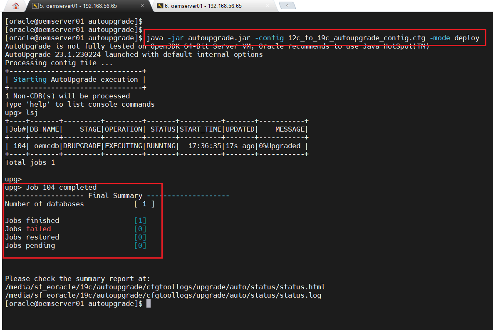
	
	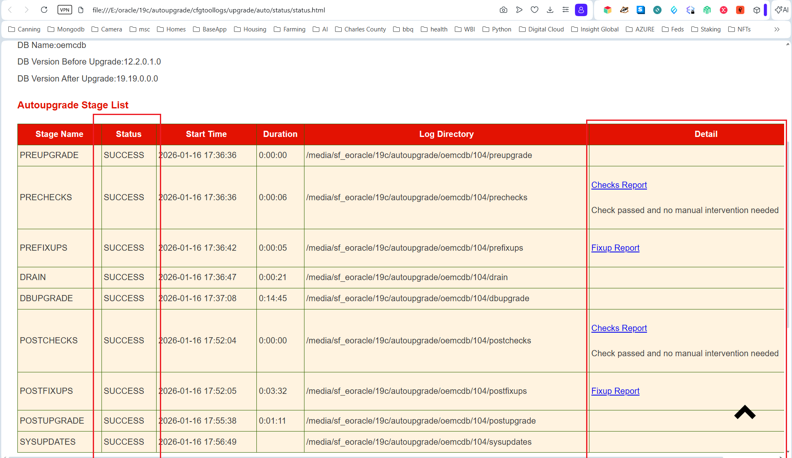 
	
	


5. Upgrade: Shutdown 12c DB. Run: `java -jar autoupgrade.jar -config auto_upgrade.cfg -mode upgrade`.  

  

6. Post-Upgrade: Run utlrp.sql for recompiles; dbupgdiag.sql (MOS 556610.1) for diagnostics. Update COMPATIBLE=19.0.0.  

  

7. Validate: Start DB, check AWR for performance; rediscover in OEM.  

## Best Practices & Security
- Automation: Script the process (e.g., Bash for backups/pre-checks).  
- Tuning: Post-upgrade, enable AMM (MEMORY_TARGET=6GB+); monitor with OEM.  
- Security: Apply 19c security patches (MOS 555.1); enable TDE on sysman schema.  
- Testing: Simulate in POC; rollback via Flashback if issues.  
- Time: ~25-40 mins per your doc (adapt for OEM repo size).

Add screenshots to /screenshots/ and commit.

---

### oem_upgrade/README.md Content (Copy-Paste This)
