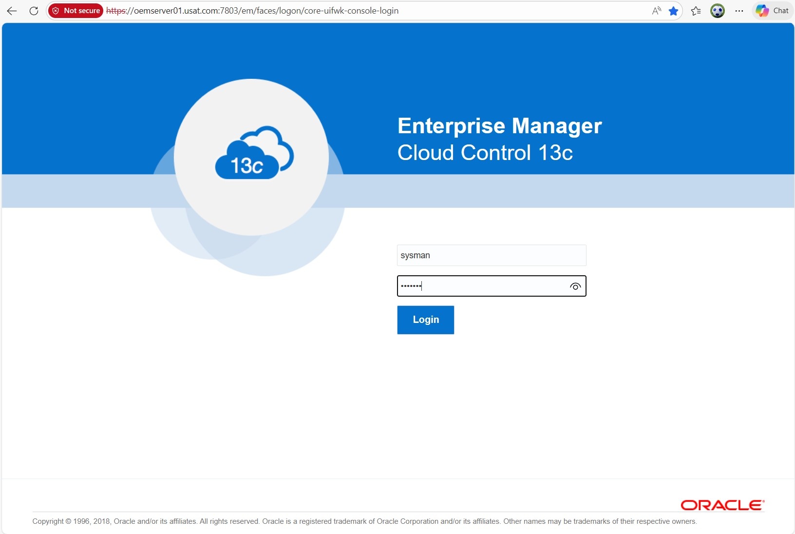
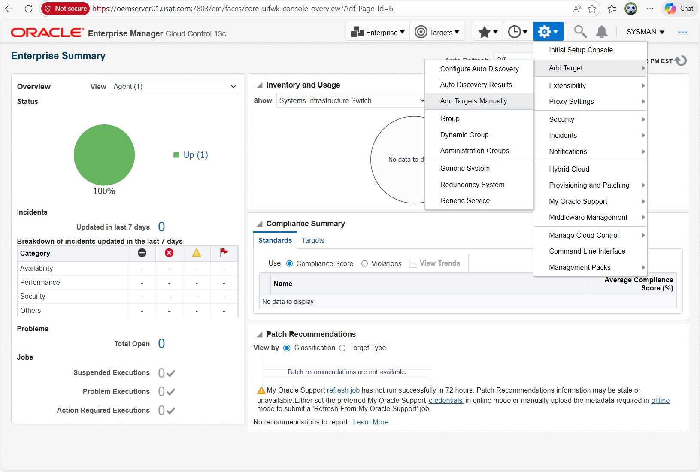
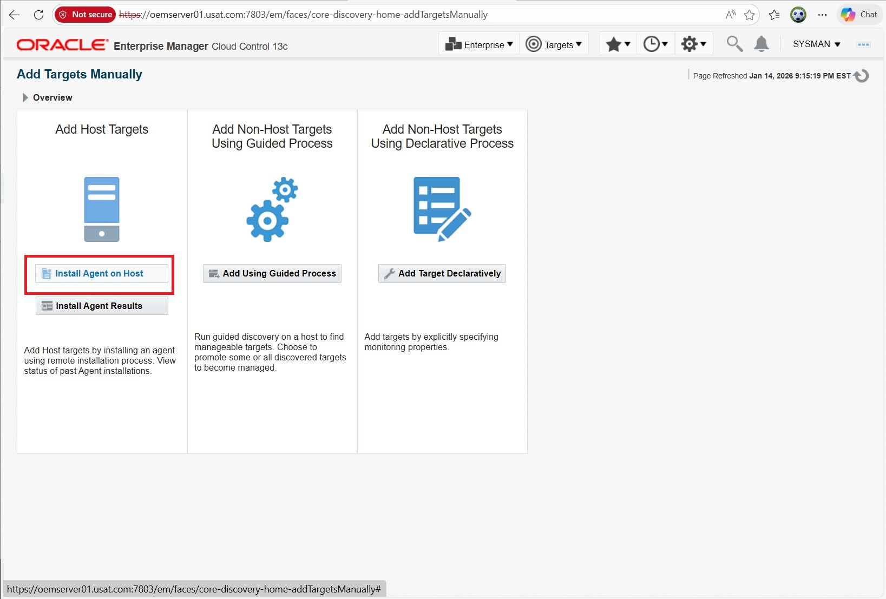
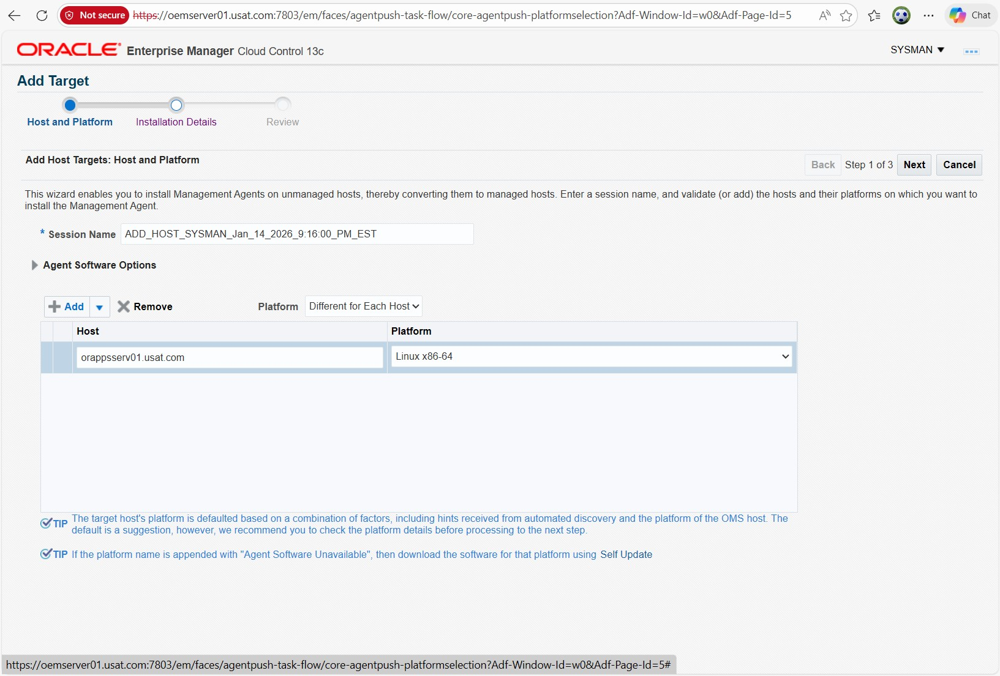
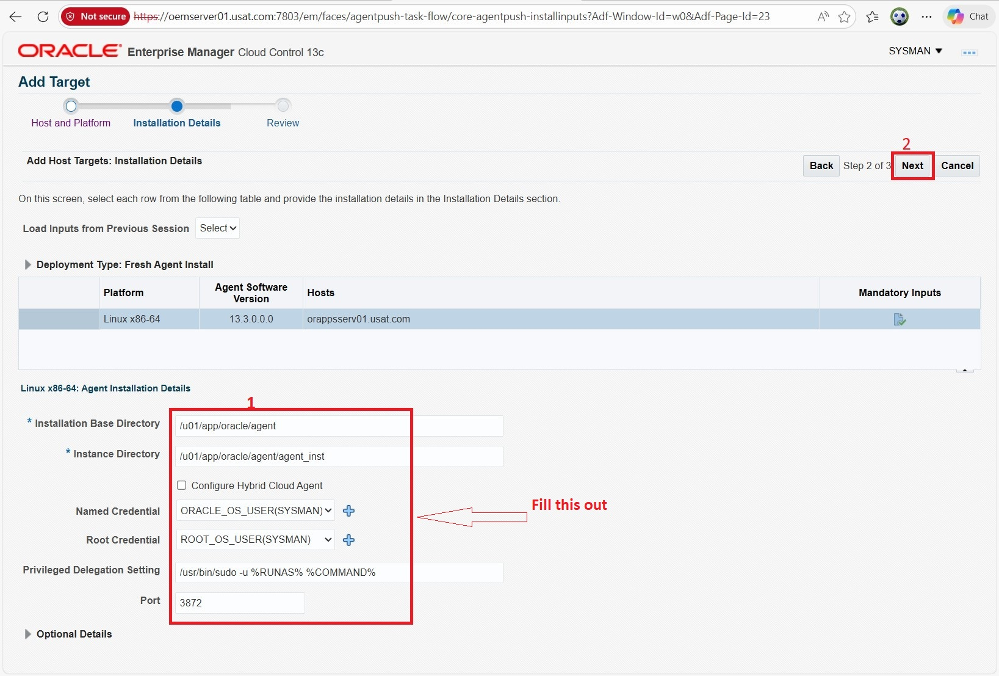
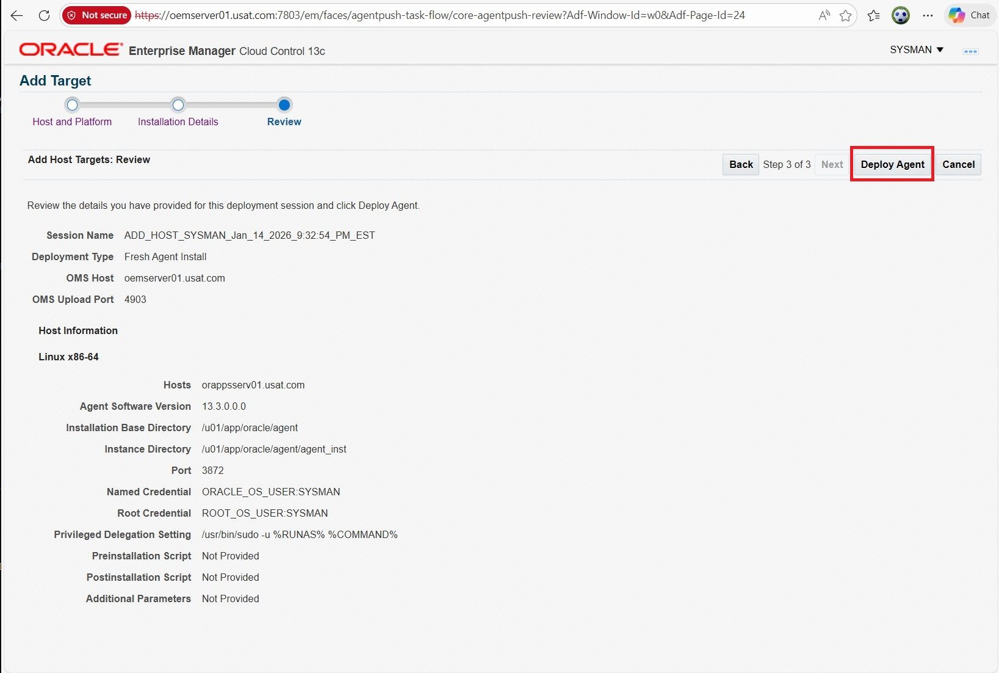
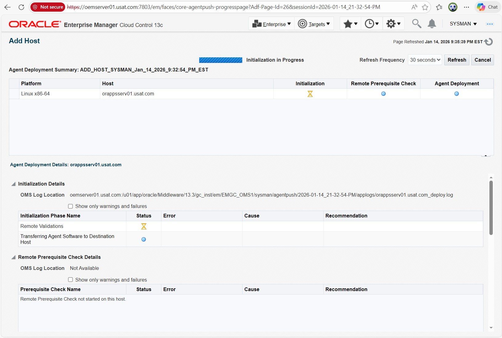
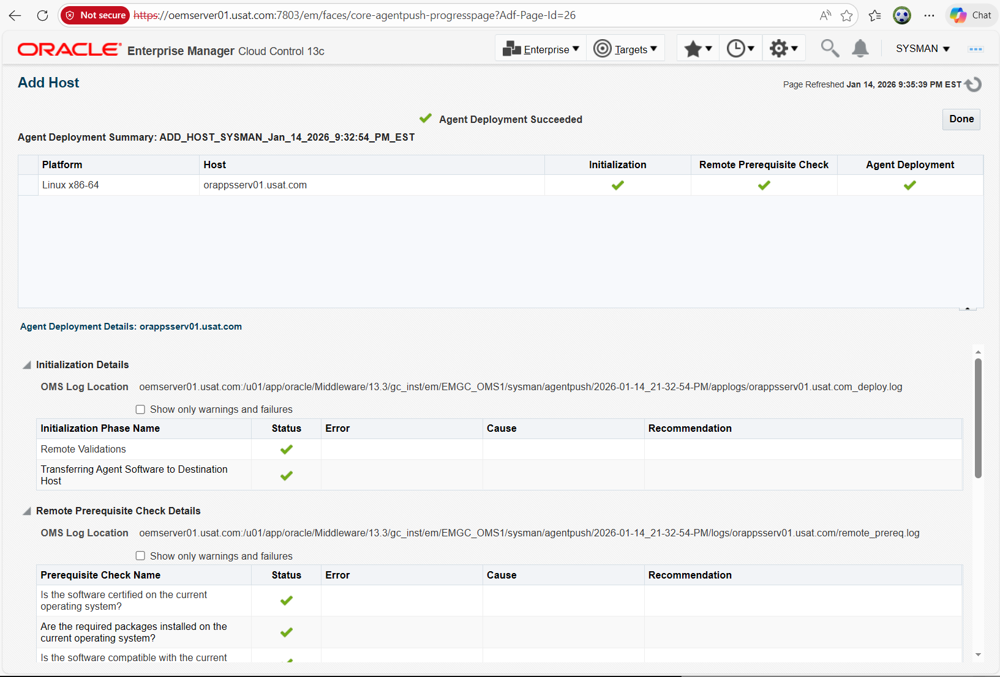
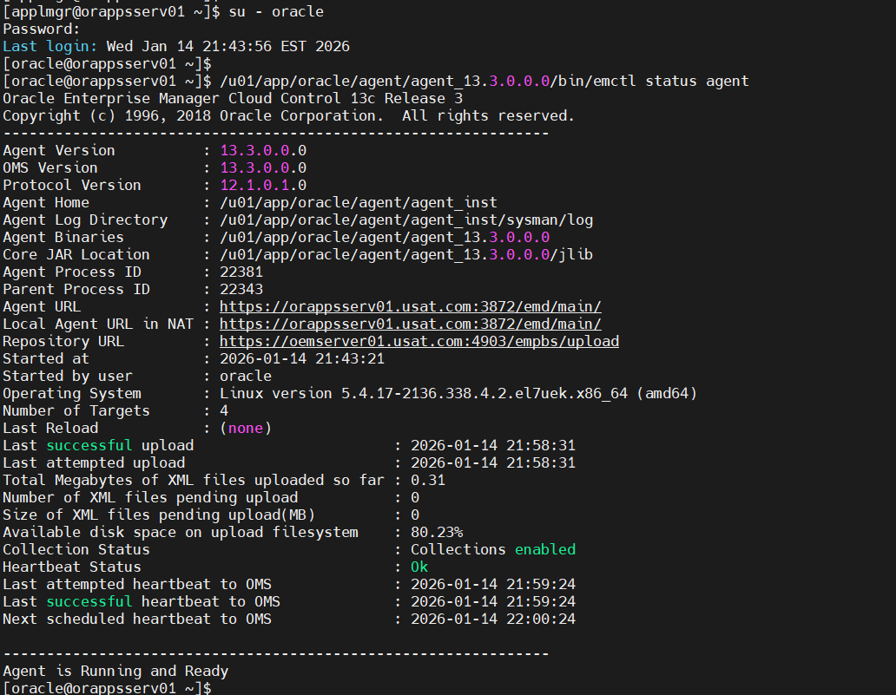

## Scenario Overview
In your Oracle E-Business Suite HA/DR proof-of-concept (running on VirtualBox VMs with 32 CPUs / 128 GB RAM host), I have:

- **OEM Server** (Oracle Enterprise Manager Cloud Control 13c or later)
- **DB Server** (single-instance Oracle 19c backend for EBS)
- **App Server** (single-instance EBS 12.2 application tier)

This guide demonstrates deploying **Oracle Management Agents (OMA)** to the DB and App servers for centralized monitoring (performance tuning, alerts, patching, Data Guard/GoldenGate visibility via OEM plugins).
Oracle recommends two main methods:

- **Agent Push** (preferred): OMS "pushes" the agent remotely from the console (Add Host Targets Wizard) — automated, secure, and scalable.
- **Agent Pull** (manual): Target host "pulls" the agent software (using AgentPull.sh) — useful when push fails (firewall, SSH issues) or for air-gapped environments.

Both methods are showcased here for completeness in this GitHub POC. (Reference: Oracle Enterprise Manager 13c Advanced Installation Guide and MOS Note 1596348.1)

## Prerequisites (Common to Both Methods)

1. Configure /etc/hosts on OEM server to include IP addresses of target servers.
2. OMS host can resolve target hostnames (or use IP).
3. Test: ssh e.g user@target_hostname date 
4. Targets have required OS packages (e.g., bc, libaio, net-tools on OL7/8).
5. Firewall allows ports: 3872 (agent), 4900-4903 (upload), etc.
6. In OEM create Named Credentials password for OS users such as Oracle. Grant it sudo privileges.

## Method 1: Agent Push (Recommended – from OEM Console)

1. Log in to OEM console as SYSMAN.

2. Navigate: **Setup** → **Add Target** → **Add Targets Manually**

3. Select **Install Agent on Host** → Click **Add**

4. Enter host details:
- Hostname: dbserver_hostname (or IP)
- Platform: Linux x86-64 (match your VM)
- Click **Next**

5. On Installation Details screen:
- Installation Base Directory: /u01/app/oracle/agent (example – choose consistent path)
- Instance Directory: auto-filled or /u01/app/oracle/agent/agent_inst
- Port: 3872 (default agent listen port)
- Registration Password: the one you set
- Additional Parameters (optional): -ignorePrereqs if testing

6. Review → **Deploy Agent**

7. Monitor progress on **Add Host Status** page.

8. After success: Run root.sh on each target (as root):
--- /u01/app/oracle/agent/root.sh

9. Verify: 
--- emctl status agent

Targets auto-discover (DB, listener, EBS apps) in OEM.

## Method 2: Agent Pull (Manual – from Target Host)

