## Scenario Overview

Demonstrating both **Agent Pull** method for monitoring App servers in EBS HA/DR POC. 
This method is typically used for new agent installs only. There is not a direct path upgrade from the OLD 13.3 agent to the new 13.5 agent.
For that Oracle Recommends using the console. In this case the OMA Agent upgrade via OEM 13.5 failed for the EBS APP server with step Deploying Agent Image see attached screenshot below.
Therefore, we need to get a little bit creative in deploying the OMA on this server.


link (Demonstrating **Agent Push** (console) method for monitoring DB/App servers in EBS HA/DR POC.)


Current setup:

- **OEM Server** (Oracle Enterprise Manager Cloud Control 13c or later)
- **DB Server** (single-instance Oracle 19c backend for EBS)
- **App Server** (single-instance EBS 12.2 application tier)


	

	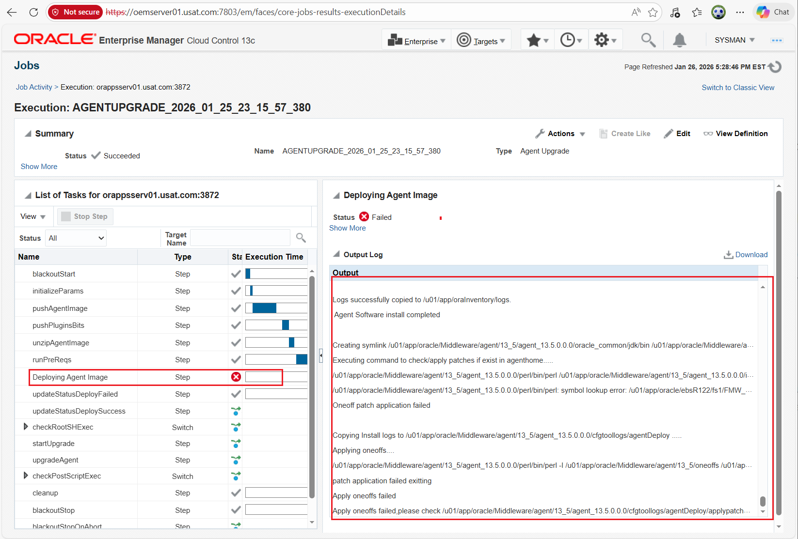

	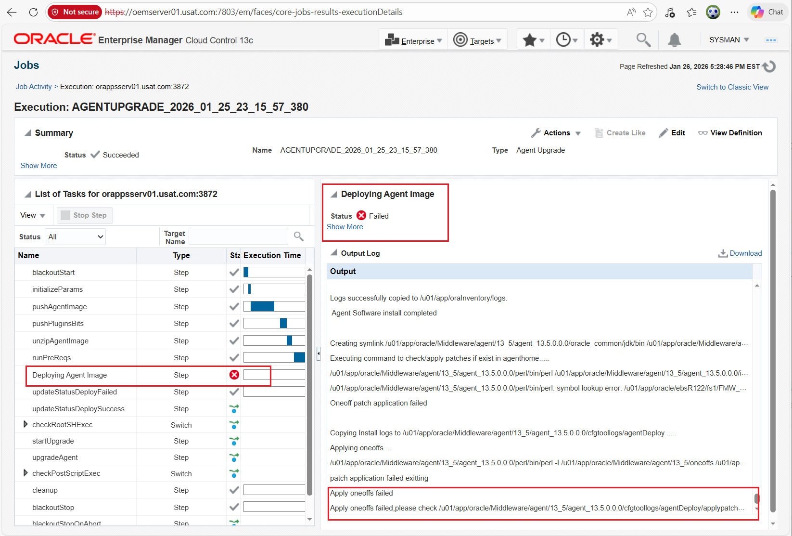

```bash

---
---
--- Not the complete log entry. Entries have been truncated.
---
---
Configuration complete

The install operation completed successfully.

Logs successfully copied to /u01/app/oraInventory/logs.
 Agent Software install completed 

Creating symlink /u01/app/oracle/Middleware/agent/13_5/agent_13.5.0.0.0/oracle_common/jdk/bin /u01/app/oracle/Middleware/agent/13_5/agent_13.5.0.0.0/jdk/bin
Executing command to check/apply patches if exist in agenthome.....
/u01/app/oracle/Middleware/agent/13_5/agent_13.5.0.0.0/perl/bin/perl /u01/app/oracle/Middleware/agent/13_5/agent_13.5.0.0.0/install/oneoffs/apply_NewOneoffs.pl /u01/app/oracle/Middleware/agent/13_5/agent_13.5.0.0.0 true
/u01/app/oracle/Middleware/agent/13_5/agent_13.5.0.0.0/perl/bin/perl: symbol lookup error: /u01/app/oracle/ebsR122/fs1/FMW_Home/webtier/perl/lib/5.10.0/x86_64-linux-thread-multi/auto/Cwd/Cwd.so: undefined symbol: Perl_Gthr_key_ptr
Oneoff patch application failed 

Copying Install logs to /u01/app/oracle/Middleware/agent/13_5/agent_13.5.0.0.0/cfgtoollogs/agentDeploy .....
Applying oneoffs....
/u01/app/oracle/Middleware/agent/13_5/agent_13.5.0.0.0/perl/bin/perl -I /u01/app/oracle/Middleware/agent/13_5/oneoffs /u01/app/oracle/Middleware/agent/13_5/oneoffs/applypatchesonapplicablehome.pl -patch_location=/u01/app/oracle/Middleware/agent/13_5/oneoffs -primary_home=/u01/app/oracle/Middleware/agent/13_5/agent_13.5.0.0.0  -log_loc=/u01/app/oracle/Middleware/agent/13_5/agent_13.5.0.0.0/cfgtoollogs/agentDeploy
patch application failed exitting
Apply oneoffs failed
Apply oneoffs failed,please check /u01/app/oracle/Middleware/agent/13_5/agent_13.5.0.0.0/cfgtoollogs/agentDeploy/applypatchesonapplicablehome2026-01-25_23_16_37.log for detailspply oneoffs failed,please check /u01/app/oracle/Middleware/agent/13_5/agent_13.5.0.0.0/cfgtoollogs/agentDeploy/applypatchesonapplicablehome2026-01-25_23_16_37.log for details


/u01/app/oracle/Middleware/agent/13_5/agent_13.5.0.0.0/perl/bin/perl: symbol lookup error: /u01/app/oracle/ebsR122/fs1/FMW_Home/webtier/perl/lib/5.10.0/x86_64-linux-thread-multi/auto/Cwd/Cwd.so: undefined symbol: Perl_Gthr_key_ptr
https://<OMS_HOSTNAME>:<EM_CONSOLE_PORT>/em/install/getAgentImage


````


## Root Cause:

The agent's Perl binary is loading libraries from EBS FMW Home:
/u01/app/oracle/ebsR122/fs1/FMW_Home/webtier/perl/lib/5.10.0/x86_64-linux-thread-multi/auto/Cwd/Cwd.so

This happens because:

PERL5LIB environment variable includes EBS paths

LD_LIBRARY_PATH includes EBS library paths

The environment is contaminated with EBS variables during agent deployment

## Proposed Solution: (skip section: Actual Solution if you do not have time)

I will have to use *AgentPull.sh* method to have control over the environmental variables that are causing the OMA deployment to fail.
I could also use *agentDeploy.sh*


## Prerequisites (Common to all Methods)

  1. Configure *'/etc/hosts'* on OEM server to include IP addresses of target servers.
  2. OMS host can resolve target hostnames (or use IP).
  3. Test: ssh e.g user@target_hostname date 
  4. Targets have required OS packages (e.g., bc, libaio, net-tools on OL7/8).
  5. Firewall allows ports: 3872 (agent), 4900-4903 (upload), etc.
  6. In OEM create Named Credentials password for OS users such as Oracle. Grant it sudo privileges.
  7. CURL utility is installed (http://curl.haxx.se/dlwiz/?type=bin)


## Method II: Agent Pull to get the Software and then use Agent Deploy to complete. 

	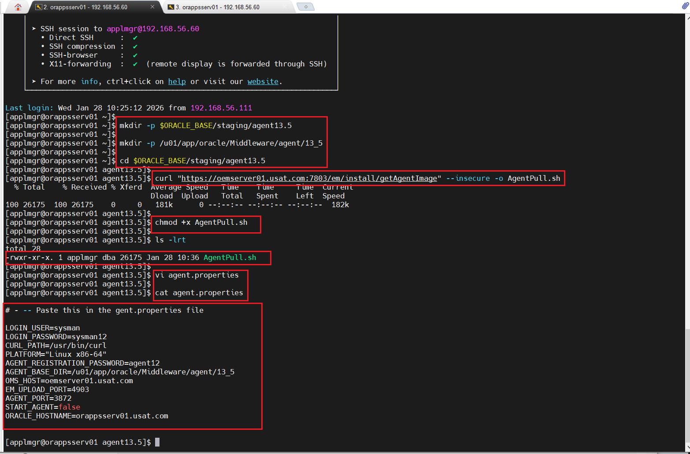


1. Create a staging directory
	
	```bash
	
	mkdir -p $ORACLE_BASE/staging/agent13.5
	
	```


2. Create Agent base directory

	```bash
	
	mkdir -p /u01/app/oracle/Middleware/agent/13_5

	cd $ORACLE_BASE/staging/agent13.5
	
	```


3. Download the **AgentPull.sh** script.

	```bash
	
	curl "https://oemserver01.usat.com:7803/em/install/getAgentImage" --insecure -o AgentPull.sh
	
	chmod +x AgentPull.sh
	
	ls -lrt
	
	```


4. Create the response file. DO NOT name the response file agent.rsp.


	```bash

	cd $ORACLE_BASE/staging/agent13.5
	
	vi agent.properties 
	
	# -- Paste this in the gent.properties file
	
	LOGIN_USER=sysman 
	LOGIN_PASSWORD=sysman12 
	CURL_PATH=/usr/bin/curl  
	PLATFORM="Linux x86-64" 
	AGENT_REGISTRATION_PASSWORD=agent12
	AGENT_BASE_DIR=/u01/app/oracle/staging/agent13.5  # <----- This is where we want stage the Software.
	OMS_HOST=oemserver01.usat.com
	EM_UPLOAD_PORT=4903
	AGENT_PORT=3872
	START_AGENT=false
	ORACLE_HOSTNAME=orappsserv01.usat.com
	
	```


5. Deploy the OMA onto the server by executing *AgentPull.sh* script


	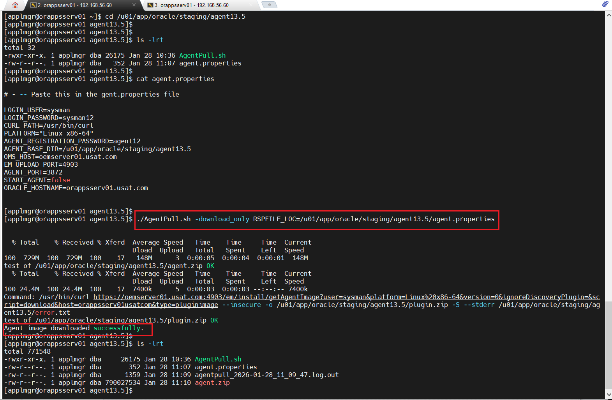

	

	cd /u01/app/oracle/staging/agent13.5
	
	
	./AgentPull.sh -download_only RSPFILE_LOC=/u01/app/oracle/staging/agent13.5/agent.properties
	
	


6.  Unzip the OMA file to extract the *agent.rsp* file
	Edit the *agent.rsp* accordingly
	
	
	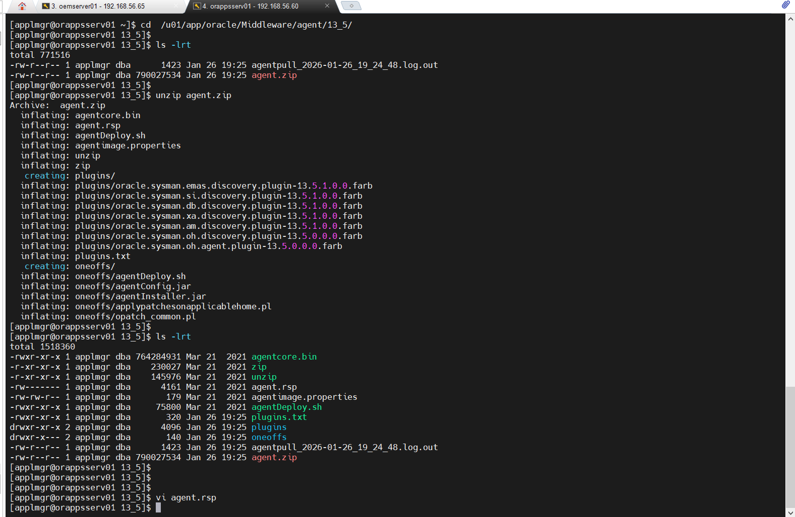

	

	
	cd  /u01/app/oracle/staging/agent13.5
	
	
	unzip agent.zip
	
	
	vi agent.rsp
	
	# --- Fill in the values
	# 
	
	OMS_HOST=oemserver01.usat.com
	EM_UPLOAD_PORT=4903
	AGENT_REGISTRATION_PASSWORD=agent12
	b_startAgent=false
	AGENT_BASE_DIR=/u01/app/oracle/Middleware/agent/13_5   # <----- This is the actual destination we want stage the Software.
	AGENT_PORT=3872
	ORACLE_HOSTNAME=orappsserv01.usat.com
	EM_INSTALL_TYPE="AGENT"
	

	
	
	
7.  Execute *agentDeploy.sh* to actually deploy the NEW agent into it NEW home.
	Firstly, STOP the OLD 13.3 OMA to avoid Port= 3872 is busy error.


	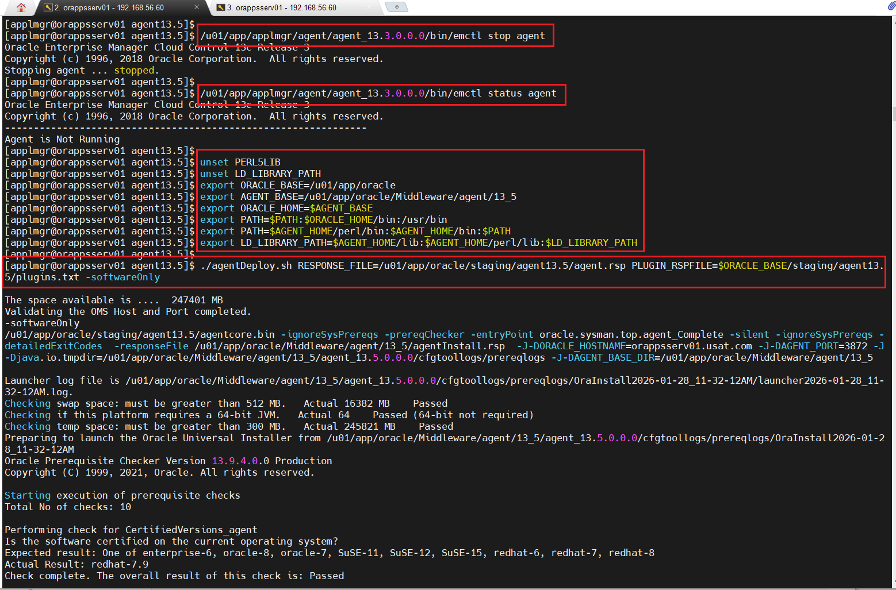

	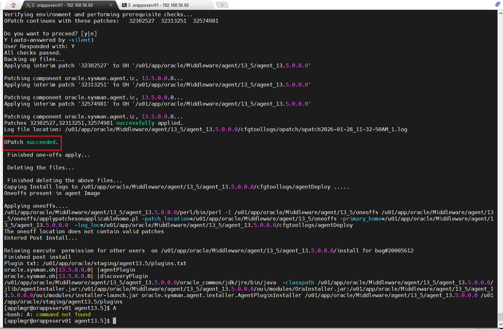

 -  Stop agent
	
	```bash
	
	/u01/app/applmgr/agent/agent_13.3.0.0.0/bin/emctl stop agent
	
	/u01/app/applmgr/agent/agent_13.3.0.0.0/bin/emctl status agent
	
	```
	
 -  Set the environmental variables to avoid conflicting EBS environment.
 
	```bash
	unset PERL5LIB
	unset LD_LIBRARY_PATH
	export ORACLE_BASE=/u01/app/oracle
	export AGENT_BASE=/u01/app/oracle/Middleware/agent/13_5
	export ORACLE_HOME=$AGENT_BASE
	export PATH=$PATH:$ORACLE_HOME/bin:/usr/bin
	export PATH=$AGENT_HOME/perl/bin:$AGENT_HOME/bin:$PATH
	export LD_LIBRARY_PATH=$AGENT_HOME/lib:$AGENT_HOME/perl/lib:$LD_LIBRARY_PATH
	
	```
	

	
 -  First Execute **agentDeploy.sh -softwareOnly**. This installs the OMA Software.
	
	```bash
	
	./agentDeploy.sh RESPONSE_FILE=/u01/app/oracle/staging/agent13.5/agent.rsp \ 
	PLUGIN_RSPFILE=$ORACLE_BASE/staging/agent13.5/plugins.txt -softwareOnly 
	
	```
	
 -  Next Execute **agentDeploy.sh -configOnly**. This configures it. 
 
	```bash
	
	./agentDeploy.sh RESPONSE_FILE=/u01/app/oracle/staging/agent13.5/agent.rsp \ 
	PLUGIN_RSPFILE=$ORACLE_BASE/staging/agent13.5/plugins.txt -configOnly 
	
	```

Here is the problem. If we start this agent, OEM will NOT accept it causing a "Blocked Agent" Scenario.
If we DECOMMISION the old 13.3 Agent then we lose all the targets, and metrics. 

Therefore, the plan is to "Take Over" the 13.3 OMA Identity. 
This is the "magic" step that prevents the block. You must tell the new agent to inherit the identity of the old one using the Agent Registration Password.
Navigate to your new 13.5 bin directory:Bashcd /u01/app/oracle/Middleware/agent/13_5/agent_13.5.0.0.0/bin

Short answer is my awesome plan didn't work. I may have to revisit this in future. 

What I learn is that Agent Pull and Agent Deploy are mostly primarily for fresh installations and not upgrades. if you want to upgrade
existing agents then you must use OEM Console: Login > Step UP > Manage Cloud Control > upgrade Agents.

Why the "Blocked Agent" error happens. The AgentPull.sh method generates a new GUID (Global Unique Identifier) for the agent. When the OMS sees a new GUID for an existing hostname, it assumes a security breach or a cloned VM and blocks communication.By stopping the old agent first.


### Problem: Agent Upgrade via OEM Console is failing due to Perl versions are mismatched. The 13.5 agent Perl (5.14.1) conflicts with 12.2.0 DB Perl. 


	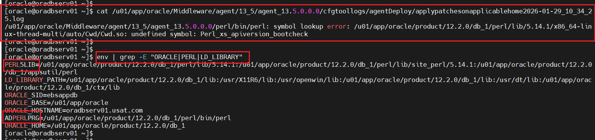


 cat /u01/app/oracle/Middleware/agent/13_5/agent_13.5.0.0.0/cfgtoollogs/agentDeploy/applypatchesonapplicablehome2026-01-29_10_34_25.log
/u01/app/oracle/Middleware/agent/13_5/agent_13.5.0.0.0/perl/bin/perl: symbol lookup error: /u01/app/oracle/product/12.2.0/db_1/perl/lib/5.14.1/x86_64-linux-thread-multi/auto/Cwd/Cwd.so: undefined symbol: Perl_xs_apiversion_bootcheck


### Oracle Documentation:

	These didn't help!
	
 -  Oracle MOS Note 1073165.1 - "Agent Silent Upgrade Response File Parameters"
	
 -  Oracle MOS Note 249212.1 - "How to Upgrade Oracle Management Agent in Silent Mode"
	
 -  Oracle Support Document 1378786.1 - "Agent Upgrade Fails with Perl Library Errors"


### Actual Solution
 

1.	Fix the Perl conflict first.
 
	I simply backup/ my current Oracle OS user .bash_profile to old.bash_profile, unset perl, and 13.3 restart agent. 
	Like so:
	

	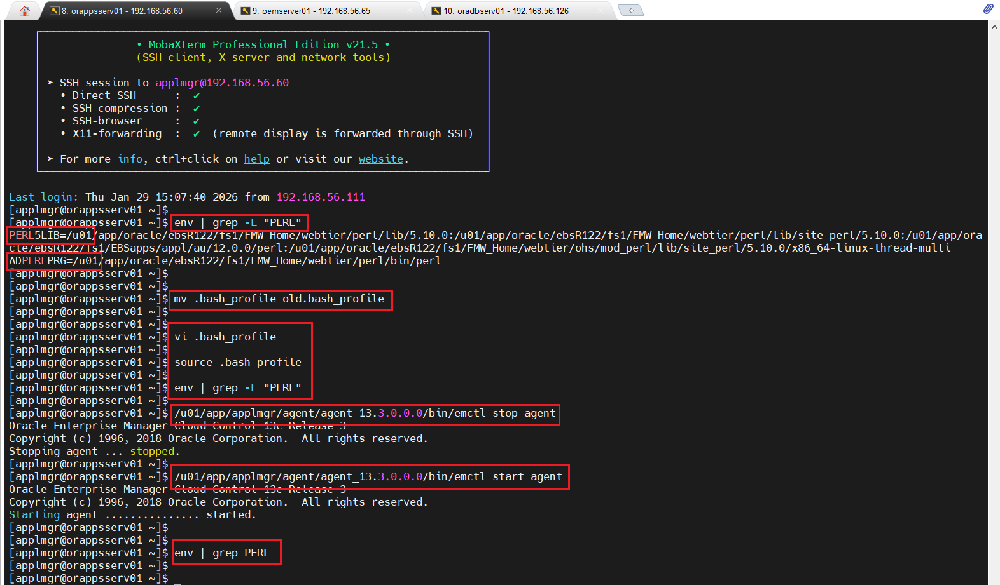
	
	
	
	env | grep -E "PERL"
	
	cd ~
	
	mv .bash_profile old.bash_profile
	
	# --- Also check the .bashrc to make sure no Oracle related parameters
	
	# --- Create and save a minimal .bash_profile
	
	vi .bash_profile
	
		# .bash_profile

		# Get the aliases and functions
		if [ -f ~/.bashrc ]; then
				. ~/.bashrc
		fi
		
		#
		
		unset PERL5LIB
		unset ADPERLPRG


	# --- Reload the .bash_profile
	
	source .bash_profile
	
	# --- For PERL
	

	env | grep -E "PERL"
	
	
	# --- Stop and restart the OLD 13.3 Agent
	
	/u01/app/applmgr/agent/agent_13.3.0.0.0/bin/emctl stop agent
	
	/u01/app/applmgr/agent/agent_13.3.0.0.0/bin/emctl start agent
	
		
	# --- Verify the environment is clean (Double check this step). Should return empty

	env | grep PERL


	


2. 	Use the OEM Console Login > Step Up > Manage Cloud Control > upgrade Agents.
    (it should work after fixing Perl)

	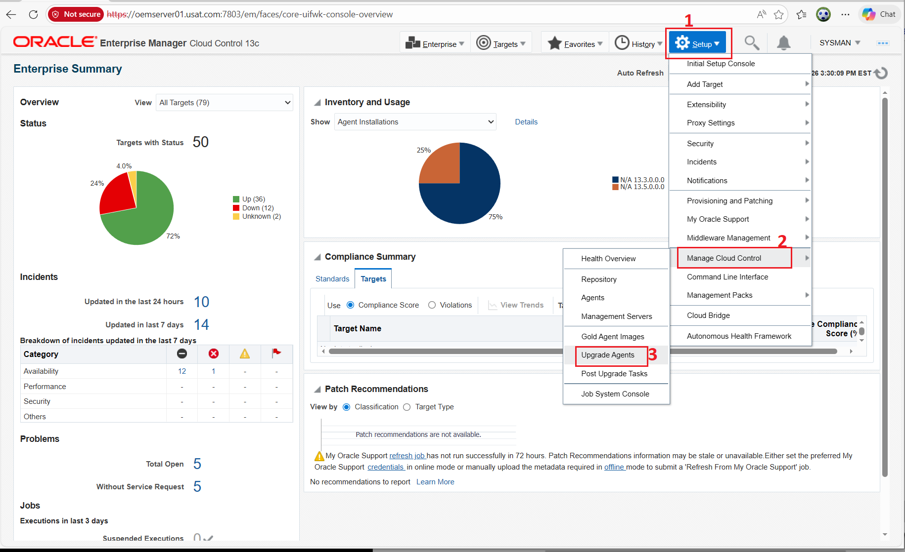

-  Agent Upgrade Console page:

	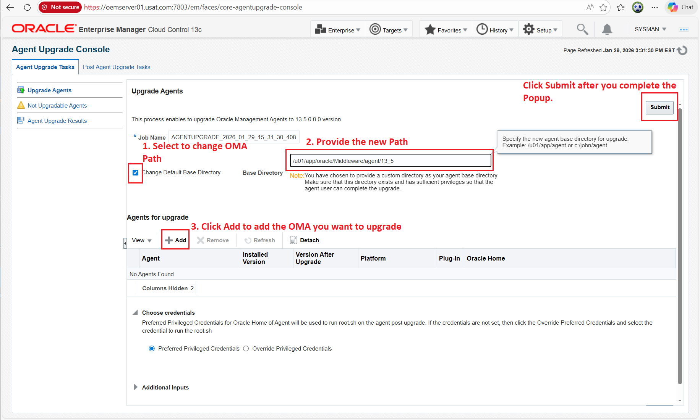

-  Upgradable Agents:

	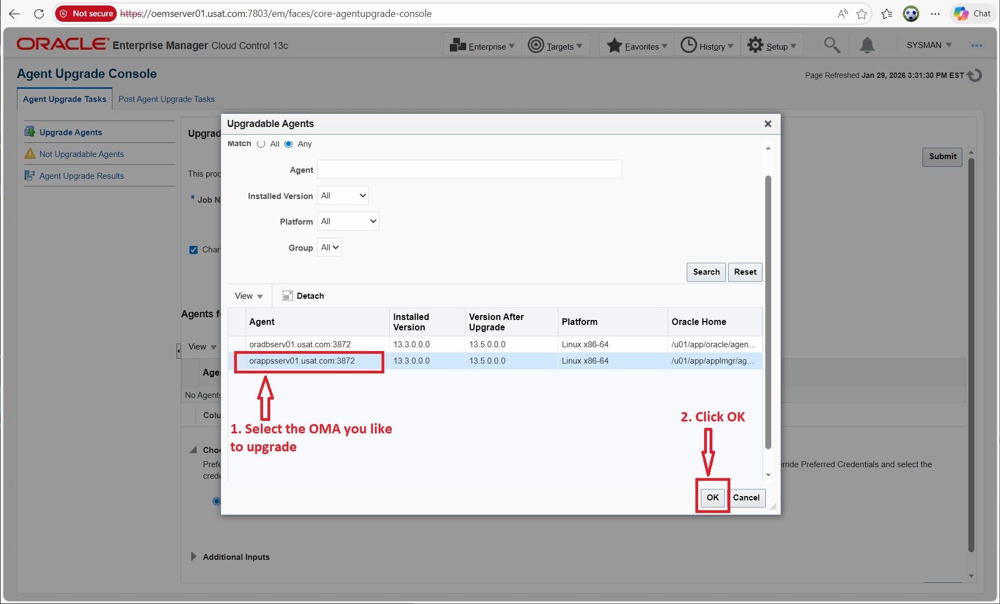

-  Agent Upgrade Notifications
  
	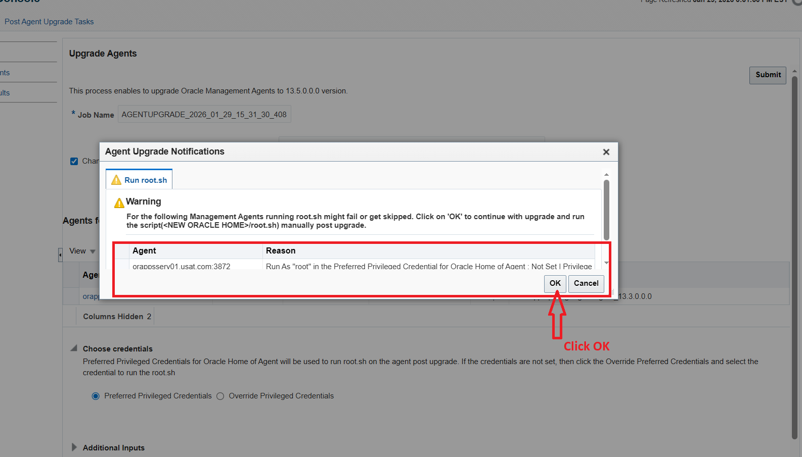

-  Agent Upgrade Console : Agent Upgrade Tasks page
  
	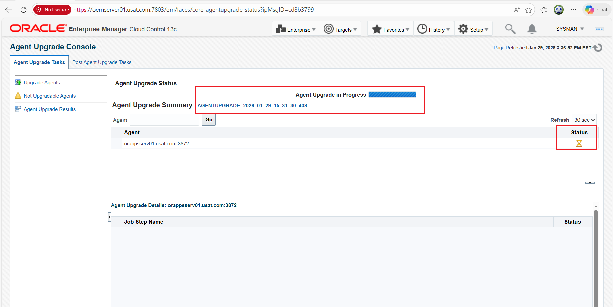


3.	 After success: Run root.sh on each target (as root) and Verify:

	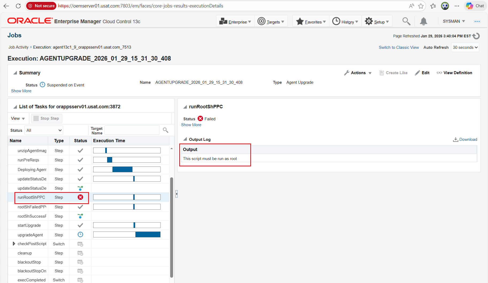

	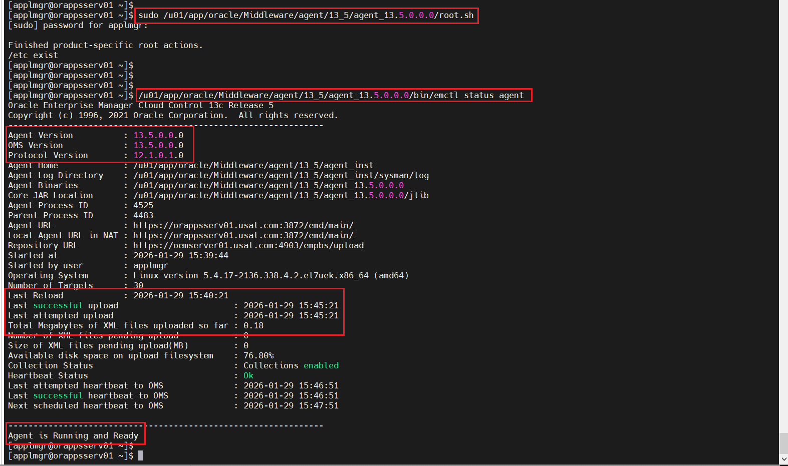


	```bash
	
	sudo /u01/app/oracle/Middleware/agent/13_5/agent_13.5.0.0.0/root.sh
	
	/u01/app/oracle/Middleware/agent/13_5/agent_13.5.0.0.0/bin/emctl status agent
	
		
	```
	
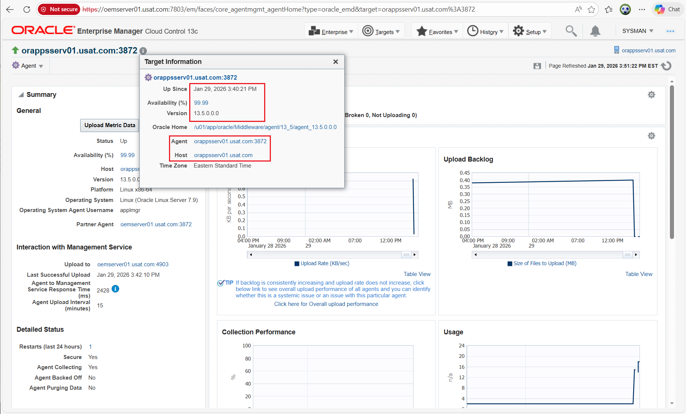


!!!!!!!!!!!!!!!!!!!! THE END !!!!!!!!!!!!!!!!!!!


