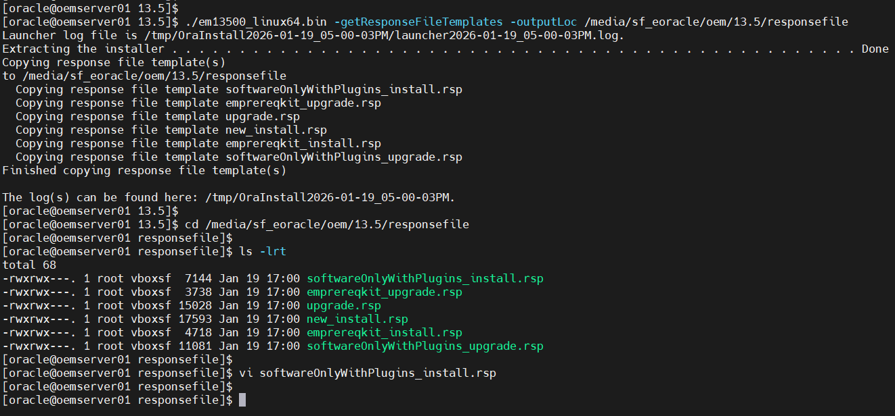
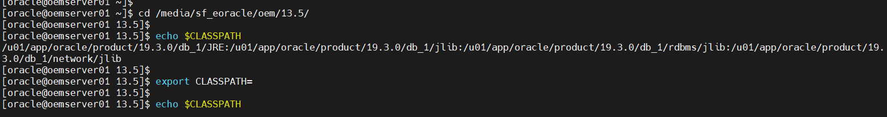
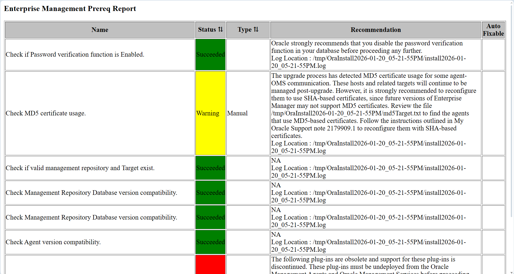

# Upgrading OEM OMR Database from 12c to 19c in EBS HA/DR POC

## Overview

This guide demonstrates upgrading Oracle Enterprise Manager (OEM) Oracle Management Service (OMS) from 13.3 to 13.5. This highlights patching for security (e.g., OAuth fixes per MOS Doc ID 2998693.1 and supports move from OAM to IDCS for secure cloud identity, addressing auth vulnerabilities like token exposure).
Security Reason: Oracle recommends 13.5 for Holistic Patching (streamlined CPU application), enhanced DBSAT compliance for PDB/RAC, and fixes for OAuth/IDCS integration – reducing risks in hybrid/cloud setups (per MOS 2998693.1 and 13.5 RU notes).
(Reference: Oracle EM Upgrade Guide; MOS for RUs.)


Prerequisites:

 - Certified DB: Upgraded to 19c (certified).
 - Agents: Upgrade to 13.5-compatible (use Agent Upgrade Console).
 - Backup: emctl exportconfig oms; full file system backup.
 - Download: 13.5 software (p32646422_13500_Linux-x86-64.zip); latest RU (e.g., 13.5.0.23).
 - Space: 20 GB /tmp -J-Djava.io.tmpdir=/u01/tmp/; stop JVMD/ADP: emctl extended oms adp stop -all.
 - SSL: If enabled, use ENABLE_SSL=true.
 - Pre-Checks: Run EM Prerequisite Kit: *./em13500_linux64.bin EMPREREQ_KIT=true*.
 

## Prepare the OEM Server


1. Downloading the files
   ---------------------
   
   Download the all shiphome zips files, for each platform there are 5 files example as shown below to a staging directory of your choice.
	
	
	- V1007079-01(V1007079-01.zip)	
	- V1007080-01(V1007080-01.zip)
	- V1007081-01(V1007081-01.zip)
	- V1007082-01(V1007082-01.zip)
	- V1007083-01(V1007083-01.zip)			


2. The downloaded files are compressed with the zip format. Use any unzip tool to uncompress the file, or download a utility from eDelivery http://updates.oracle.com/unzips/unzips.html. This will generate the compressed zip files.


	```bash
	cd /staging_area

	unzip V1007079-01.zip
	unzip V1007080-01.zip
	unzip V1007081-01.zip
	unzip V1007082-01.zip
	unzip V1007083-01.zip

	```


3. Server (system) Pre-Checks: To check the local server's OS packages, kernel parameters, and hardware (RAM/Swap) before you even touch a database 
   Run EM Prereqchecker: *./em13500_linux64.bin -prereqchecker*.


	```bash

	./em13500_linux64.bin -silent -prereqchecker -entryPoint oracle.sysman.top.oms_Core \ 
	-J-Djava.io.tmpdir=/media/sf_eoracle/oem/13.5/prerequisites/log
	
	```

	```bash

	# Sample outputxczxc
	
	Launcher log file is /tmp/OraInstall2026-01-19_04-46-09PM/launcher2026-01-19_04-46-09PM.log.
	Extracting the installer . . . . . . . . . . . . . . . . . . . . . . . . . . . . . . . . . . . . . . . . . . . . . . . . . . Done
	Checking swap space: must be greater than 512 MB.   Actual 16382 MB    Passed
	Checking if this platform requires a 64-bit JVM.   Actual 64    Passed (64-bit not required)
	Preparing to launch the Oracle Universal Installer from /tmp/OraInstall2026-01-19_04-46-09PM
	Oracle Prerequisite Checker Version 13.9.4.0.0 Production
	Copyright (C) 1999, 2021, Oracle. All rights reserved.
	
	Starting execution of prerequisite checks
	Total No of checks: 13
	
	Performing check for CertifiedVersions
	
	------
	------
	------ ++++++++++ For brevity Log entries have been removed.
	------
	------
	------
	------
	
	Check complete: Passed
	========================================================
	PrereqChecks complete
	
	
	The log(s) can be found here: /tmp/OraInstall2026-01-19_04-46-09PM.
	
	```

	
	


4. Perform Software Only with Plug-ins in Silent Mode


  - Extract and edit the Response file.
  
	```bash
	cd /media/sf_eoracle/oem/13.5
	- ./em13500_linux64.bin -getResponseFileTemplates -outputLoc /media/sf_eoracle/oem/13.5/responsefile
  
	```
	
	
	
  
  - Edit the *softwareOnlyWithPlugins_upgrade.rsp* file
  
	```bash
	cd /media/sf_eoracle/oem/13.5/responsefile
	vi softwareOnlyWithPlugins_install.rsp
	
	# Inputs sample softwareOnlyWithPlugins_install.rsp
	
	STAGE_LOCATION=/media/sf_eoracle/oem/13.5
	ORACLE_MIDDLEWARE_HOME_LOCATION=/u01/app/oracle/Middleware/oms/13.5
	AGENT_BASE_DIR=/u01/app/oracle/Middleware/agent/13.5
	ORACLE_HOSTNAME=oemserver01.usat.com
	CONFIGURATION_TYPE=LATER
	```
 
 
  - Unset CLASSPATH. Will set it later:
 
	```bash
	cd /media/sf_eoracle/oem/13.5/
	echo $CLASSPATH 
	export CLASSPATH=
	echo $CLASSPATH
	```

	

	
	
  - Execute the software-only installation. 
	
	```bash		
	./em13500_linux64.bin -silent -responseFile /media/sf_eoracle/oem/13.5/responsefile/softwareOnlyWithPlugins_upgrade.rsp \
	-J-Djava.io.tmpdir=/media/sf_eoracle/oem/13.5/log
		
	```

	```bash
	
		Run the allroot.sh Script
		
		/u01/app/oracle/Middleware/oms/13.5/allroot.sh
	```


5. Updating OMSPatcher and applying OMS patch to the new OMS_HOME

	```bash
    export ORACLE_HOME=/u01/app/oracle/Middleware/oms/13.5
	export OMS_HOME=$ORACLE_HOME
	export PATH=$PATH:$ORACLE_HOME/bin:$ORACLE_HOME/OMSPatcher:$ORACLE_HOME/OPatch
	export CLASSPATH=
	echo $CLASSPATH
	
	# -- Upgrading OMSPatcher
	
	# -1- Verify
	
	
	/u01/app/oracle/Middleware/oms/13.5/OMSPatcher/omspatcher version
	
	# OMSPatcher Version: 13.9.4.4.0
	# OPlan Version: 12.2.0.1.16
	# OsysModel build: Tue Apr 28 18:16:31 PDT 2020
	# 
	# OMSPatcher succeeded.
	
	# -2- Backup
	
	mv /u01/app/oracle/Middleware/13.5/OMSPatcher /u01/app/oracle/Middleware/13.5/OMSPatcher.old
	
	# -3- Update
	
	unzip OMSPatcher_patch_of_version_13.9.24.9.0_p19999993_241000_Generic.zip \ 
	-d /u01/app/oracle/Middleware/oms/13.5
	
	# -4- Post Update verification
	
	/u01/app/oracle/Middleware/13.5/OMSPatcher/omspatcher version
	
	# OMSPatcher Version: 13.9.24.9.0
	# OPlan Version: 12.2.0.1.16
	# OsysModel build: Tue Apr 28 18:16:31 PDT 2020
	# 
	# OMSPatcher succeeded.
	
	# -5- Apply new Patch to the installed OEM 13.5 Software.
	
	cd 38100300/
	
	$ORACLE_HOME/OMSPatcher/omspatcher apply -analyze -bitonly
	
	```	

 


7. Execute PrereqChecks for Upgrades: Each database environment is very unique. Therefore you as the DBA is responsible for making sure that all prerequisite checks are successfully met for the environment.

 - I found these documents very helpful is performing my Prerequisite checks before Configuring OMS.
  
   *13.5: Checklist for Upgrading Enterprise Manager Cloud Control from Version 13.3/13.4 to 13.5(Doc ID 2761728.1)*
   *Doc ID 2761728.1 Oracle recently resigned  their website so this doc might not be found that easily.*
     
   Prerequisites for Upgrading to Enterprise Manager Cloud Control 13c Release 5:
   *https://docs.oracle.com/en/enterprise-manager/cloud-control/enterprise-manager-cloud-control/13.5/emupg/prerequisites-upgrading-enterprise-manager-cloud-control-13c-release.html#GUID-F6CFDFAD-D742-4644-A11A-4CBB5A6E8338*

	
 - For Upgrades: Using EMPREREQ_KIT=true
	 This is the modern method for OEM 13.5 and 24c. It triggers a specific logic that validates the existing repository database and the middleware environment.


 - Executing the *em13500_linux64.bin EMPREREQ_KIT=true* file 

	```bash
	 cd /media/sf_eoracle/oem/13.5

	 ./em13500_linux64.bin EMPREREQ_KIT=true -silent -J-Djava.io.tmpdir=/media/sf_eoracle/oem/13.5/log \
	 -responseFile /media/sf_eoracle/oem/13.5/responsefile/emprereqkit_upgrade.rsp
	```  
 
	
	
	```bash
	
	# ---- Sample Check fixes for my environment
	
	Disabling triggers
	
	SQL> SELECT COUNT (trigger_name) FROM sys.dba_triggers WHERE TRIGGERING_EVENT LIKE 'LOGON%' AND status='ENABLED';
	
	COUNT(TRIGGER_NAME)
	-------------------
					0
	
	SQL>
	SQL> SELECT trigger_name FROM sys.dba_triggers WHERE TRIGGERING_EVENT LIKE 'LOGON%' AND status='ENABLED';
	
	no rows selected
	
	SQL>
	SQL>
	SQL> SELECT COUNT (trigger_name) FROM sys.dba_triggers WHERE TRIGGERING_EVENT LIKE 'LOGOFF%' AND status='ENABLED';
	
	COUNT(TRIGGER_NAME)
	-------------------
					1
	
	SQL> SELECT owner, trigger_name FROM sys.dba_triggers WHERE TRIGGERING_EVENT LIKE 'LOGOFF%' AND status='ENABLED';
	
	OWNER                     TRIGGER_NAME
	-------------------       --------------
	GSMADMIN_INTERNAL         GSMLOGOFF
	
	
	
	SQL> alter trigger GSMADMIN_INTERNAL.GSMLOGOFF disable;
	
	Trigger altered.
	
	SQL>
	SQL> SELECT trigger_name FROM sys.dba_triggers WHERE TRIGGERING_EVENT LIKE 'LOGOFF%' AND status='ENABLED';
	
	no rows selected
	

	# ---- Backup Spfile
	
	SQL> create pfile='init.ora_20260120.bak' from spfile;
	
	SQL> alter system set parallel_min_servers=0 scope=both sid='*';
	SQL> alter system set "job_queue_processes"=0 scope=both sid='*';
	SQL> grant execute on DBMS_RANDOM to DBSNMP;
	SQL> alter system set "_allow_insert_with_update_check"=TRUE scope=both sid='*';
	SQL> alter system set parallel_max_servers=0 scope=both  sid='*';
	
	
	# --- Before values:
	
	job_queue_processes                  integer     80
	parallel_max_servers                 integer     80
	parallel_min_servers                 integer     2
	
	```

 Prior to upgrade, the EM KEY must be copied into the repository: 
 EMKEY Copy Requirements
  
 $<ORACLE_HOME>/bin/emctl config emkey -copy_to_repos [-sysman_pwd <sysman_pwd>]
 
 For example:
 
 oemserver01.usat.com-/media/sf_e_oracle/oem/13.4
 >
 > $ORACLE_HOME/bin/emctl config emkey -copy_to_repos -sysman_pwd oracle4u
 

5: Configuring the Software Only with Plug-ins in Silent Mode.


UNIX_GROUP_NAME=oinstall
INVENTORY_LOCATION=/app/oracle/oraInventory
STAGE_LOCATION=/media/sf_eoracle/oem/13.5
ORACLE_MIDDLEWARE_HOME_LOCATION=/u01/app/oracle/Middleware/13.5
ORACLE_INSTANCE_HOME_LOCATION=/u01/app/oracle/product/19.3.0/db_1
OLD_BASE_DIR=/u01/app/oracle/Middleware/13.3
ORACLE_HOSTNAME=oemserver01.usat.com
AGENT_BASE_DIR=/u01/app/oracle/agent15
OLD_DATABASE_SYSMAN_PASSWORD=xxxxxxxxx
WLS_ADMIN_SERVER_USERNAME=weblogic
WLS_ADMIN_SERVER_PASSWORD=xxxxxxxxx
WLS_ADMIN_SERVER_CONFIRM_PASSWORD=
NODE_MANAGER_PASSWORD=nodemanager
NODE_MANAGER_CONFIRM_PASSWORD=xxxxxxxxxx
WLS_ADMIN_SERVER_PASSWORD=xxxxxxx
DATABASE_HOSTNAME=oemserver01.usat.com
LISTENER_PORT=1521
SERVICENAME_OR_SID=oemcdb
SYS_PASSWORD=sys
REPOSITORY_BACKUP_DONE=true

$<ORACLE_HOME>/sysman/install/ConfigureGC.sh

$<ORACLE_HOME>/sysman/install/ConfigureGC.sh -silent -responseFile <absolute_path_to_the_directory_where_the_generated_and_updated_response_file_is_stored>/upgrade.rsp ENABLE_SSL=true [-invPtrLoc <absolute_path_to_oraInst.loc>]


Step 1: Stop all the OMS and Agents.

When stopping the OMS, ensure to use the command: emctl stop oms -all

Step 2: Start the repository and OMS upgrade


Agent Upgrade Console or EM CLI

Use the Agent Upgrade Console or EM CLI to upgrade the central agent of only 13 c Release 3 or 13 c Release 4.

1 From the Setup menu, select Manage Cloud Control, then select Upgrade Agents.
2 For Job Name, accept the default job name, or enter a unique job name.
A unique job name enables you to identify the upgrade job, know details of its execution, and track its progress on the Agent Upgrade Status page.

The job name can have a maximum length of 64 characters. It can consist of alphanumeric and special characters, and can begin with either of these.

3. Click Add to select the Management Agents you want to upgrade.
In the Upgradable Agents window, search for the Management Agents you want to upgrade, using the Agent, Installed Version, Platform, and Group fields.

Select the Management Agents you want to upgrade. Click OK.

4. Click Submit.

5. To view a summary from the Setup menu, select Manage Cloud Control, then select Upgrade Agents. Click Agent Upgrade Results.

6. run the root.sh 


Upgrade software only with plug-ins and Configure Later

Install software only with plug-ins", this option splits the Upgrade into Software Install and Configuration. This upgrade approach is best suited for most environments, as it minimizes the downtime of the OMS instances. You can install the software binaries on all the OMS hosts in parallel without shutting down the OMS instances. This not only saves time but also enables the earlier release of the OMS instances to remain up and running at this point. Once the software binaries are copied, you can shut down all the OMS instances, and configure the software binaries to upgrade the OMS instances, one after the other. Therefore, the downtime begins only when you start configuring the OMS instances, and not while copying the software binaries to the host.

This option also provides the ability to apply a Release Update on the OMS at the time of the upgrade, thereby saving the OMS downtime that is needed later during patching. During the Software install phase, you can select the OMS Home, Agent Home and required plugins. The binaries of the OEM along with the selected plugins are installed in the OMS Home provided. After a successful installation of the OMS binaries, you can apply the Release Updates on it using the "bitonly" method.

Generate  the Response File to Upgrade Software Only with Plug-ins in Silent Mode

Install 13.5 Software (Silent): Unzip to stage; run: ./em13500_linux64.bin -silent -responseFile /path/to/softwareOnlyWithPlugins_upgrade.rsp.Step 1: Software Install
Run Root Script: $<NEW_OMS_HOME>/allroot.sh (UNIX).Step 2: Root Script
Apply Patches/RU: Use OMSPatcher: omspatcher apply -analyze /path/to/ru_patch.zip; then apply.Step 3: RU Apply
Configure (Silent): Edit upgrade.rsp; run: $<NEW_OMS_HOME>/sysman/install/ConfigureGC.sh -silent -responseFile /path/to/upgrade.rsp.Step 4: Configure
Upgrade Additional OMS (if multi): Parallel on others.
Upgrade Agents: Via OEM Agent Upgrade Console; apply JDK 1.8u261+ if needed.Step 6: Agent Upgrade
Post-Upgrade: Run DDMP jobs if disabled; validate targets.Step 7: Validation

Best Practices & Security

Downtime: Software-only minimizes (upgrade binaries offline).
Automation: Silent responses; script backups/pre-checks.
Security: Apply latest CPU via Holistic Patching (13.5+); enable IDCS OAuth for secure auth.
Tuning: Monitor post-upgrade AWR; tune dirty_ratio for disk caching.
Testing: Rediscover EBS targets; simulate monitoring.

Add screenshots to /screenshots/ and commit.
Commit all: git add .; git commit -m "Added OEM/DB upgrade guides with best practices"; git push.
From Baltimore, MD (@iam_dat_iam_iam on X), share: "Showcased OEM 13.5 upgrade for security in my Oracle EBS POC! #OracleDBA #OEMUpgrade"


Applying Release Update in Bit Only Mode

export ORACLE_HOME=/u01/software/em135
cd <Release_Update_Directory>
$ORACLE_HOME/OMSPatcher/omspatcher apply -bitonly
